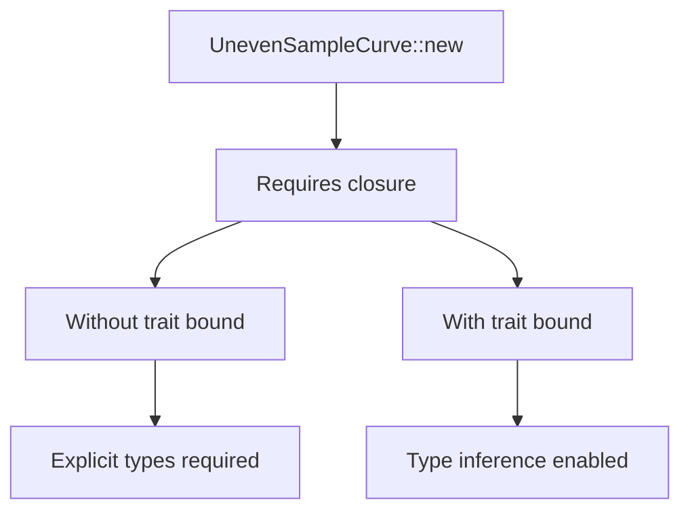

+++
title = "#20046 Allow UnevenSampleCurve to infer interpolation arguments from samples"
date = "2025-07-27T00:00:00"
draft = false
template = "pull_request_page.html"
in_search_index = true

[taxonomies]
list_display = ["show"]

[extra]
current_language = "en"
available_languages = {"en" = { name = "English", url = "/pull_request/bevy/2025-07/pr-20046-en-20250727" }, "zh-cn" = { name = "中文", url = "/pull_request/bevy/2025-07/pr-20046-zh-cn-20250727" }}
labels = ["C-Usability", "A-Math"]
+++

# Analysis of PR #20046: Allow UnevenSampleCurve to infer interpolation arguments from samples

## Basic Information
- **Title**: Allow UnevenSampleCurve to infer interpolation arguments from samples
- **PR Link**: https://github.com/bevyengine/bevy/pull/20046
- **Author**: laundmo
- **Status**: MERGED
- **Labels**: C-Usability, S-Ready-For-Final-Review, A-Math
- **Created**: 2025-07-08T21:16:35Z
- **Merged**: 2025-07-27T19:49:22Z
- **Merged By**: alice-i-cecile

## Description Translation
# Objective
`bevy_math::curve::UnevenSampleCurve` was lacking trait bounds on its `new` method which caused a need to manually specify interpolation function argument types, even though the types are already known from the timed_samples argument.

```rs
UnevenSampleCurve::new(
    [(0.1, 1.0), (1.0, 3.0)],
    |x: &f64, y: &f64, t| x.lerp(*y, t)
//      ^ ugly and annoying
)
```

## Solution

This adds the `Fn` trait bound to the new method, matching the behaviour of `SampleCurve`.

## Testing

I added a test which doesn't actually test for any runtime behaviour, instead writing code that would error before this PR.

---

## Showcase

It's now possible to create a `UnevenSampleCurve` without specifying the interpolation closure argument types.

```diff
UnevenSampleCurve::new(
    [(0.1, 1.0), (1.0, 3.0)],
-   |x: &f64, y: &f64, t| x.lerp(*y, t)
+   |x, y, t| x.lerp(*y, t)
)
```


### Sidenote
Seeing `x` and `y` in lerp feels wrong, I've always used `a` and `b` to avoid confusion with coordinates.

## The Story of This Pull Request

### The Problem and Context
The `UnevenSampleCurve::new` method in Bevy's math module had an ergonomic issue where users needed to explicitly annotate closure parameter types when creating curve instances. This requirement existed despite the compiler having sufficient type information from the timed_samples argument. The unnecessary annotations made the API more verbose and less intuitive, as shown in the original example:

```rust
UnevenSampleCurve::new(
    [(0.1, 1.0), (1.0, 3.0)],
    |x: &f64, y: &f64, t| x.lerp(*y, t)
)
```

This problem stemmed from a missing trait bound in the method signature. Without an explicit `Fn` bound, the Rust compiler couldn't infer the closure's parameter types from the context. This inconsistency was particularly noticeable because the similar `SampleCurve` API already included the necessary trait bounds.

### The Solution Approach
The solution involved adding a trait bound to the `new` method that matches the closure signature used during curve evaluation. Specifically, we needed to specify that the interpolation parameter `I` must implement `Fn(&T, &T, f32) -> T`, where `T` is the sample type. This approach aligns with how `SampleCurve` was implemented and leverages Rust's type inference system.

The key engineering decision was to match the existing `SampleCurve` API's behavior rather than introducing new patterns. This maintains consistency across Bevy's curve APIs and minimizes cognitive overhead for users. No alternatives were considered since this was a straightforward omission in the original implementation.

### The Implementation
The implementation modified the `UnevenSampleCurve::new` method signature to include the required trait bound. The change is concise but impactful:

```rust
// Before (without trait bound)
pub fn new(
    timed_samples: impl IntoIterator<Item = (f32, T)>,
    interpolation: I,
) -> Result<Self, UnevenCoreError> {

// After (with trait bound)
pub fn new(
    timed_samples: impl IntoIterator<Item = (f32, T)>,
    interpolation: I,
) -> Result<Self, UnevenCoreError>
where
    I: Fn(&T, &T, f32) -> T,
{
```

The added `where` clause enables type inference for closure parameters while maintaining identical runtime behavior. This change affects only compile-time type checking.

To validate the fix, a compile-time test was added:

```rust
#[test]
fn test_infer_interp_arguments() {
    SampleCurve::new(Interval::UNIT, [0.0, 1.0], |x, y, t| x.lerp(*y, t)).ok();
    UnevenSampleCurve::new([(0.1, 1.0), (1.0, 3.0)], |x, y, t| x.lerp(*y, t)).ok();
}
```

This test verifies that both curve types can be instantiated without explicit closure parameter types. It uses `.ok()` to discard the result since we're only concerned with compilation success. The test will fail if type inference breaks, serving as a safeguard against regression.

### Technical Insights
The core technical insight is that Rust's type inference for closures requires explicit trait bounds in generic contexts. Without the `Fn(&T, &T, f32) -> T` bound, the compiler treats `I` as a completely unconstrained generic, preventing it from inferring closure parameter types. Adding the bound provides the necessary constraints for type inference while maintaining identical runtime characteristics.

This change demonstrates an important API design principle: Generic methods accepting closures should include precise trait bounds even when not strictly required for compilation, as this enables type inference and improves ergonomics. The solution also highlights the value of API consistency - by matching `SampleCurve`'s bounds, we create a more predictable user experience.

### The Impact
This change improves developer experience by eliminating unnecessary type annotations when working with `UnevenSampleCurve`. Users can now write more concise and readable code:

```rust
UnevenSampleCurve::new(
    [(0.1, 1.0), (1.0, 3.0)],
    |x, y, t| x.lerp(*y, t)
)
```

The modification maintains full backward compatibility while making the API more ergonomic. It also aligns `UnevenSampleCurve` with `SampleCurve`'s behavior, creating a consistent pattern across Bevy's curve APIs. The compile-time test ensures this functionality remains working in future updates.

## Visual Representation



## Key Files Changed

### `crates/bevy_math/src/curve/sample_curves.rs`

**Changes:**
1. Added trait bound to `UnevenSampleCurve::new` to enable closure type inference
2. Added compile-time test to verify type inference

**Code Snippets:**

Before change (no trait bound):
```rust
pub fn new(
    timed_samples: impl IntoIterator<Item = (f32, T)>,
    interpolation: I,
) -> Result<Self, UnevenCoreError> {
```

After change (with trait bound):
```rust
pub fn new(
    timed_samples: impl IntoIterator<Item = (f32, T)>,
    interpolation: I,
) -> Result<Self, UnevenCoreError>
where
    I: Fn(&T, &T, f32) -> T,
{
```

Added test:
```rust
#[test]
fn test_infer_interp_arguments() {
    SampleCurve::new(Interval::UNIT, [0.0, 1.0], |x, y, t| x.lerp(*y, t)).ok();
    UnevenSampleCurve::new([(0.1, 1.0), (1.0, 3.0)], |x, y, t| x.lerp(*y, t)).ok();
}
```

## Further Reading
1. Rust Closure Traits: [The Rust Programming Language - Closures](https://doc.rust-lang.org/book/ch13-01-closures.html)
2. Type Inference in Rust: [Rust Reference - Type Inference](https://doc.rust-lang.org/reference/type-inference.html)
3. Bevy Math Module: [bevy_math Documentation](https://docs.rs/bevy_math/latest/bevy_math/)