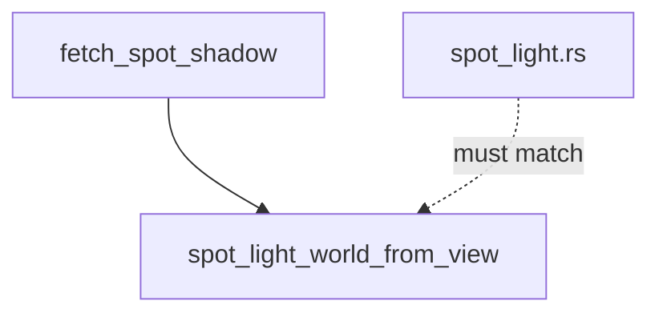

+++
title = "#20050 Refactoring Spotlight Shadow Matrix Calculation for Improved Readability"
date = "2025-07-09T00:00:00"
draft = false
template = "pull_request_page.html"
in_search_index = true

[taxonomies]
list_display = ["show"]

[extra]
current_language = "en"
available_languages = {"en" = { name = "English", url = "/pull_request/bevy/2025-07/pr-20050-en-20250709" }, "zh-cn" = { name = "中文", url = "/pull_request/bevy/2025-07/pr-20050-zh-cn-20250709" }}
labels = ["D-Trivial", "A-Rendering"]
+++

## Title: Refactoring Spotlight Shadow Matrix Calculation for Improved Readability

### Basic Information
- **Title**: Split out spot_light_world_from_view into a function in shadows.wgsl
- **PR Link**: https://github.com/bevyengine/bevy/pull/20050
- **Author**: atlv24
- **Status**: MERGED
- **Labels**: D-Trivial, A-Rendering, S-Needs-Review
- **Created**: 2025-07-09T02:53:47Z
- **Merged**: 2025-07-09T06:29:14Z
- **Merged By**: superdump

### Description Translation
# Objective

- Improve readability

## Solution

- Split a function out

## Testing

- spotlight example works

### The Story of This Pull Request

The PR addresses a code readability issue in Bevy's shadow calculation implementation. In the original `shadows.wgsl` shader, the spotlight shadow calculation included a complex matrix construction directly within the `fetch_spot_shadow` function. This matrix construction needed to precisely match the equivalent Rust implementation in `spot_light.rs` to ensure consistent behavior between CPU and GPU calculations.

The problem was that this inline matrix construction:
1. Made the `fetch_spot_shadow` function harder to read and understand
2. Created a maintenance risk since any changes needed to be manually synchronized between the shader and Rust code
3. Lacked clear documentation about its purpose and relationship to the Rust implementation

The solution extracts the matrix construction logic into a separate function `spot_light_world_from_view`. This approach:
- Isolates the complex matrix math into a well-documented unit
- Creates a single point of truth for this calculation within the shader
- Maintains the exact same behavior through direct code reuse

The implementation carefully preserves all mathematical operations exactly as they appeared in the original inline version. The new function includes detailed comments explaining:
- The origin of the algorithm (glam::Vec3::any_orthonormal_pair)
- The critical requirement to mirror the Rust implementation
- The need to switch handedness for consistency

By replacing the inline code with a function call:
```wgsl
let light_inv_rot = spot_light_world_from_view(fwd);
```
the main shadow calculation becomes more readable while maintaining identical output. The author verified functionality by testing the spotlight example, confirming the changes didn't break existing behavior.

This change demonstrates a good practice for shader development: isolating complex mathematical operations into well-documented functions improves maintainability without affecting performance, since WGSL compilers can inline functions automatically.

### Visual Representation



### Key Files Changed

**crates/bevy_pbr/src/render/shadows.wgsl (+17/-11)**  
Refactored the spotlight shadow calculation by extracting matrix construction to a dedicated function.

```wgsl
// Before (inline implementation in fetch_spot_shadow):
var sign = -1.0;
if (fwd.z >= 0.0) {
    sign = 1.0;
}
let a = -1.0 / (fwd.z + sign);
let b = fwd.x * fwd.y * a;
let up_dir = vec3<f32>(1.0 + sign * fwd.x * fwd.x * a, sign * b, -sign * fwd.x);
let right_dir = vec3<f32>(-b, -sign - fwd.y * fwd.y * a, fwd.y);
let light_inv_rot = mat3x3<f32>(right_dir, up_dir, fwd);

// After (extracted function):
fn spot_light_world_from_view(fwd: vec3<f32>) -> mat3x3<f32> {
    var sign = -1.0;
    if (fwd.z >= 0.0) {
        sign = 1.0;
    }
    let a = -1.0 / (fwd.z + sign);
    let b = fwd.x * fwd.y * a;
    let up_dir = vec3<f32>(1.0 + sign * fwd.x * fwd.x * a, sign * b, -sign * fwd.x);
    let right_dir = vec3<f32>(-b, -sign - fwd.y * fwd.y * a, fwd.y);
    return mat3x3<f32>(right_dir, up_dir, fwd);
}

// Usage in fetch_spot_shadow:
let light_inv_rot = spot_light_world_from_view(fwd);
```

### Further Reading
1. [WGSL Functions Specification](https://www.w3.org/TR/WGSL/#function-declaration)
2. [Bevy Spotlight Documentation](https://docs.rs/bevy/latest/bevy/core/struct.SpotLight.html)
3. [Orthonormal Basis Construction](https://en.wikipedia.org/wiki/Orthonormal_basis)
4. [glam::Vec3::any_orthonormal_pair](https://docs.rs/glam/latest/glam/struct.Vec3.html#method.any_orthonormal_pair)