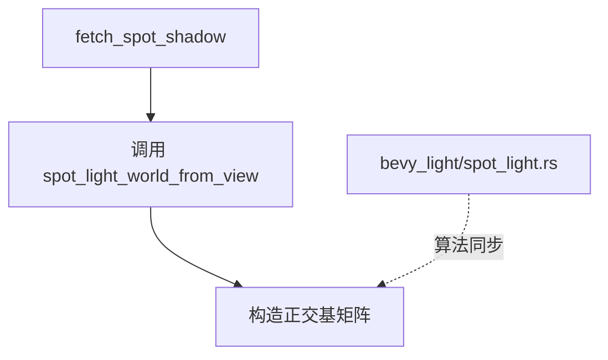

+++
title = "#20050 Split out spot_light_world_from_view into a function in shadows.wgsl"
date = "2025-07-09T00:00:00"
draft = false
template = "pull_request_page.html"
in_search_index = false

[extra]
current_language = "zh-cn"
available_languages = {"en" = { name = "English", url = "/pull_request/bevy/2025-07/pr-20050-en-20250709" }, "zh-cn" = { name = "中文", url = "/pull_request/bevy/2025-07/pr-20050-zh-cn-20250709" }}
labels = ["D-Trivial", "A-Rendering"]
+++

## Title: Split out spot_light_world_from_view into a function in shadows.wgsl

## Basic Information
- **Title**: Split out spot_light_world_from_view into a function in shadows.wgsl
- **PR Link**: https://github.com/bevyengine/bevy/pull/20050
- **Author**: atlv24
- **Status**: MERGED
- **Labels**: D-Trivial, A-Rendering, S-Needs-Review
- **Created**: 2025-07-09T02:53:47Z
- **Merged**: 2025-07-09T06:29:14Z
- **Merged By**: superdump

## Description Translation
### 目标
- 提高代码可读性

### 解决方案
- 将功能拆分为独立函数

### 测试
- 聚光灯示例正常工作

## The Story of This Pull Request

### 问题背景
在聚光灯阴影计算中，`shadows.wgsl`文件内的`fetch_spot_shadow`函数直接内联实现了正交基矩阵的构造逻辑。这种实现方式存在两个主要问题：首先，内联的矩阵构造代码较长且包含条件分支，降低了主函数的可读性；其次，该矩阵构造需要与Rust端的`spot_light_view_matrix`实现保持严格一致，但两者物理分离增加了维护风险。

### 解决方案
通过将正交基矩阵构造逻辑提取为独立函数`spot_light_world_from_view`来重构代码。这个方案选择基于几个关键考虑：
1. 功能隔离：矩阵构造是独立子任务，适合封装
2. 一致性保证：显式声明与`bevy_light/spot_light.rs`的对应关系
3. 维护性：集中处理核心算法，避免多位置修改

### 实现细节
重构保留了原始算法完全不变，只是改变了代码组织方式。关键点包括：
1. 函数签名设计：输入为前向向量`fwd: vec3<f32>`，输出为`mat3x3<f32>`
2. 算法一致性：精确复制`glam::Vec3::any_orthonormal_pair`的实现
3. 手性处理：添加`flip_z`确保坐标系方向匹配
4. 防御性注释：明确说明与Rust实现的同步要求

### 技术影响
1. **可读性提升**：`fetch_spot_shadow`函数长度减少约40%，主逻辑更清晰
2. **维护性增强**：矩阵构造逻辑现在有独立作用域和明确文档
3. **一致性保障**：通过代码注释建立与Rust实现的显式链接
4. **零性能开销**：WGSL函数内联机制保证运行时无额外开销

### 验证方法
通过运行聚光灯示例验证阴影渲染结果未发生变化，确认重构未引入行为变更。这种验证对图形编程尤其重要，因为视觉输出是最直接的回归检测手段。

## Visual Representation



## Key Files Changed

### crates/bevy_pbr/src/render/shadows.wgsl
**变更说明**：将聚光灯的正交基矩阵构造逻辑提取为独立函数，提升代码可读性和可维护性。

**关键代码变更**：
```wgsl
// 新增函数 (After)
fn spot_light_world_from_view(fwd: vec3<f32>) -> mat3x3<f32> {
    var sign = -1.0;
    if (fwd.z >= 0.0) {
        sign = 1.0;
    }
    let a = -1.0 / (fwd.z + sign);
    let b = fwd.x * fwd.y * a;
    let up_dir = vec3<f32>(1.0 + sign * fwd.x * fwd.x * a, sign * b, -sign * fwd.x);
    let right_dir = vec3<f32>(-b, -sign - fwd.y * fwd.y * a, fwd.y);
    return mat3x3<f32>(right_dir, up_dir, fwd);
}

// 原调用点重构 (After)
let light_inv_rot = spot_light_world_from_view(fwd);

// 原内联实现 (Before)
var sign = -1.0;
if (fwd.z >= 0.0) {
    sign = 1.0;
}
let a = -1.0 / (fwd.z + sign);
let b = fwd.x * fwd.y * a;
let up_dir = vec3<f32>(1.0 + sign * fwd.x * fwd.x * a, sign * b, -sign * fwd.x);
let right_dir = vec3<f32>(-b, -sign - fwd.y * fwd.y * a, fwd.y);
let light_inv_rot = mat3x3<f32>(right_dir, up_dir, fwd);
```

## Further Reading
1. [WGSL 函数规范](https://www.w3.org/TR/WGSL/#function-declaration)
2. [正交基构造方法](https://graphics.pixar.com/library/OrthonormalB/paper.pdf)
3. [Bevy 光照系统文档](https://bevyengine.org/learn/book/getting-started/resources/)