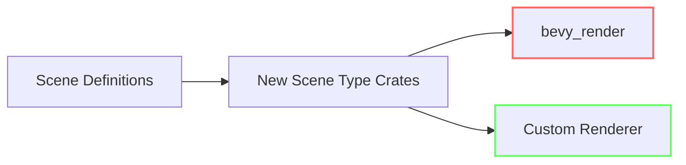

+++
title = "#20051 Add a release note for scene types refactor"
date = "2025-07-11T00:00:00"
draft = false
template = "pull_request_page.html"
in_search_index = true

[taxonomies]
list_display = ["show"]

[extra]
current_language = "en"
available_languages = {"en" = { name = "English", url = "/pull_request/bevy/2025-07/pr-20051-en-20250711" }, "zh-cn" = { name = "中文", url = "/pull_request/bevy/2025-07/pr-20051-zh-cn-20250711" }}
labels = ["A-Rendering"]
+++

## Add a release note for scene types refactor

### Basic Information
- **Title**: Add a release note for scene types refactor
- **PR Link**: https://github.com/bevyengine/bevy/pull/20051
- **Author**: atlv24
- **Status**: MERGED
- **Labels**: A-Rendering, S-Ready-For-Final-Review
- **Created**: 2025-07-09T04:18:42Z
- **Merged**: 2025-07-11T07:57:09Z
- **Merged By**: superdump

### Description Translation
Its really barebones but I'm not sure what else to write.

### The Story of This Pull Request

This PR adds release notes for a significant architectural change in Bevy's scene system. The core problem addressed was the tight coupling between scene definitions and Bevy's renderer implementation. Previously, defining scenes containing cameras, lights, or meshes required a dependency on `bevy_render`, even for projects using custom renderers. This created unnecessary bloat and limited flexibility for alternative rendering solutions.

The solution involved a series of foundational PRs (#19997, #19991, #20000, #19949, #19943, #19953) that decoupled scene types from the renderer implementation. These changes moved scene-relevant components into separate crates with clean abstraction boundaries. The key technical approach was:

1. Establishing trait-based interfaces for renderable components
2. Moving scene serialization/deserialization logic into renderer-agnostic crates
3. Maintaining backward compatibility through type aliases
4. Creating explicit extension points for renderer-specific functionality

The implementation required careful coordination of multiple changes across the codebase. For example, camera components were moved from `bevy_render` to `bevy_core_pipeline` with clear trait boundaries:

```rust
// Before: Camera was defined in bevy_render
pub struct Camera {
    // renderer-specific fields
}

// After: Moved to core pipeline with renderer-agnostic traits
pub trait CameraProjection {
    fn get_projection_matrix(&self) -> Mat4;
}

pub struct Camera {
    projection: Box<dyn CameraProjection>,
    // renderer-agnostic fields
}
```

This architectural shift enables significant benefits:
- Custom renderers can now implement the trait interfaces without modifying scene definitions
- Projects using scenes without rendering no longer pay the dependency cost of `bevy_render`
- Existing scenes remain compatible across different renderer implementations
- Cleaner separation of concerns in the codebase

The release note serves as documentation for this architectural improvement, signaling to users that they can now define scenes containing renderable components without being locked into Bevy's default renderer implementation.

### Visual Representation



### Key Files Changed

1. `release-content/release-notes/scene-type-crates.md`  
   Added documentation for the scene type refactoring. The file summarizes the change and lists all relevant implementation PRs.

```markdown
---
title: Define scenes without depending on bevy_render
authors: ["@atlv24"]
pull_requests: [19997, 19991, 20000, 19949, 19943, 19953]
---

It is now possible to use cameras, lights, and meshes without depending on the Bevy renderer. This makes it possible for 3rd party custom renderers to be drop-in replacements for rendering existing scenes.
```

### Further Reading
1. [Bevy ECS documentation](https://bevyengine.org/learn/book/ecs/) - Understanding Bevy's Entity Component System
2. [Bevy Scene System](https://github.com/bevyengine/bevy/tree/main/crates/bevy_scene) - Official scene system implementation
3. [Trait-based Architecture Patterns](https://rust-lang.github.io/api-guidelines/flexibility.html) - Rust API guidelines on trait design