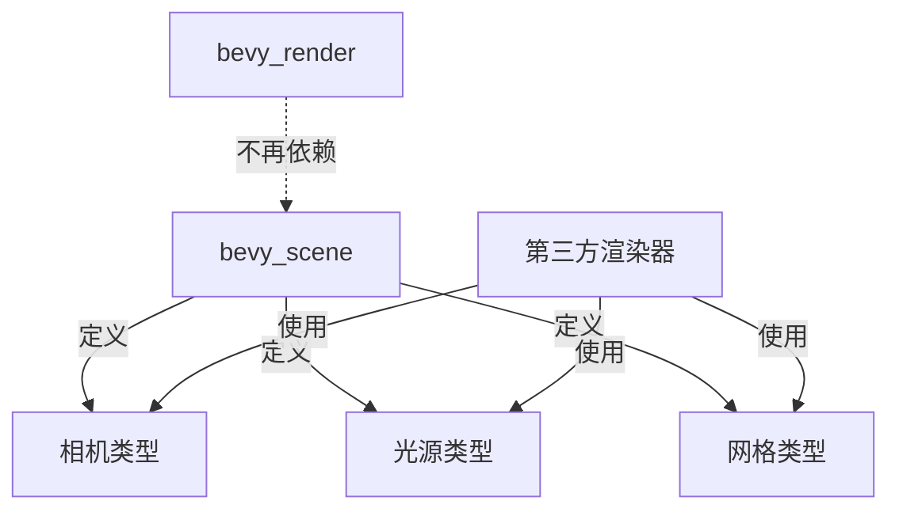

+++
title = "#20051 Add a release note for scene types refactor"
date = "2025-07-11T00:00:00"
draft = false
template = "pull_request_page.html"
in_search_index = false

[extra]
current_language = "zh-cn"
available_languages = {"en" = { name = "English", url = "/pull_request/bevy/2025-07/pr-20051-en-20250711" }, "zh-cn" = { name = "中文", url = "/pull_request/bevy/2025-07/pr-20051-zh-cn-20250711" }}
+++

# 添加场景类型重构的发布说明

## 基础信息
- **标题**: Add a release note for scene types refactor
- **PR链接**: https://github.com/bevyengine/bevy/pull/20051
- **作者**: atlv24
- **状态**: 已合并
- **标签**: A-Rendering, S-Ready-For-Final-Review
- **创建时间**: 2025-07-09T04:18:42Z
- **合并时间**: 2025-07-11T07:57:09Z
- **合并者**: superdump

## 描述翻译
该PR非常基础，但我不确定还需要写些什么。

## PR内容分析

### 背景与问题
在Bevy引擎中，场景(scene)相关的核心类型（如相机、光源和网格）原本与渲染器模块`bevy_render`存在强耦合。这种架构限制了第三方渲染器的集成能力——任何自定义渲染方案都需要完整依赖Bevy的渲染器实现，导致代码冗余和兼容性问题。

### 解决方案
通过一系列重构PR（#19997, #19991, #20000, #19949, #19943, #19953），核心场景类型被解耦并移至独立模块。主要变更包括：
1. 将相机、光源、网格等类型迁移到`bevy_scene`等基础模块
2. 创建明确的抽象层分离场景定义与渲染实现
3. 保持原有API兼容性，避免破坏现有用户代码

### 技术影响
这项重构实现了：
1. **渲染器无关性**：第三方渲染器现在可以直接使用标准场景定义
2. **依赖优化**：非渲染相关项目可移除对`bevy_render`的依赖
3. **架构清晰化**：明确区分场景描述与渲染实现的责任边界

### 发布说明的必要性
虽然代码变更已通过其他PR完成，但需要专门的发布说明向用户传达此架构变更的重要性。该说明帮助用户理解：
- 如何利用新架构集成自定义渲染器
- 依赖关系的潜在变化
- 向后兼容性保证

## 可视化关系



## 关键文件变更

### 新增发布说明文档
路径: `release-content/release-notes/scene-type-crates.md`

```markdown
---
title: Define scenes without depending on bevy_render
authors: ["@atlv24"]
pull_requests: [19997, 19991, 20000, 19949, 19943, 19953]
---

It is now possible to use cameras, lights, and meshes without depending on the Bevy renderer. This makes it possible for 3rd party custom renderers to be drop-in replacements for rendering existing scenes.
```

变更要点：
1. 创建新文档记录场景类型解耦的功能
2. 通过`pull_requests`字段关联所有相关技术PR
3. 明确说明用户现在可以不依赖`bevy_render`使用核心场景元素
4. 强调对第三方渲染器的支持价值

## 延伸阅读
1. [Bevy场景系统文档](https://bevyengine.org/learn/book/getting-started/scene/)
2. [ECS架构中的组件解耦模式](https://www.gamedeveloper.com/programming/component-based-entity-systems)
3. [渲染抽象层设计原则](https://zeux.io/2020/02/27/writing-an-efficient-vulkan-renderer/)