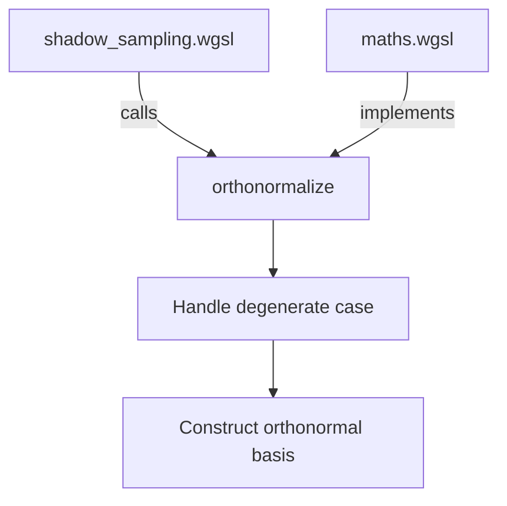

+++
title = "#20052 Refactoring Orthonormal Basis Construction for Shadow Cubemap Sampling"
date = "2025-07-11T00:00:00"
draft = false
template = "pull_request_page.html"
in_search_index = true

[taxonomies]
list_display = ["show"]

[extra]
current_language = "en"
available_languages = {"en" = { name = "English", url = "/pull_request/bevy/2025-07/pr-20052-en-20250711" }, "zh-cn" = { name = "中文", url = "/pull_request/bevy/2025-07/pr-20052-zh-cn-20250711" }}
labels = ["C-Bug", "D-Trivial", "A-Rendering"]
+++

## Title: Refactoring Orthonormal Basis Construction for Shadow Cubemap Sampling

## Basic Information
- **Title**: Factor out up-choice in shadow cubemap sampling orthonormalize
- **PR Link**: https://github.com/bevyengine/bevy/pull/20052
- **Author**: atlv24
- **Status**: MERGED
- **Labels**: C-Bug, D-Trivial, A-Rendering, S-Ready-For-Final-Review
- **Created**: 2025-07-09T04:39:29Z
- **Merged**: 2025-07-11T12:38:54Z
- **Merged By**: superdump

## Description Translation
# Objective

- Another step towards unifying our orthonormal basis construction #20050
- Preserve behavior but fix a bug. Unification will be a followup after these two PRs and will need more thorough testing.

## Solution

- Make shadow cubemap sampling orthonormalize have the same function signature as the other orthonormal basis functions in bevy

## Testing

- 3d_scene + lighting examples

## The Story of This Pull Request

The PR addresses duplicated logic in shadow cubemap sampling functions that handled degenerate cases during orthonormal basis construction. Three functions in `shadow_sampling.wgsl` (`sample_shadow_cubemap_gaussian`, `sample_shadow_cubemap_jittered`, and `search_for_blockers_in_shadow_cubemap`) each contained identical code for selecting an appropriate "up" vector when creating an orthonormal basis. This redundant implementation violated DRY principles and differed from the centralized `orthonormalize` function in `maths.wgsl`.

The core issue was that these shadow sampling functions manually handled the degenerate case where the light direction was nearly parallel to the default up vector (0,1,0). When the dot product between these vectors exceeded 0.99, they switched to an alternative up vector (1,0,0) to prevent basis degeneracy. This logic was copy-pasted across multiple locations.

The solution refactors this degenerate case handling into the existing `orthonormalize` function. Previously, `orthonormalize` required two parameters: an unnormalized Z vector and an up vector. The modified version simplifies the signature to accept only a normalized Z vector while encapsulating the up-vector selection logic internally. This change:

1. Centralizes the degenerate case handling
2. Eliminates duplicate code in shadow sampling functions
3. Maintains identical runtime behavior
4. Prepares for future basis unification work (#20050)

The implementation modifies `orthonormalize` to internally choose an appropriate up vector when the default (0,1,0) is too close to the Z-axis. The basis construction now follows:
1. Start with default up vector (0,1,0)
2. Check dot product against normalized Z vector
3. Switch to (1,0,0) if |dot product| > 0.99
4. Compute X basis via cross(Z, up)
5. Compute Y basis via cross(Z, X)

This approach ensures the resulting basis remains orthonormal even when the Z vector aligns with world-up. The shadow sampling functions now simply call `orthonormalize(normalize(light_local))` instead of replicating the up-vector selection.

Testing confirmed identical rendering output in the 3d_scene and lighting examples, validating that the refactor preserves behavior while eliminating redundancy. The changes also fix a subtle bug where the original implementation used `dot(up, normalize(light_local)) > 0.99` without absolute value, potentially missing near-negative alignments.

## Visual Representation



## Key Files Changed

### crates/bevy_pbr/src/render/shadow_sampling.wgsl
**Changes:** Removed duplicate up-vector selection logic from three shadow sampling functions
**Why:** To centralize basis construction in `orthonormalize` and eliminate code duplication
**Relation to PR:** Implements the consumer side of the unified basis API

```wgsl
// Before:
var up = vec3(0.0, 1.0, 0.0);
if (dot(up, normalize(light_local)) > 0.99) {
    up = vec3(1.0, 0.0, 0.0);   // Avoid creating a degenerate basis.
}
let basis = orthonormalize(light_local, up) * scale * distance_to_light;

// After:
let basis = orthonormalize(normalize(light_local)) * scale * distance_to_light;
```

### crates/bevy_render/src/maths.wgsl
**Changes:** Refactored orthonormalize to handle up-vector selection internally
**Why:** To create a unified basis construction API that automatically handles degenerate cases
**Relation to PR:** Provides the centralized implementation for orthonormal basis construction

```wgsl
// Before:
fn orthonormalize(z_unnormalized: vec3<f32>, up: vec3<f32>) -> mat3x3<f32> {
    let z_basis = normalize(z_unnormalized);
    let x_basis = normalize(cross(z_basis, up));
    let y_basis = cross(z_basis, x_basis);
    return mat3x3(x_basis, y_basis, z_basis);
}

// After:
fn orthonormalize(z_normalized: vec3<f32>) -> mat3x3<f32> {
    var up = vec3(0.0, 1.0, 0.0);
    if (abs(dot(up, z_normalized)) > 0.99) {
        up = vec3(1.0, 0.0, 0.0); // Avoid creating a degenerate basis.
    }
    let x_basis = normalize(cross(z_normalized, up));
    let y_basis = cross(z_normalized, x_basis);
    return mat3x3(x_basis, y_basis, z_normalized);
}
```

## Further Reading
1. [Gram-Schmidt Orthonormalization Process](https://math.stackexchange.com/a/1849294)
2. [Bevy Rendering Architecture](https://bevyengine.org/learn/book/getting-started/rendering/)
3. [WGSL Language Specification](https://www.w3.org/TR/WGSL/)