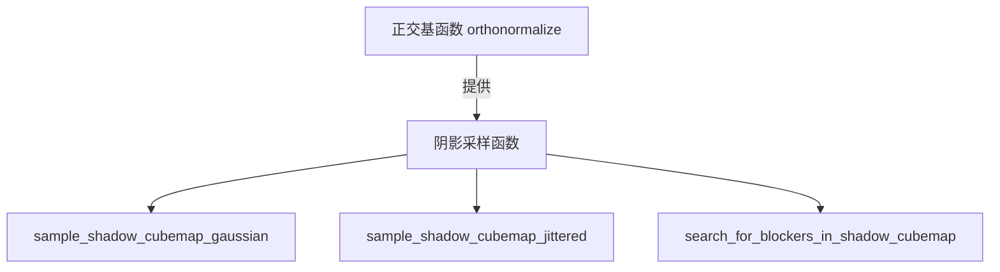

+++
title = "#20052 Factor out up-choice in shadow cubemap sampling orthonormalize"
date = "2025-07-11T00:00:00"
draft = false
template = "pull_request_page.html"
in_search_index = false

[extra]
current_language = "zh-cn"
available_languages = {"en" = { name = "English", url = "/pull_request/bevy/2025-07/pr-20052-en-20250711" }, "zh-cn" = { name = "中文", url = "/pull_request/bevy/2025-07/pr-20052-zh-cn-20250711" }}
+++

## 技术报告：PR #20052 分析

### 基础信息
- **标题**: Factor out up-choice in shadow cubemap sampling orthonormalize
- **PR链接**: https://github.com/bevyengine/bevy/pull/20052
- **作者**: atlv24
- **状态**: 已合并
- **标签**: C-Bug, D-Trivial, A-Rendering, S-Ready-For-Final-Review
- **创建时间**: 2025-07-09T04:39:29Z
- **合并时间**: 2025-07-11T12:38:54Z
- **合并者**: superdump

### 描述翻译
**目标**
- 统一正交基构造的另一步骤 #20050
- 保留行为但修复错误。统一将在后续两个PR后进行，需要更彻底的测试。

**解决方案**
- 让阴影立方体贴图采样的正交化函数与Bevy中其他正交基函数具有相同的函数签名

**测试**
- 3d_scene + lighting 示例

---

### PR技术分析

#### 问题背景
在阴影立方体贴图采样中，多个函数（`sample_shadow_cubemap_gaussian`, `sample_shadow_cubemap_jittered`, `search_for_blockers_in_shadow_cubemap`）重复实现了相同的正交基构造逻辑。具体表现为：
1. 每个函数都手动选择上方向向量(up vector)
2. 当法线接近垂直时，需要特殊处理避免退化基(degenerate basis)
3. 存在代码冗余，且原实现中`orthonormalize`函数需要两个参数，而调用方需要额外处理

这种重复代码违反了DRY原则，增加了维护成本，且存在潜在错误风险。

#### 解决方案
核心思路是将上方向向量的选择逻辑封装到`orthonormalize`函数内部：
1. 重构`orthonormalize`函数，使其仅需一个参数（归一化的Z向量）
2. 在`orthonormalize`内部处理退化基的特殊情况
3. 移除采样函数中的重复逻辑

#### 实现细节
**1. 正交基函数重构 (maths.wgsl)**
```wgsl
// 重构前
fn orthonormalize(z_unnormalized: vec3<f32>, up: vec3<f32>) -> mat3x3<f32> {
    let z_basis = normalize(z_unnormalized);
    let x_basis = normalize(cross(z_basis, up));
    let y_basis = cross(z_basis, x_basis);
    return mat3x3(x_basis, y_basis, z_basis);
}

// 重构后
fn orthonormalize(z_normalized: vec3<f32>) -> mat3x3<f32> {
    var up = vec3(0.0, 1.0, 0.0);
    if (abs(dot(up, z_normalized)) > 0.99) {
        up = vec3(1.0, 0.0, 0.0); // 避免创建退化基
    }
    let x_basis = normalize(cross(z_normalized, up));
    let y_basis = cross(z_normalized, x_basis);
    return mat3x3(x_basis, y_basis, z_normalized);
}
```
关键改进：
- 参数从`(z_unnormalized, up)`简化为`(z_normalized)`
- 内部自动处理退化基情况（当法线接近垂直时切换上方向）
- 明确要求输入向量已归一化（函数名`z_normalized`体现）

**2. 采样函数简化 (shadow_sampling.wgsl)**
```wgsl
// 重构前（以sample_shadow_cubemap_gaussian为例）
var up = vec3(0.0, 1.0, 0.0);
if (dot(up, normalize(light_local)) > 0.99) {
    up = vec3(1.0, 0.0, 0.0); 
}
let basis = orthonormalize(light_local, up) * scale * distance_to_light;

// 重构后
let basis = orthonormalize(normalize(light_local)) * scale * distance_to_light;
```
优化效果：
- 移除15行重复代码（3处×5行）
- 调用接口与Bevy其他正交基函数保持一致
- 显式要求输入向量归一化（增加`normalize()`调用）

#### 技术洞察
1. **退化基处理**：当表面法线接近(0,1,0)时，叉积(cross product)会失效。新实现通过切换上方向到(1,0,0)避免此问题，使用绝对值和0.99阈值确保稳定性。

2. **性能考量**：虽然移除了重复代码，但增加了`normalize()`调用（原在`orthonormalize`内部）。不过：
   - 归一化操作在GPU上成本较低
   - 显式归一化提高代码可读性
   - 实际性能影响需基准测试验证

3. **API设计**：新接口更符合Bevy的数学工具函数设计规范，为后续统一正交基构造（#20050）奠定基础。

#### 影响评估
- **错误修复**：原实现中`dot(up, ...) > 0.99`未取绝对值，当法线为(0,-1,0)时可能错误进入退化分支。新实现使用`abs()`全面覆盖
- **代码质量**：减少15行冗余代码，提高可维护性
- **兼容性**：保持原有行为不变，通过3d_scene + lighting示例验证

### 关键文件变更

#### `crates/bevy_render/src/maths.wgsl` (+9/-7)
```wgsl
// 变更前
fn orthonormalize(z_unnormalized: vec3<f32>, up: vec3<f32>) -> mat3x3<f32> {
    let z_basis = normalize(z_unnormalized);
    let x_basis = normalize(cross(z_basis, up));
    let y_basis = cross(z_basis, x_basis);
    return mat3x3(x_basis, y_basis, z_basis);
}

// 变更后
fn orthonormalize(z_normalized: vec3<f32>) -> mat3x3<f32> {
    var up = vec3(0.0, 1.0, 0.0);
    if (abs(dot(up, z_normalized)) > 0.99) {
        up = vec3(1.0, 0.0, 0.0);
    }
    let x_basis = normalize(cross(z_normalized, up));
    let y_basis = cross(z_normalized, x_basis);
    return mat3x3(x_basis, y_basis, z_normalized);
}
```

#### `crates/bevy_pbr/src/render/shadow_sampling.wgsl` (+3/-15)
```wgsl
// 典型变更示例
// 变更前
var up = vec3(0.0, 1.0, 0.0);
if (dot(up, normalize(light_local)) > 0.99) {
    up = vec3(1.0, 0.0, 0.0);
}
let basis = orthonormalize(light_local, up) * scale * distance_to_light;

// 变更后
let basis = orthonormalize(normalize(light_local)) * scale * distance_to_light;
```

### 组件关系图


### 延伸阅读
1. [Gram-Schmidt正交化过程](https://math.stackexchange.com/a/1849294)
2. [Bevy渲染管线概述](https://bevyengine.org/learn/book/getting-started/rendering/)
3. [WGSL向量运算规范](https://www.w3.org/TR/WGSL/#vector-and-matrix-operations)