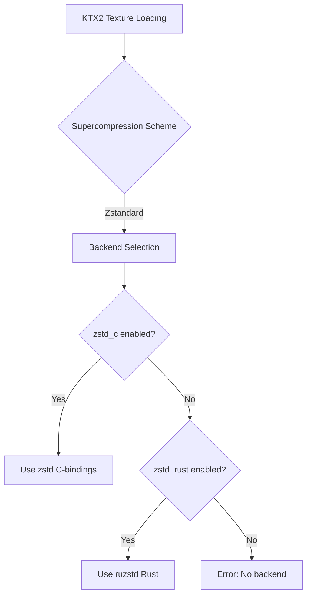

+++
title = "#20053 Add zstd release note"
date = "2025-07-14T00:00:00"
draft = false
template = "pull_request_page.html"
in_search_index = true

[taxonomies]
list_display = ["show"]

[extra]
current_language = "en"
available_languages = {"en" = { name = "English", url = "/pull_request/bevy/2025-07/pr-20053-en-20250714" }, "zh-cn" = { name = "中文", url = "/pull_request/bevy/2025-07/pr-20053-zh-cn-20250714" }}
labels = ["A-Rendering"]
+++

## Title  
Add zstd release note and improve backend selection logic

## Basic Information  
- **Title**: Add zstd release note  
- **PR Link**: https://github.com/bevyengine/bevy/pull/20053  
- **Author**: atlv24  
- **Status**: MERGED  
- **Labels**: A-Rendering, S-Ready-For-Final-Review  
- **Created**: 2025-07-09T05:11:02Z  
- **Merged**: 2025-07-14T21:14:14Z  
- **Merged By**: alice-i-cecile  

## Description Translation  
# Objective  

- Add a release note for the new zstd backend.  
- Doing so, I realized it was really cumbersome to enable this feature because we default-enable ruzstd AND make it take precedence if both are enabled. We can improve ux a bit by making the optional feature take precedence when both are enabled. This still doesnt remove the unneeded dependency, but oh well.  

Note: it would be nice to have a way to make zstd_c not do anything when building wasm, but im not sure theres a way to do that, as it seems like it would need negative features.  

## The Story of This Pull Request  

This PR addresses two related but distinct needs: documentation of a new feature and improvement of its usability. The core issue stemmed from Bevy's KTX2 texture decompression implementation, which supports Zstandard compression through two backends - the pure Rust `ruzstd` (default) and the C-bindings-based `zstd_c` (faster but less portable).  

The initial implementation had a usability flaw: when both backends were enabled, the Rust backend (`zstd_rust`) would always take precedence over the faster C backend (`zstd_c`). This forced users to manually disable default features and explicitly select backends, creating unnecessary friction for those wanting to use the faster option.  

The solution modifies the backend selection logic in the KTX2 decompressor. Instead of:  
```rust
#[cfg(feature = "zstd_rust")]
// Use ruzstd

#[cfg(all(feature = "zstd_c", not(feature = "zstd_rust")))]
// Use zstd
```  
We now have:  
```rust
#[cfg(all(feature = "zstd_rust", not(feature = "zstd_c")))]
// Use ruzstd

#[cfg(feature = "zstd_c")]
// Use zstd
```  
This simple conditional swap ensures that when both features are enabled, the faster C backend takes precedence. The change maintains backward compatibility while optimizing for the more performance-sensitive use case.  

Concurrently, the PR adds release documentation explaining:  
1. The 44% performance advantage of the C backend  
2. The feature flag interaction  
3. Workarounds for cargo's lack of mutually exclusive features  
4. Usage examples for `Cargo.toml`  

The author notes a remaining limitation - the inability to completely eliminate the `ruzstd` dependency when using `zstd_c` due to cargo's feature constraints. They also mention potential WASM compatibility concerns, though these remain unresolved in this PR.  

## Visual Representation  



## Key Files Changed  

### 1. `release-content/release-notes/faster-zstd-option.md`  
**Purpose**: Document new zstd backend option and usage patterns  
**Key changes**:  
```markdown
---
title: Faster Zstd decompression option
authors: ["@atlv24", "@brianreavis"]
pull_requests: [19793]
---

There is now an option to use the [zstd](https://crates.io/crates/zstd) c-bindings instead of [ruzstd](https://crates.io/crates/ruzstd).
This is less safe and portable, but can be around 44% faster.

The two features that control which one is used are `zstd_rust` and `zstd_c`.
`zstd_rust` is enabled by default, but `zstd_c` takes precedence if both are enabled.

To enable it, add the feature to the `bevy` entry of your Cargo.toml:

```toml
bevy = { version = "0.17.0", features = ["zstd_c"] }
```

Note: this will still include a dependency on `ruzstd`, because mutually exclusive features are not supported by Cargo.
To remove this dependency, disable default-features, and manually enable any default features you need:

```toml
bevy = { version = "0.17.0", default-features = false, features = [
    "zstd_c",
    "bevy_render", # etc..
] }
```
```

### 2. `crates/bevy_image/src/ktx2.rs`  
**Purpose**: Improve backend selection logic  
**Key changes**:  
```rust
// Before:
#[cfg(feature = "zstd_rust")]
SupercompressionScheme::Zstandard => {
    // ruzstd implementation
}
#[cfg(all(feature = "zstd_c", not(feature = "zstd_rust"))]
SupercompressionScheme::Zstandard => {
    // zstd implementation
}

// After:
#[cfg(all(feature = "zstd_rust", not(feature = "zstd_c")))]
SupercompressionScheme::Zstandard => {
    // ruzstd implementation
}
#[cfg(feature = "zstd_c")]
SupercompressionScheme::Zstandard => {
    // zstd implementation
}
```

## Further Reading  
1. [Zstandard RFC](https://github.com/bevyengine/rfcs/pull/44)  
2. [Cargo Feature Documentation](https://doc.rust-lang.org/cargo/reference/features.html)  
3. [KTX2 Specification](https://github.khronos.org/KTX-Specification/)  
4. [Zstd Rust vs C Benchmarks](https://github.com/gyscos/zstd-rs/tree/main/bench)