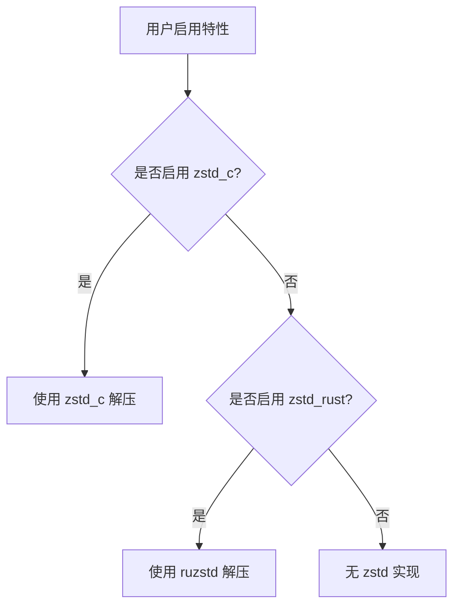

+++
title = "#20053 Add zstd release note"
date = "2025-07-14T00:00:00"
draft = false
template = "pull_request_page.html"
in_search_index = false

[extra]
current_language = "zh-cn"
available_languages = {"en" = { name = "English", url = "/pull_request/bevy/2025-07/pr-20053-en-20250714" }, "zh-cn" = { name = "中文", url = "/pull_request/bevy/2025-07/pr-20053-zh-cn-20250714" }}
labels = ["A-Rendering"]
+++

# PR 分析报告：Add zstd release note

## Basic Information
- **Title**: Add zstd release note
- **PR Link**: https://github.com/bevyengine/bevy/pull/20053
- **Author**: atlv24
- **Status**: MERGED
- **Labels**: A-Rendering, S-Ready-For-Final-Review
- **Created**: 2025-07-09T05:11:02Z
- **Merged**: 2025-07-14T21:14:14Z
- **Merged By**: alice-i-cecile

## Description Translation
### 目标
- 为新的 zstd 后端添加发布说明
- 在此过程中，发现启用此功能非常繁琐，因为我们默认启用了 ruzstd 且当两者都启用时优先使用它。我们可以通过让可选功能在两者都启用时具有优先权来稍微改进用户体验。这仍然无法移除不需要的依赖，但总比没有好

注意：最好能有一种方法让 zstd_c 在构建 wasm 时不执行任何操作，但我不确定是否有办法实现，因为这似乎需要负特性(negative features)

---

## The Story of This Pull Request

### 问题背景
在 Bevy 引擎处理 KTX2 纹理格式时，需要支持 zstd 超级压缩方案的解压。现有实现提供了两种后端选择：
1. **ruzstd**：纯 Rust 实现，默认启用，安全且可移植
2. **zstd_c**：基于 C 绑定的实现，性能更好但可移植性和安全性较低

用户启用 `zstd_c` 功能时面临两个主要问题：
1. 即使明确启用了 `zstd_c`，如果未禁用默认的 `zstd_rust`，引擎仍会使用较慢的 ruzstd 实现
2. 缺乏明确的文档说明如何正确启用更快的 zstd_c 后端

### 解决方案
PR 采用双管齐下的方法解决这些问题：
1. **添加发布说明**：创建专门的发布说明文档，明确解释两种 zstd 后端的区别和启用方式
2. **调整特性优先级**：修改特性检测逻辑，让 `zstd_c` 在两者同时启用时优先于 `zstd_rust`

### 关键技术实现
核心修改位于 KTX2 解压处理逻辑中，通过调整 `cfg` 条件编译属性改变特性优先级：

```rust
// 修改前
#[cfg(feature = "zstd_rust")]
// 使用 ruzstd 的实现

#[cfg(all(feature = "zstd_c", not(feature = "zstd_rust")))]
// 使用 zstd_c 的实现

// 修改后
#[cfg(all(feature = "zstd_rust", not(feature = "zstd_c")))]
// 使用 ruzstd 的实现

#[cfg(feature = "zstd_c")]
// 使用 zstd_c 的实现
```

这个改动确保：
1. 当仅启用 `zstd_rust` 时：使用 Rust 实现
2. 当启用 `zstd_c` 时：无论 `zstd_rust` 是否启用，都优先使用 C 绑定实现
3. 条件编译属性保持互斥，避免逻辑冲突

### 技术权衡
1. **特性优先级调整**：
   - 优点：简化用户配置，只需启用 `zstd_c` 即可获得性能提升
   - 限制：无法完全移除 ruzstd 依赖（Cargo 特性系统限制）
   - 变通方案：文档中说明如何通过禁用默认特性完全移除 ruzstd

2. **WASM 兼容性**：
   - 作者注意到 zstd_c 在 WASM 环境可能存在问题
   - 当前方案未解决，因为需要 Cargo 支持负特性(negative features)
   - 暂时接受此限制，作为已知问题记录

### 实际影响
1. **性能提升**：用户可轻松启用性能提升约 44% 的解压后端
2. **配置简化**：用户不再需要手动禁用 `zstd_rust` 来启用 `zstd_c`
3. **文档完善**：提供明确的配置示例和注意事项

### 未来改进方向
1. WASM 环境的条件编译处理
2. 探索完全移除不必要依赖的方法
3. 特性系统优化（如果 Cargo 支持负特性）

## Visual Representation



## Key Files Changed

### 1. 新增发布说明文档
**文件**: `release-content/release-notes/faster-zstd-option.md` (+27/-0)  
**目的**: 提供新特性的正式文档和配置指南

```markdown
---
title: Faster Zstd decompression option
authors: ["@atlv24", "@brianreavis"]
pull_requests: [19793]
---

There is now an option to use the [zstd](https://crates.io/crates/zstd) c-bindings instead of [ruzstd](https://crates.io/crates/ruzstd).
This is less safe and portable, but can be around 44% faster.

The two features that control which one is used are `zstd_rust` and `zstd_c`.
`zstd_rust` is enabled by default, but `zstd_c` takes precedence if both are enabled.

To enable it, add the feature to the `bevy` entry of your Cargo.toml:

```toml
bevy = { version = "0.17.0", features = ["zstd_c"] }
```

Note: this will still include a dependency on `ruzstd`, because mutually exclusive features are not supported by Cargo.
To remove this dependency, disable default-features, and manually enable any default features you need:

```toml
bevy = { version = "0.17.0", default-features = false, features = [
    "zstd_c",
    "bevy_render", # etc..
] }
```
```

### 2. 修改特性检测逻辑
**文件**: `crates/bevy_image/src/ktx2.rs` (+2/-2)  
**目的**: 调整 zstd 后端优先级逻辑

```rust
// 修改前:
#[cfg(feature = "zstd_rust")]
SupercompressionScheme::Zstandard => {
    // ruzstd 实现
}

#[cfg(all(feature = "zstd_c", not(feature = "zstd_rust")))]
SupercompressionScheme::Zstandard => {
    // zstd_c 实现
}

// 修改后:
#[cfg(all(feature = "zstd_rust", not(feature = "zstd_c")))]
SupercompressionScheme::Zstandard => {
    // ruzstd 实现
}

#[cfg(feature = "zstd_c")]
SupercompressionScheme::Zstandard => {
    // zstd_c 实现
}
```

**关键变更**:
1. 将 `zstd_rust` 的条件增加 `not(feature = "zstd_c")` 约束
2. 简化 `zstd_c` 的条件为单独特性检测
3. 保持相同的错误处理结构

## Further Reading
1. [zstd crate 文档](https://docs.rs/zstd/latest/zstd/) - Rust 的 zstd 绑定
2. [ruzstd crate 文档](https://docs.rs/ruzstd/latest/ruzstd/) - 纯 Rust zstd 实现
3. [Cargo 特性文档](https://doc.rust-lang.org/cargo/reference/features.html) - 官方特性系统说明
4. [KTX2 格式规范](https://github.khronos.org/KTX-Specification/) - 纹理压缩标准细节