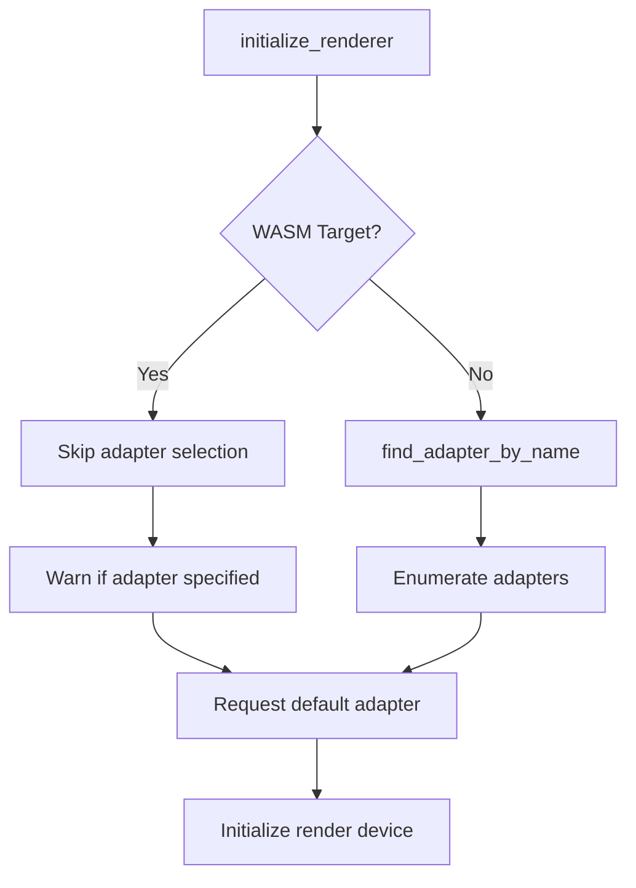

+++
title = "#20054 Fix adapter forcing breaking wasm builds"
date = "2025-07-11T00:00:00"
draft = false
template = "pull_request_page.html"
in_search_index = true

[taxonomies]
list_display = ["show"]

[extra]
current_language = "en"
available_languages = {"en" = { name = "English", url = "/pull_request/bevy/2025-07/pr-20054-en-20250711" }, "zh-cn" = { name = "中文", url = "/pull_request/bevy/2025-07/pr-20054-zh-cn-20250711" }}
labels = ["A-Rendering"]
+++

## Fix Adapter Forcing Breaking WASM Builds

### Basic Information
- **Title**: Fix adapter forcing breaking wasm builds
- **PR Link**: https://github.com/bevyengine/bevy/pull/20054
- **Author**: atlv24
- **Status**: MERGED
- **Labels**: A-Rendering, S-Ready-For-Final-Review
- **Created**: 2025-07-09T05:21:57Z
- **Merged**: 2025-07-11T12:38:54Z
- **Merged By**: superdump

### Description Translation
# Objective

- Appease @mockersf 

## Solution

- Gate out enumerate_adapters usage on wasm and warn if `WGPU_FORCE_FALLBACK_ADAPTER` is somehow used.

### The Story of This Pull Request

#### Problem and Context
The core issue stemmed from how Bevy's renderer initialization handled GPU adapter selection on WebAssembly targets. When developers specified a desired adapter name (typically through `WGPU_FORCE_FALLBACK_ADAPTER`), the code attempted to use `wgpu::Instance::enumerate_adapters()`. However, this method isn't supported in WebGPU's WASM implementation. This caused WASM builds to fail with runtime errors when forcing a specific adapter, blocking web deployment scenarios.

#### Solution Approach
The fix required two complementary changes:
1. **Conditional Compilation**: Gate adapter enumeration logic behind `#[cfg(not(target_family = "wasm"))]` to prevent its execution on WASM targets
2. **Fallback Behavior**: Maintain functionality on native platforms while adding warnings for unsupported operations on WASM

#### Implementation Details
The solution restructured the adapter selection flow in `initialize_renderer()`:

```rust
#[cfg(not(target_family = "wasm"))]
let mut selected_adapter = desired_adapter_name.and_then(|adapter_name| {
    find_adapter_by_name(
        instance,
        options,
        request_adapter_options.compatible_surface,
        &adapter_name,
    )
});

#[cfg(target_family = "wasm")]
let mut selected_adapter = None;

#[cfg(target_family = "wasm")]
if desired_adapter_name.is_some() {
    warn!("Choosing an adapter is not supported on wasm.");
}
```

A new helper function `find_adapter_by_name()` was introduced for native platforms:

```rust
#[cfg(not(target_family = "wasm"))]
fn find_adapter_by_name(
    instance: &Instance,
    options: &WgpuSettings,
    compatible_surface: Option<&wgpu::Surface<'_>>,
    adapter_name: &str,
) -> Option<Adapter> {
    for adapter in instance.enumerate_adapters(...) {
        tracing::trace!("Checking adapter: {:?}", adapter.get_info());
        // ... adapter matching logic ...
    }
    None
}
```

Key implementation notes:
1. The WASM path completely skips adapter enumeration
2. A warning logs when adapter selection is attempted on WASM
3. Native functionality remains unchanged with case-insensitive matching
4. Unused `tracing::trace` import was removed since it's only used in conditional code

#### Technical Insights
The implementation demonstrates proper handling of platform-specific WebGPU limitations:
1. **WASM Constraints**: WebGPU's WASM bindings don't support adapter enumeration due to browser security restrictions
2. **Graceful Degradation**: Maintains core functionality while preventing hard failures
3. **Diagnostic Clarity**: Explicit warning helps developers understand platform limitations
4. **Code Hygiene**: Removed unused imports to keep compilation clean

#### Impact
These changes resolve critical WASM build failures while preserving native functionality. Developers can now:
1. Safely use `WGPU_FORCE_FALLBACK_ADAPTER` on native targets
2. Build WASM projects without adapter-related crashes
3. Receive clear warnings about unsupported operations on web

The solution maintains backward compatibility while addressing a platform-specific constraint in WebGPU's implementation.

### Visual Representation



### Key Files Changed

**File**: `crates/bevy_render/src/renderer/mod.rs`

**Changes**: 
1. Added conditional adapter selection logic for WASM vs native
2. Introduced platform-specific `find_adapter_by_name` helper
3. Improved warning diagnostics for unsupported operations

**Code Snippets**:

Before (problematic WASM behavior):
```rust
let mut selected_adapter = None;
if let Some(adapter_name) = &desired_adapter_name {
    debug!("Searching for adapter with name: {}", adapter_name);
    for adapter in instance.enumerate_adapters(...) {
        // ... adapter matching logic ...
    }
} else {
    // ... fallback logic ...
};
```

After (fixed implementation):
```rust
#[cfg(not(target_family = "wasm"))]
let mut selected_adapter = desired_adapter_name.and_then(|adapter_name| {
    find_adapter_by_name( ... )
});

#[cfg(target_family = "wasm")]
let mut selected_adapter = None;

#[cfg(target_family = "wasm")]
if desired_adapter_name.is_some() {
    warn!("Choosing an adapter is not supported on wasm.");
}

if selected_adapter.is_none() {
    // ... fallback logic ...
}
```

### Further Reading
1. [WebGPU WASM Limitations](https://github.com/gfx-rs/wgpu/wiki/WebGPU-Backend-Notes)
2. [Bevy Web Rendering Guide](https://bevyengine.org/learn/book/getting-started/web/)
3. [`wgpu::Instance` Documentation](https://docs.rs/wgpu/latest/wgpu/struct.Instance.html)
4. [Conditional Compilation in Rust](https://doc.rust-lang.org/reference/conditional-compilation.html)