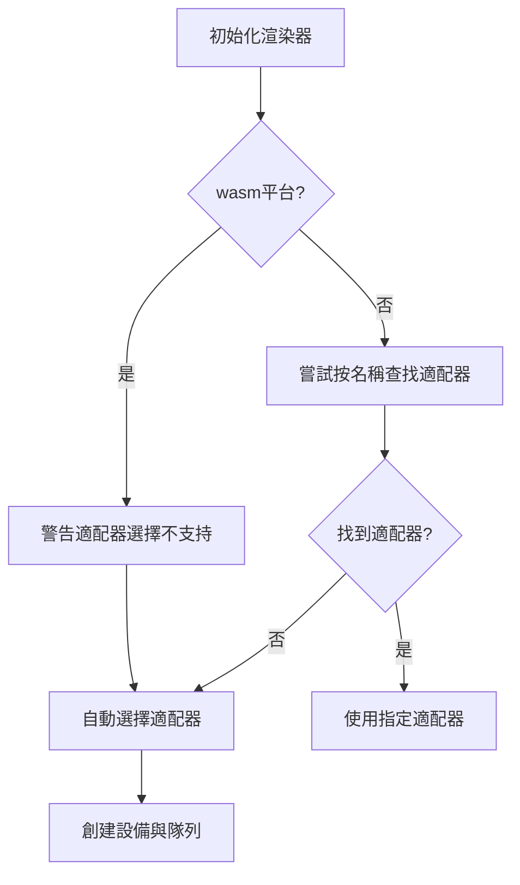

+++
title = "#20054"
date = "2025-07-11T00:00:00"
draft = false
template = "pull_request_page.html"
in_search_index = false

[extra]
current_language = "zh-cn"
available_languages = {"en" = { name = "English", url = "/pull_request/bevy/2025-07/pr-20054-en-20250711" }, "zh-cn" = { name = "中文", url = "/pull_request/bevy/2025-07/pr-20054-zh-cn-20250711" }}
+++

## 基本資訊
- **標題**: Fix adapter forcing breaking wasm builds
- **PR 連結**: https://github.com/bevyengine/bevy/pull/20054
- **作者**: atlv24
- **狀態**: MERGED
- **標籤**: A-Rendering, S-Ready-For-Final-Review
- **建立時間**: 2025-07-09T05:21:57Z
- **合併時間**: 2025-07-11T12:38:54Z
- **合併者**: superdump

## 描述翻譯
### 目標
- 滿足 @mockersf 的需求

### 解決方案
- 在 wasm 平台禁用 enumerate_adapters 的使用，並在 `WGPU_FORCE_FALLBACK_ADAPTER` 被使用時發出警告

## PR 技術分析

### 問題背景與上下文
在 WebAssembly (wasm) 環境下，Bevy 渲染系統嘗試通過名稱強制選擇特定 GPU 適配器時會導致構建失敗。核心問題在於 `enumerate_adapters()` 方法在 wasm 平台不可用。當開發者嘗試在 wasm 環境下通過 `WGPU_FORCE_FALLBACK_ADAPTER` 環境變量強制指定適配器時，會出現以下問題：
1. `enumerate_adapters()` 在 wasm 平台不存在
2. 現有邏輯未考慮 wasm 平台的限制
3. 錯誤處理機制未提供明確的 wasm 平台指導

這導致 wasm 構建流程中斷，影響開發者在瀏覽器環境中使用 Bevy 的能力。

### 解決方案實現
PR 採用平台條件編譯策略重構適配器選擇邏輯：

1. **隔離平台特定邏輯**  
   新增 `find_adapter_by_name` 函數，使用 `#[cfg(not(target_family = "wasm"))]` 確保僅在非 wasm 平台編譯：
   ```rust
   #[cfg(not(target_family = "wasm"))]
   fn find_adapter_by_name(
       instance: &Instance,
       options: &WgpuSettings,
       compatible_surface: Option<&wgpu::Surface<'_>>,
       adapter_name: &str,
   ) -> Option<Adapter> {
       // ... 適配器枚舉與過濾邏輯
   }
   ```

2. **重構適配器選擇流程**  
   將原有單一邏輯拆分為平台專用分支：
   ```rust
   #[cfg(not(target_family = "wasm"))]
   let mut selected_adapter = desired_adapter_name.and_then(|adapter_name| {
       find_adapter_by_name(instance, options, ...)
   });
   
   #[cfg(target_family = "wasm")]
   let mut selected_adapter = None;
   ```

3. **添加 wasm 平台警告**  
   檢測到 wasm 環境嘗試指定適配器時輸出明確警告：
   ```rust
   #[cfg(target_family = "wasm")]
   if desired_adapter_name.is_some() {
       warn!("Choosing an adapter is not supported on wasm.");
   }
   ```

4. **統一後備處理**  
   當指定適配器不存在時，回退到默認適配器選擇邏輯：
   ```rust
   if selected_adapter.is_none() {
       selected_adapter = instance.request_adapter(...).await.ok();
   }
   ```

### 技術決策分析
1. **條件編譯優於運行時檢測**  
   選擇 `#[cfg]` 而非運行時檢查，徹底消除 wasm 平台無效代碼，減少二進制體積

2. **保留非 wasm 功能完整性**  
   非 wasm 平台仍支持完整適配器枚舉功能，保持原有工作流

3. **分級日誌輸出**  
   使用 `warn!` 而非 `error!` 避免中斷 wasm 應用執行，同時提供明確開發指引

4. **錯誤消息優化**  
   保持 GPU_NOT_FOUND_ERROR_MESSAGE 的跨平台一致性，避免平台特定錯誤消息增加維護成本

### 影響與改進
1. **構建穩定性**  
   解決 wasm 構建中斷問題，確保跨平台一致性

2. **開發者體驗**  
   明確警告提示避免 wasm 環境下無效配置嘗試

3. **代碼可維護性**  
   平台差異邏輯集中管理，減少未來維護成本

4. **潛在改進方向**  
   可考慮將適配器選擇抽象為平台特性(trait)，進一步解耦平台實現

## 可視化流程


## 關鍵文件變更
### crates/bevy_render/src/renderer/mod.rs
**變更說明**：重構適配器初始化邏輯，解決 wasm 平台構建問題

**核心修改**：
```rust
// 新增條件編譯的適配器查找函數
#[cfg(not(target_family = "wasm"))]
fn find_adapter_by_name(...) -> Option<Adapter> {
    // 實現適配器枚舉與過濾
}

// 修改後的適配器選擇邏輯
#[cfg(not(target_family = "wasm"))]
let mut selected_adapter = desired_adapter_name.and_then(|adapter_name| {
    find_adapter_by_name(...)
});
#[cfg(target_family = "wasm")]
let mut selected_adapter = None;

// wasm平台警告機制
#[cfg(target_family = "wasm")]
if desired_adapter_name.is_some() {
    warn!("Choosing an adapter is not supported on wasm.");
}

// 統一後備處理
if selected_adapter.is_none() {
    selected_adapter = instance.request_adapter(...).await.ok();
}
```

## 延伸閱讀
1. [WebGPU wasm 限制說明](https://github.com/gfx-rs/wgpu/wiki/Feature-Detection-on-the-Web)
2. [Rust 條件編譯實踐指南](https://doc.rust-lang.org/reference/conditional-compilation.html)
3. [Bevy 跨平台渲染架構](https://bevyengine.org/learn/book/getting-started/setup/#webassembly)