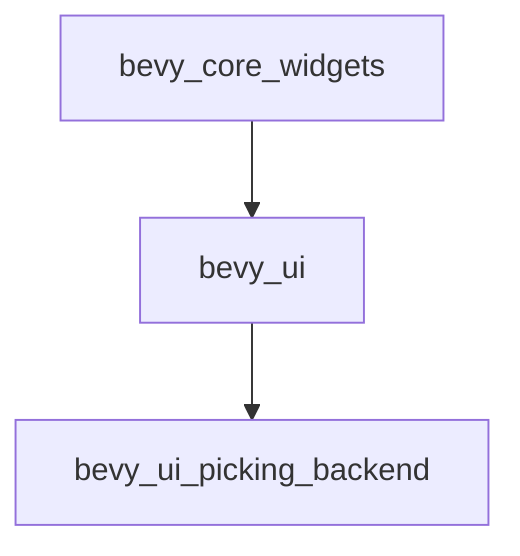

+++
title = "#20055 Fix core widgets unconditionally enabling bevy_ui_picking_backend"
date = "2025-07-14T00:00:00"
draft = false
template = "pull_request_page.html"
in_search_index = true

[taxonomies]
list_display = ["show"]

[extra]
current_language = "en"
available_languages = {"en" = { name = "English", url = "/pull_request/bevy/2025-07/pr-20055-en-20250714" }, "zh-cn" = { name = "中文", url = "/pull_request/bevy/2025-07/pr-20055-zh-cn-20250714" }}
labels = ["C-Dependencies", "A-UI"]
+++

## Technical Analysis: Fixing Unconditional Dependency on `bevy_ui_picking_backend`

### Basic Information
- **Title**: Fix core widgets unconditionally enabling bevy_ui_picking_backend
- **PR Link**: https://github.com/bevyengine/bevy/pull/20055
- **Author**: atlv24
- **Status**: MERGED
- **Labels**: C-Dependencies, A-UI, S-Ready-For-Final-Review
- **Created**: 2025-07-09T05:40:03Z
- **Merged**: 2025-07-14T21:16:58Z
- **Merged By**: alice-i-cecile

### Description Translation
# Objective

- Fixes #19742

## Solution

- Initially I made it an optional feature on bevy_core_widgets and piped it through to bevy_internal, but then I realized that its not actually directly reference in the crate so its safe to just remove it.

### The Story of This Pull Request

**The Problem and Context**  
The core issue (#19742) stemmed from `bevy_core_widgets` unconditionally enabling the `bevy_ui_picking_backend` feature from `bevy_ui`. This was problematic because the picking backend is an optional system for UI interactivity that not all applications require. Forcing this dependency meant:

1. Applications without UI interactivity needs still compiled unnecessary code
2. Build times increased due to compiling unused features
3. Violated the principle of optional dependencies in Bevy's modular architecture

The technical constraint was maintaining backward compatibility while removing an unnecessary hard dependency. The challenge was ensuring this change wouldn't break existing functionality that might depend on the picking backend.

**The Solution Approach**  
The author initially considered making the picking backend an optional feature in `bevy_core_widgets` and propagating this through the dependency chain. However, after further analysis, they realized:

1. `bevy_core_widgets` doesn't directly reference any picking functionality
2. The picking backend was only needed when actual UI interaction was required
3. Removing the feature entirely wouldn't break core widget functionality

The key engineering decision was to completely remove the feature flag rather than make it optional, since no code in `bevy_core_widgets` actually depended on it. This resulted in a simpler solution with no configuration needed.

**The Implementation**  
The change was straightforward but surgically precise. The author modified the `bevy_ui` dependency declaration in `bevy_core_widgets`'s Cargo.toml file:

```toml
# Before:
bevy_ui = { path = "../bevy_ui", version = "0.17.0-dev", features = [
  "bevy_ui_picking_backend",
] }

# After:
bevy_ui = { path = "../bevy_ui", version = "0.17.0-dev" }
```

By removing the feature array entirely, the picking backend becomes an optional dependency that applications can enable only when needed. This change maintains the existing public API while reducing default dependencies.

**Technical Insights**  
This fix demonstrates an important dependency management principle: dependencies should only include what's strictly necessary. The original implementation violated this by:

- Enabling a feature that wasn't directly used
- Forcing downstream users to include unnecessary code
- Creating implicit dependencies

The solution respects Bevy's modular architecture by making the picking system truly optional. Applications needing UI interactivity can still enable the picking backend explicitly through their own Cargo.toml:

```toml
bevy_ui = { version = "0.17.0-dev", features = ["bevy_ui_picking_backend"] }
```

**The Impact**  
This change provides concrete benefits:
1. Reduces default build times by excluding unused code
2. Decreases binary size for applications without UI interactivity
3. Maintains backward compatibility for existing projects
4. Preserves flexibility - picking can still be enabled when needed
5. Aligns with Bevy's philosophy of "only pay for what you use"

The minimal change surface (single file, 3 lines removed) made this a low-risk but high-value improvement to Bevy's dependency graph.

### Visual Representation



### Key Files Changed

**File**: `crates/bevy_core_widgets/Cargo.toml`  
**Changes**: Removed forced `bevy_ui_picking_backend` feature from `bevy_ui` dependency  

```toml
# Before:
bevy_ui = { path = "../bevy_ui", version = "0.17.0-dev", features = [
  "bevy_ui_picking_backend",
] }

# After:
bevy_ui = { path = "../bevy_ui", version = "0.17.0-dev" }
```

**Why this matters**:  
This change decouples core widget functionality from the optional picking system. The core widgets crate now depends only on essential UI functionality, allowing applications to opt-in to interactivity features when needed.

### Further Reading
1. [Cargo Features Documentation](https://doc.rust-lang.org/cargo/reference/features.html)
2. [Bevy Picking System Overview](https://github.com/bevyengine/bevy/tree/main/crates/bevy_picking)
3. [Rust Dependency Management Best Practices](https://doc.rust-lang.org/cargo/guide/dependencies.html)

### Full Code Diff
```diff
diff --git a/crates/bevy_core_widgets/Cargo.toml b/crates/bevy_core_widgets/Cargo.toml
index 186b2ec820d23..01da19ae7c0d2 100644
--- a/crates/bevy_core_widgets/Cargo.toml
+++ b/crates/bevy_core_widgets/Cargo.toml
@@ -18,9 +18,7 @@ bevy_input_focus = { path = "../bevy_input_focus", version = "0.17.0-dev" }
 bevy_log = { path = "../bevy_log", version = "0.17.0-dev" }
 bevy_math = { path = "../bevy_math", version = "0.17.0-dev" }
 bevy_picking = { path = "../bevy_picking", version = "0.17.0-dev" }
-bevy_ui = { path = "../bevy_ui", version = "0.17.0-dev", features = [
-  "bevy_ui_picking_backend",
-] }
+bevy_ui = { path = "../bevy_ui", version = "0.17.0-dev" }
 
 # other
 accesskit = "0.19"
```