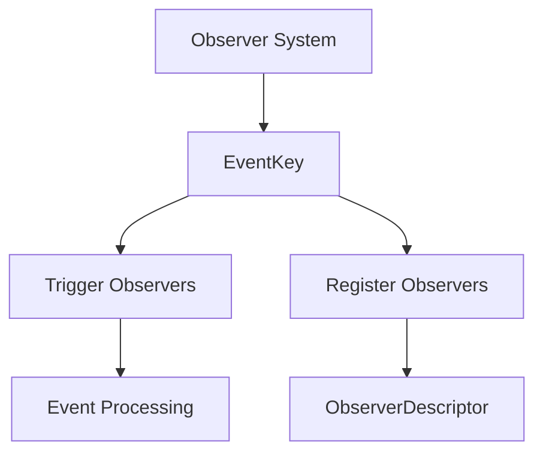

+++
title = "#20060 Change `event` to `event_key` where it refers to an `EventKey`"
date = "2025-07-16T00:00:00"
draft = false
template = "pull_request_page.html"
in_search_index = true

[taxonomies]
list_display = ["show"]

[extra]
current_language = "en"
available_languages = {"en" = { name = "English", url = "/pull_request/bevy/2025-07/pr-20060-en-20250716" }, "zh-cn" = { name = "中文", url = "/pull_request/bevy/2025-07/pr-20060-zh-cn-20250716" }}
labels = ["C-Docs", "A-ECS", "C-Code-Quality"]
+++

## Change `event` to `event_key` where it refers to an `EventKey`

### Basic Information
- **Title**: Change `event` to `event_key` where it refers to an `EventKey`
- **PR Link**: https://github.com/bevyengine/bevy/pull/20060
- **Author**: SteveAlexander
- **Status**: MERGED
- **Labels**: C-Docs, A-ECS, C-Code-Quality, S-Needs-Review
- **Created**: 2025-07-09T15:17:19Z
- **Merged**: 2025-07-16T18:42:05Z
- **Merged By**: mockersf

### Description
The ECS code to do with Observers was recently refactored to use an `EventKey` newtype. On reading through the PR, I was a bit confused that sometimes a variable called `event` refers to an `Event` and sometimes it refers to an `EventKey`. I think the code is clearer when `event` refers to an `Event` and `event_key` refers to an `EventKey`.

This PR renames some uses of `event` to `event_key`.

**Testing**
- Did you test these changes? If so, how?  
I ran `cargo run -p ci -- tests`
- Are there any parts that need more testing?  
No
- How can other people (reviewers) test your changes? Is there anything specific they need to know?  
No.
- If relevant, what platforms did you test these changes on, and are there any important ones you can't test?  
Probably not relevant, but MacOS.

### The Story of This Pull Request

Recent refactoring in Bevy's ECS introduced the `EventKey` newtype to handle observer functionality. This created a naming conflict where the variable `event` was used ambiguously - sometimes referring to an actual event (`Event`) and other times to an event identifier (`EventKey`). This ambiguity made the code harder to understand and maintain.

The solution involved systematically renaming variables, parameters, and fields from `event` to `event_key` wherever they referred to an `EventKey` instance. This change improves code clarity by establishing a consistent naming convention: `event` refers to actual event data, while `event_key` specifically identifies event types through their `EventKey` identifiers.

Implementation required updating multiple locations across the observer system:
1. Method parameters were renamed (e.g., `with_event` became `with_event_key`)
2. Field names were updated (`events` became `event_keys`)
3. Comments and documentation strings were revised to reflect the new terminology
4. Internal logic using these identifiers was updated accordingly

The changes maintain identical runtime behavior while significantly improving code readability. By separating concerns in naming, developers can now more easily distinguish between:
- Event data (handled as `Event`)
- Event type identifiers (handled as `EventKey`)
- Observer registration logic
- Event triggering mechanisms

For example, the `ObserverDescriptor` struct was updated to better reflect its purpose:

```rust
// Before:
pub struct ObserverDescriptor {
    pub(super) events: Vec<EventKey>,
}

// After:
pub struct ObserverDescriptor {
    pub(super) event_keys: Vec<EventKey>,
}
```

Similarly, method signatures were updated for clarity:

```rust
// Before:
pub unsafe fn with_event(mut self, event: EventKey) -> Self

// After:
pub unsafe fn with_event_key(mut self, event_key: EventKey) -> Self
```

The renaming also propagated through observer invocation logic, where the key distinction between event types and event data is critical for correct operation. The `trigger_observers` method demonstrates this:

```rust
// Before:
pub(crate) unsafe fn trigger_observers(
    &mut self,
    event: EventKey,
)

// After:
pub(crate) unsafe fn trigger_observers(
    &mut self,
    event_key: EventKey,
)
```

These changes required updates to 6 files with 29 lines modified. The PR maintains full backward compatibility while making the codebase more maintainable. The explicit naming convention reduces cognitive load when working with observers and helps prevent type confusion during future development.

### Visual Representation



### Key Files Changed

1. **crates/bevy_ecs/src/observer/distributed_storage.rs** (+15/-15)  
   Updated field names and method parameters to use `event_key` terminology.  
   Key changes:
   ```rust
   // Before:
   pub(super) events: Vec<EventKey>,
   pub unsafe fn with_event(mut self, event: EventKey) -> Self
   
   // After:
   pub(super) event_keys: Vec<EventKey>,
   pub unsafe fn with_event_key(mut self, event_key: EventKey) -> Self
   ```

2. **crates/bevy_ecs/src/world/deferred_world.rs** (+7/-7)  
   Updated method parameters in observer triggering logic.  
   Key changes:
   ```rust
   // Before:
   pub(crate) unsafe fn trigger_observers(&mut self, event: EventKey)
   
   // After:
   pub(crate) unsafe fn trigger_observers(&mut self, event_key: EventKey)
   ```

3. **crates/bevy_ecs/src/observer/mod.rs** (+4/-4)  
   Updated iteration logic to use renamed `event_keys` field.  
   Key change:
   ```rust
   // Before:
   for &event_key in &descriptor.events
   
   // After:
   for &event_key in &descriptor.event_keys
   ```

4. **crates/bevy_ecs/src/event/registry.rs** (+1/-1)  
   Improved comment clarity regarding `EventKey` usage.  
   Key change:
   ```rust
   // Before:
   // SAFETY: The component ID and the function must be used...
   
   // After:
   // SAFETY: The `EventKey`'s component ID and the function must be used...
   ```

5. **crates/bevy_ecs/src/observer/entity_cloning.rs** (+1/-1)  
   Updated field reference during entity cloning.  
   Key change:
   ```rust
   // Before:
   let event_keys = observer_state.descriptor.events.clone();
   
   // After:
   let event_keys = observer_state.descriptor.event_keys.clone();
   ```

### Further Reading
1. [Bevy ECS Observer System Documentation](https://docs.rs/bevy_ecs/latest/bevy_ecs/observer/index.html)
2. [Newtype Pattern in Rust](https://doc.rust-lang.org/rust-by-example/generics/new_types.html)
3. [Bevy Events System Guide](https://bevyengine.org/learn/book/getting-started/events/)