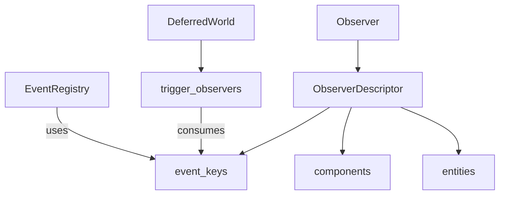

+++
title = "#20060 Change `event` to `event_key` where it refers to an `EventKey"
date = "2025-07-16T00:00:00"
draft = false
template = "pull_request_page.html"
in_search_index = false

[extra]
current_language = "zh-cn"
available_languages = {"en" = { name = "English", url = "/pull_request/bevy/2025-07/pr-20060-en-20250716" }, "zh-cn" = { name = "中文", url = "/pull_request/bevy/2025-07/pr-20060-zh-cn-20250716" }}
+++

# 技术分析报告：PR #20060 - Change `event` to `event_key` where it refers to an `EventKey`

## 基本信息
- **标题**: Change `event` to `event_key` where it refers to an `EventKey`
- **PR链接**: https://github.com/bevyengine/bevy/pull/20060
- **作者**: SteveAlexander
- **状态**: 已合并
- **标签**: C-Docs, A-ECS, C-Code-Quality, S-Needs-Review
- **创建时间**: 2025-07-09T15:17:19Z
- **合并时间**: 2025-07-16T18:42:05Z
- **合并人**: mockersf

## 描述翻译
### 目标
ECS 中与观察者(Observers)相关的代码最近被重构为使用 `EventKey` 新类型(newtype)。在阅读该PR时，我有些困惑：有时名为 `event` 的变量指的是 `Event`，有时却指的是 `EventKey`。我认为当 `event` 指代 `Event` 而 `event_key` 指代 `EventKey` 时，代码会更清晰。

### 解决方案
本PR将一些 `event` 的使用重命名为 `event_key`。

### 测试
- 你是否测试了这些更改？如果是，如何测试的？
  运行了 `cargo run -p ci -- tests`
- 是否有任何部分需要更多测试？
  不需要
- 其他人（审阅者）如何测试你的更改？他们需要了解什么特别事项吗？
  不需要。
- 如果相关，你在哪些平台上测试了这些更改，是否有任何重要平台无法测试？
  可能不相关，但在 macOS 上测试过。

## PR的技术分析

### 问题背景
在 Bevy 的 ECS 实现中，观察者系统(Observer system)最近引入了 `EventKey` 类型来标识事件类型。然而，在相关代码中，变量名 `event` 被用于指代两种不同的概念：
1. 实际的 `Event` 实例
2. 标识事件类型的 `EventKey`

这种命名歧义会导致代码可读性问题，开发者需要根据上下文推断 `event` 变量的确切含义，增加了认知负担和理解成本。

### 解决方案
通过系统的重命名操作，将所有引用 `EventKey` 类型的变量从 `event` 改为 `event_key`，保留 `event` 用于指代实际的 `Event` 实例。这种改动：
1. 保持语义一致性
2. 通过名称明确区分两种不同概念
3. 提高代码自文档化能力
4. 不改变任何功能逻辑，仅涉及标识符重命名

### 具体实现
核心改动集中在观察者系统的关键组件上，包括 `Observer` 结构体及其描述符(descriptor)、事件触发逻辑和相关辅助函数。所有改动都是机械式的重命名操作，保持原有逻辑不变。

#### 关键修改示例
1. **ObserverDescriptor 结构体字段重命名**  
   `events` → `event_keys` 更准确反映其存储的是事件键集合
   ```rust
   // crates/bevy_ecs/src/observer/distributed_storage.rs
   // 修改前:
   pub struct ObserverDescriptor {
       pub(super) events: Vec<EventKey>,
   }
   
   // 修改后:
   pub struct ObserverDescriptor {
       pub(super) event_keys: Vec<EventKey>,
   }
   ```

2. **方法参数和内部逻辑更新**  
   统一将接收 `EventKey` 的参数从 `event` 改为 `event_key`
   ```rust
   // crates/bevy_ecs/src/observer/distributed_storage.rs
   // 修改前:
   pub unsafe fn with_event(mut self, event: EventKey) -> Self {
       self.descriptor.events.push(event);
       self
   }
   
   // 修改后:
   pub unsafe fn with_event_key(mut self, event_key: EventKey) -> Self {
       self.descriptor.event_keys.push(event_key);
       self
   }
   ```

3. **事件触发逻辑更新**  
   事件触发函数参数重命名以保持一致性
   ```rust
   // crates/bevy_ecs/src/world/deferred_world.rs
   // 修改前:
   pub(crate) unsafe fn trigger_observers(
       &mut self,
       event: EventKey,
       // ...
   )
   
   // 修改后:
   pub(crate) unsafe fn trigger_observers(
       &mut self,
       event_key: EventKey,
       // ...
   )
   ```

### 技术影响
1. **可读性提升**：消除命名歧义，使代码更易于理解
2. **维护性增强**：通过统一命名约定降低未来修改引入错误的风险
3. **文档一致性**：相关注释同步更新以反映术语变化
4. **无功能影响**：纯重构操作，不影响系统行为或性能

### 测试验证
作者执行了 Bevy 的标准测试套件 (`cargo run -p ci -- tests`) 验证无回归错误。由于这是纯重构操作，不涉及逻辑变更，因此不需要额外的平台特定测试。

## 关键文件变更

### crates/bevy_ecs/src/observer/distributed_storage.rs
**变更原因**：统一 `EventKey` 相关变量的命名约定  
**核心修改**：
```diff
-    pub(super) events: Vec<EventKey>,
+    pub(super) event_keys: Vec<EventKey>,

-    pub unsafe fn with_event(mut self, event: EventKey) -> Self {
-        self.descriptor.events.push(event);
+    pub unsafe fn with_event_key(mut self, event_key: EventKey) -> Self {
+        self.descriptor.event_keys.push(event_key);

-    if observe.descriptor.events.is_empty() {
+    if observe.descriptor.event_keys.is_empty() {
```

### crates/bevy_ecs/src/world/deferred_world.rs
**变更原因**：保持事件触发函数的参数命名一致性  
**核心修改**：
```diff
-    pub(crate) unsafe fn trigger_observers(&mut self, event: EventKey, ...)
+    pub(crate) unsafe fn trigger_observers(&mut self, event_key: EventKey, ...)

-    Observers::invoke::<_(self.reborrow(), event, ...)
+    Observers::invoke::<_(self.reborrow(), event_key, ...)
```

### crates/bevy_ecs/src/observer/mod.rs
**变更原因**：更新观察者处理逻辑中的字段引用  
**核心修改**：
```diff
-    for &event_key in &descriptor.events {
+    for &event_key in &descriptor.event_keys {

-    .with_event(on_remove)
+    .with_event_key(on_remove)
```

### crates/bevy_ecs/src/event/registry.rs
**变更原因**：澄清注释中 `EventKey` 的作用  
**核心修改**：
```diff
-    // SAFETY: The component ID and the function must be used to fetch the Events<T> resource
+    // SAFETY: The `EventKey`'s component ID and the function must be used to fetch the Events<T> resource
```

### crates/bevy_ecs/src/observer/entity_cloning.rs
**变更原因**：同步字段名称变更  
**核心修改**：
```diff
-    let event_keys = observer_state.descriptor.events.clone();
+    let event_keys = observer_state.descriptor.event_keys.clone();
```

## 组件关系图



## 总结
此PR通过系统化的重命名操作，解决了ECS观察者系统中存在的命名歧义问题。主要技术贡献包括：
1. 将引用 `EventKey` 的变量统一命名为 `event_key`
2. 保留 `event` 用于指代实际的 `Event` 实例
3. 更新相关注释以保持一致性
4. 验证无功能影响

这种类型的重构虽然不改变系统行为，但显著提高了代码可读性和可维护性，是保持大型代码库健康的重要实践。

## 延伸阅读
1. [Rust API 命名指南](https://rust-lang.github.io/api-guidelines/naming.html)
2. [Bevy ECS 观察者文档](https://docs.rs/bevy_ecs/latest/bevy_ecs/observer/index.html)
3. [Newtype 模式在 Rust 中的应用](https://doc.rust-lang.org/rust-by-example/generics/new_types.html)