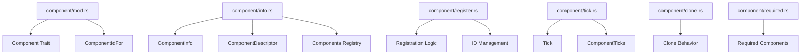

+++
title = "#20063 Splitting `component.rs` for Improved Maintainability"
date = "2025-07-09T00:00:00"
draft = false
template = "pull_request_page.html"
in_search_index = true

[taxonomies]
list_display = ["show"]

[extra]
current_language = "en"
available_languages = {"en" = { name = "English", url = "/pull_request/bevy/2025-07/pr-20063-en-20250709" }, "zh-cn" = { name = "中文", url = "/pull_request/bevy/2025-07/pr-20063-zh-cn-20250709" }}
labels = ["A-ECS", "C-Code-Quality", "P-High"]
+++

## Title: Splitting `component.rs` for Improved Maintainability

## Basic Information
- **Title**: Split `component.rs`
- **PR Link**: https://github.com/bevyengine/bevy/pull/20063
- **Author**: SkiFire13
- **Status**: MERGED
- **Labels**: A-ECS, C-Code-Quality, P-High, S-Ready-For-Final-Review, X-Uncontroversial
- **Created**: 2025-07-09T16:28:03Z
- **Merged**: 2025-07-09T20:27:57Z
- **Merged By**: alice-i-cecile

## Description Translation
The original PR description remains unchanged as it is already in English.

## The Story of This Pull Request

### The Problem and Context
The `component.rs` file had grown to over 3000 lines, becoming difficult to navigate and maintain. This monolithic file contained all component-related functionality including registration, metadata storage, change detection, cloning behavior, and required component calculations. The size made it challenging to locate specific functionality and understand the relationships between different component-related systems. 

The goal was to improve code organization and maintainability without altering any functionality. The constraints required maintaining existing public APIs and ensuring no behavioral changes occurred for users of the ECS system.

### The Solution Approach
The solution involved splitting `component.rs` into logically grouped modules within a new `component` directory. The approach followed these principles:
1. Group related functionality together
2. Maintain existing public interfaces
3. Create clear boundaries between different concerns
4. Preserve all existing code behavior

The new structure organizes functionality into distinct areas:
- Core component definitions (`mod.rs`)
- Component metadata and registration (`info.rs`, `register.rs`)
- Change detection and ticks (`tick.rs`)
- Component cloning behavior (`clone.rs`)
- Required component calculations (`required.rs`)

### The Implementation
The implementation involved moving existing code into new files while maintaining all functionality. Key aspects include:

**Component Metadata and Registration**  
`info.rs` now contains all component metadata structures (`ComponentInfo`, `ComponentDescriptor`) and the central `Components` registry. This isolates the core storage and lookup functionality for component metadata.

`register.rs` handles component registration logic with:
- `ComponentIds` for ID generation
- `ComponentsRegistrator` for direct registration
- `ComponentsQueuedRegistrator` for deferred registration
- `QueuedComponents` for pending registrations

```rust
// File: crates/bevy_ecs/src/component/register.rs
pub struct ComponentsRegistrator<'w> {
    components: &'w mut Components,
    ids: &'w mut ComponentIds,
}

impl<'w> ComponentsRegistrator<'w> {
    pub fn register_component<T: Component>(&mut self) -> ComponentId {
        // ... registration logic ...
    }
}
```

**Change Detection**  
`tick.rs` isolates change tracking functionality including:
- `Tick` implementation with change detection logic
- `ComponentTicks` for per-component change tracking
- `CheckChangeTicks` event for periodic tick maintenance

```rust
// File: crates/bevy_ecs/src/component/tick.rs
pub struct Tick {
    tick: u32,
}

impl Tick {
    pub fn is_newer_than(self, last_run: Tick, this_run: Tick) -> bool {
        // ... change detection logic ...
    }
}
```

**Component Cloning**  
`clone.rs` contains component cloning behavior definitions:
- `ComponentCloneBehavior` enum
- Default cloning implementations
- Specialized cloning via reflection

```rust
// File: crates/bevy_ecs/src/component/clone.rs
pub enum ComponentCloneBehavior {
    Default,
    Ignore,
    Custom(ComponentCloneFn),
}
```

**Required Components**  
`required.rs` manages required component relationships:
- `RequiredComponentConstructor` for initialization
- `RequiredComponents` collection
- Error handling for invalid configurations

```rust
// File: crates/bevy_ecs/src/component/required.rs
pub struct RequiredComponents(pub(crate) HashMap<ComponentId, RequiredComponent>);
```

**Core Component Definitions**  
`mod.rs` retains the core `Component` trait and related types:
- `Component` trait with all main functionality
- `StorageType` and `ComponentMutability` configurations
- `ComponentIdFor` system parameter

### Technical Insights
The split follows Rust's module system best practices by:
1. Grouping related functionality together
2. Reducing file sizes to improve navigation
3. Creating clear public/private boundaries
4. Maintaining zero functional changes

The organization reflects actual use patterns:
- Registration and metadata management are separated from core behavior
- Change detection is isolated since it's often optimized separately
- Cloning behavior is separated as it's only used in specific contexts
- Required component logic is self-contained due to its complexity

### The Impact
These changes provide several concrete benefits:
1. **Faster navigation**: Developers can locate logic more quickly
2. **Reduced merge conflicts**: Changes to different areas won't conflict
3. **Clearer boundaries**: Responsibilities are better separated
4. **Easier maintenance**: Related code is colocated
5. **Preserved functionality**: No behavioral changes for users

The split establishes a foundation for future improvements to each component subsystem without affecting others. The modular structure also makes it easier to understand the relationships between different parts of the component system.

## Visual Representation



## Key Files Changed

1. **crates/bevy_ecs/src/component.rs → Deleted**
   - All functionality moved to new module structure

2. **crates/bevy_ecs/src/component/mod.rs**
   - New home for core `Component` trait and related types
   - Preserves all public APIs unchanged

```rust
// After:
pub trait Component: Send + Sync + 'static {
    const STORAGE_TYPE: StorageType;
    type Mutability: ComponentMutability;
    // ... other trait methods ...
}
```

3. **crates/bevy_ecs/src/component/info.rs**
   - Contains component metadata and registry implementation
   - Manages component IDs and descriptors

```rust
pub struct ComponentInfo {
    id: ComponentId,
    descriptor: ComponentDescriptor,
    // ... other fields ...
}

pub struct Components {
    components: Vec<Option<ComponentInfo>>,
    // ... registry state ...
}
```

4. **crates/bevy_ecs/src/component/register.rs**
   - Handles component registration workflow
   - Manages both immediate and queued registration

```rust
pub struct ComponentsRegistrator<'w> {
    components: &'w mut Components,
    ids: &'w mut ComponentIds,
}

pub struct ComponentsQueuedRegistrator<'w> {
    components: &'w Components,
    ids: &'w ComponentIds,
}
```

5. **crates/bevy_ecs/src/component/required.rs**
   - Implements required component relationships
   - Handles constructor storage and initialization

```rust
pub struct RequiredComponent {
    pub constructor: RequiredComponentConstructor,
    pub inheritance_depth: u16,
}
```

## Further Reading
1. [Rust Module System](https://doc.rust-lang.org/book/ch07-02-defining-modules-to-control-scope-and-privacy.html)
2. [ECS Architecture Patterns](https://github.com/SanderMertens/ecs-faq)
3. [Bevy ECS Documentation](https://bevyengine.org/learn/book/plugins/ecs/)