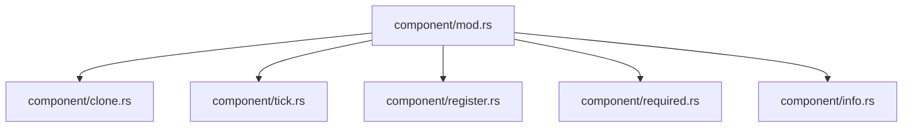

+++
title = "#20063 Split `component.rs`"
date = "2025-07-09T00:00:00"
draft = false
template = "pull_request_page.html"
in_search_index = false

[extra]
current_language = "zh-cn"
available_languages = {"en" = { name = "English", url = "/pull_request/bevy/2025-07/pr-20063-en-20250709" }, "zh-cn" = { name = "中文", url = "/pull_request/bevy/2025-07/pr-20063-zh-cn-20250709" }}
labels = ["A-ECS", "C-Code-Quality", "P-High"]
+++

# Split `component.rs`

## Basic Information
- **Title**: Split `component.rs`
- **PR Link**: https://github.com/bevyengine/bevy/pull/20063
- **Author**: SkiFire13
- **Status**: MERGED
- **Labels**: A-ECS, C-Code-Quality, P-High, S-Ready-For-Final-Review, X-Uncontroversial
- **Created**: 2025-07-09T16:28:03Z
- **Merged**: 2025-07-09T20:27:57Z
- **Merged By**: alice-i-cecile

## Description Translation
**目标**
- `component.rs` 文件变得过大，需要拆分

**解决方案**
- 将 `component.rs` 拆分为以下文件：
  - `component/mod.rs`：`component` 模块的新根文件，包含 `Component` trait 和其他非常通用的项
  - `component/clone.rs`：包含组件克隆相关项
  - `component/tick.rs`：包含 `Tick` 和其他 tick 相关项
    - 未来可能性：将这些移到 `change_detection`，但本 PR 不包含破坏性变更
  - `component/register.rs`：包含组件注册（包括队列注册）相关项
  - `component/required.rs`：包含正确计算必需组件的项和函数
  - `component/info.rs`：包含在 `World` 中存储组件信息和元数据的项

## The Story of This Pull Request

### 问题和背景
`crates/bevy_ecs/src/component.rs` 文件已经增长到超过 3000 行代码，包含多个不同领域的实现：
1. `Component` trait 及其相关类型
2. 组件注册逻辑
3. 组件克隆机制
4. 变更检测的 tick 系统
5. 必需组件计算逻辑

这种单体文件结构导致以下问题：
- **可维护性差**：查找特定功能实现困难
- **代码组织混乱**：相关功能分散在不同区域
- **编译时间增加**：修改任意部分都需要重新编译整个文件
- **新人上手困难**：理解组件系统需要浏览不相关的代码

### 解决方案方法
采用模块化拆分策略，按功能领域划分文件：
1. 创建 `component` 模块目录
2. 提取独立关注点到子模块
3. 保持公共接口不变
4. 避免破坏性变更

关键决策点：
- 保持 `Component` trait 在根模块 (`mod.rs`)
- 将辅助功能分离到子模块
- 维持现有测试覆盖率
- 确保文档链接仍然有效

### 实现细节
#### 新模块结构


#### 关键变更
1. **根模块 (`mod.rs`)**：
   - 保留 `Component` trait 定义
   - 包含模块导出：
     ```rust
     pub mod clone;
     pub mod info;
     pub mod register;
     pub mod required;
     pub mod tick;
     ```

2. **组件克隆 (`clone.rs`)**：
   - 迁移 `ComponentCloneBehavior` 逻辑
   - 包含克隆处理函数：
     ```rust
     pub fn component_clone_via_clone<C: Clone + Component>(...) { ... }
     #[cfg(feature = "bevy_reflect")]
     pub fn component_clone_via_reflect(...) { ... }
     ```

3. **Tick 系统 (`tick.rs`)**：
   - 迁移 `Tick` 和 `ComponentTicks`：
     ```rust
     pub struct Tick { tick: u32 }
     pub struct ComponentTicks { added: Tick, changed: Tick }
     ```

4. **注册逻辑 (`register.rs`)**：
   - 提取组件注册系统：
     ```rust
     pub struct ComponentIds { ... }
     pub struct ComponentsRegistrator<'w> { ... }
     ```

5. **必需组件 (`required.rs`)**：
   - 包含必需组件处理逻辑：
     ```rust
     pub struct RequiredComponent { ... }
     pub struct RequiredComponents(...);
     ```

6. **组件元数据 (`info.rs`)**：
   - 管理组件描述符和ID：
     ```rust
     pub struct ComponentDescriptor { ... }
     pub struct ComponentInfo { ... }
     pub struct Components { ... }
     ```

### 技术洞察
1. **模块边界**：按功能而非类型划分模块
2. **可见性控制**：合理使用 `pub(super)` 限制内部API
3. **依赖管理**：
   - 子模块通过根模块暴露接口
   - 避免跨子模块依赖
4. **错误处理**：保持 `RequiredComponentsError` 在核心区域

### 影响
1. **代码可读性提升**：
   - 平均文件大小从 3049 行降至约 500 行
   - 相关功能集中存放
2. **编译优化**：减少增量编译范围
3. **维护性增强**：
   - 修改克隆逻辑只需编辑 `clone.rs`
   - 添加新注册机制只需修改 `register.rs`
4. **扩展性改进**：为未来功能（如 tick 系统迁移）奠定基础

## Visual Representation


## Key Files Changed

### 1. `crates/bevy_ecs/src/component.rs` (+0/-3049)
- **变更**：文件被完全删除
- **原因**：功能被拆分到多个子模块
- **影响**：原有功能迁移到新模块结构

### 2. `crates/bevy_ecs/src/component/mod.rs` (+758/-0)
- **变更**：新的模块根文件，包含核心 `Component` trait
- **关键代码**：
```rust
// 模块导出
pub mod clone;
pub mod info;
pub mod register;
pub mod required;
pub mod tick;

// Component trait 定义
pub trait Component: Send + Sync + 'static {
    const STORAGE_TYPE: StorageType;
    type Mutability: ComponentMutability;
    // ...其他默认实现...
}
```

### 3. `crates/bevy_ecs/src/component/info.rs` (+721/-0)
- **变更**：组件元数据管理
- **关键代码**：
```rust
pub struct ComponentInfo {
    id: ComponentId,
    descriptor: ComponentDescriptor,
    hooks: ComponentHooks,
    required_components: RequiredComponents,
    required_by: HashSet<ComponentId>,
}

pub struct Components {
    components: Vec<Option<ComponentInfo>>,
    indices: TypeIdMap<ComponentId>,
    resource_indices: TypeIdMap<ComponentId>,
    queued: RwLock<QueuedComponents>,
}
```

### 4. `crates/bevy_ecs/src/component/register.rs` (+679/-0)
- **变更**：组件注册系统
- **关键代码**：
```rust
pub struct ComponentIds {
    next: AtomicUsize,
}

pub struct ComponentsRegistrator<'w> {
    components: &'w mut Components,
    ids: &'w mut ComponentIds,
}

impl ComponentsRegistrator {
    pub fn register_component<T: Component>(&mut self) -> ComponentId { ... }
}
```

### 5. `crates/bevy_ecs/src/component/required.rs` (+536/-0)
- **变更**：必需组件处理逻辑
- **关键代码**：
```rust
pub struct RequiredComponent {
    pub constructor: RequiredComponentConstructor,
    pub inheritance_depth: u16,
}

impl Components {
    pub unsafe fn register_required_components<R: Component>(
        &mut self,
        requiree: ComponentId,
        required: ComponentId,
        constructor: fn() -> R,
    ) -> Result<(), RequiredComponentsError> { ... }
}
```

## Further Reading
1. [Rust 模块系统指南](https://doc.rust-lang.org/book/ch07-02-defining-modules-to-control-scope-and-privacy.html)
2. [Bevy ECS 架构概览](https://bevyengine.org/learn/book/getting-started/ecs/)
3. [组件系统深入解析](https://github.com/bevyengine/bevy/blob/main/docs/plugins_guidelines.md#component-design)