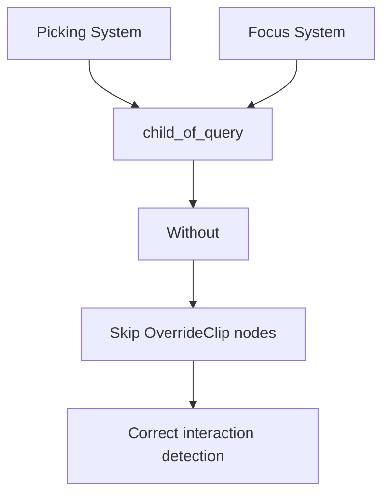

+++
title = "#20064 `OverrideClip` interaction fix"
date = "2025-07-11T00:00:00"
draft = false
template = "pull_request_page.html"
in_search_index = true

[taxonomies]
list_display = ["show"]

[extra]
current_language = "en"
available_languages = {"en" = { name = "English", url = "/pull_request/bevy/2025-07/pr-20064-en-20250711" }, "zh-cn" = { name = "中文", url = "/pull_request/bevy/2025-07/pr-20064-zh-cn-20250711" }}
labels = ["C-Bug", "A-UI", "D-Straightforward", "A-Picking"]
+++

# OverrideClip interaction fix

## Basic Information
- **Title**: `OverrideClip` interaction fix
- **PR Link**: https://github.com/bevyengine/bevy/pull/20064
- **Author**: ickshonpe
- **Status**: MERGED
- **Labels**: C-Bug, A-UI, S-Ready-For-Final-Review, D-Straightforward, A-Picking
- **Created**: 2025-07-09T16:34:07Z
- **Merged**: 2025-07-11T05:22:51Z
- **Merged By**: alice-i-cecile

## Description Translation
# Objective

Picking was changed in the UI transform PR to walk up the tree recursively to check if an interaction was on a clipped node. `OverrideClip` only affects a node's local clipping rect, so valid interactions can be ignored if a node has clipped ancestors.

## Solution

 Add a `Without<OverrideClip>` query filter to the picking systems' `child_of_query`s.

## Testing

This modified `button` example can be used to test the change:
```rust
//! This example illustrates how to create a button that changes color and text based on its
//! interaction state.

use bevy::{color::palettes::basic::*, input_focus::InputFocus, prelude::*, winit::WinitSettings};

fn main() {
    App::new()
        .add_plugins(DefaultPlugins)
        // Only run the app when there is user input. This will significantly reduce CPU/GPU use.
        .insert_resource(WinitSettings::desktop_app())
        // `InputFocus` must be set for accessibility to recognize the button.
        .init_resource::<InputFocus>()
        .add_systems(Startup, setup)
        .add_systems(Update, button_system)
        .run();
}

const NORMAL_BUTTON: Color = Color::srgb(0.15, 0.15, 0.15);
const HOVERED_BUTTON: Color = Color::srgb(0.25, 0.25, 0.25);
const PRESSED_BUTTON: Color = Color::srgb(0.35, 0.75, 0.35);

fn button_system(
    mut input_focus: ResMut<InputFocus>,
    mut interaction_query: Query<
        (
            Entity,
            &Interaction,
            &mut BackgroundColor,
            &mut BorderColor,
            &mut Button,
            &Children,
        ),
        Changed<Interaction>,
    >,
    mut text_query: Query<&mut Text>,
) {
    for (entity, interaction, mut color, mut border_color, mut button, children) in
        &mut interaction_query
    {
        let mut text = text_query.get_mut(children[0]).unwrap();

        match *interaction {
            Interaction::Pressed => {
                input_focus.set(entity);
                **text = "Press".to_string();
                *color = PRESSED_BUTTON.into();
                *border_color = BorderColor::all(RED.into());

                // The accessibility system's only update the button's state when the `Button` component is marked as changed.
                button.set_changed();
            }
            Interaction::Hovered => {
                input_focus.set(entity);
                **text = "Hover".to_string();
                *color = HOVERED_BUTTON.into();
                *border_color = BorderColor::all(Color::WHITE);
                button.set_changed();
            }
            Interaction::None => {
                input_focus.clear();
                **text = "Button".to_string();
                *color = NORMAL_BUTTON.into();
                *border_color = BorderColor::all(Color::BLACK);
            }
        }
    }
}

fn setup(mut commands: Commands, assets: Res<AssetServer>) {
    // ui camera
    commands.spawn(Camera2d);
    commands.spawn(button(&assets));
}

fn button(asset_server: &AssetServer) -> impl Bundle + use<> {
    (
        Node {
            width: Val::Percent(100.0),
            height: Val::Percent(100.0),
            align_items: AlignItems::Center,
            justify_content: JustifyContent::Center,
            ..default()
        },
        children![(
            Node {
                width: Val::Px(0.),
                height: Val::Px(0.),
                overflow: Overflow::clip(),
                ..default()
            },
            children![(
                //OverrideClip,
                Button,
                Node {
                    position_type: PositionType::Absolute,
                    width: Val::Px(150.0),
                    height: Val::Px(65.0),
                    border: UiRect::all(Val::Px(5.0)),
                    // horizontally center child text
                    justify_content: JustifyContent::Center,
                    // vertically center child text
                    align_items: AlignItems::Center,
                    ..default()
                },
                BorderColor::all(Color::WHITE),
                BorderRadius::MAX,
                BackgroundColor(Color::BLACK),
                children![(
                    Text::new("Button"),
                    TextFont {
                        font: asset_server.load("fonts/FiraSans-Bold.ttf"),
                        font_size: 33.0,
                        ..default()
                    },
                    TextColor(Color::srgb(0.9, 0.9, 0.9)),
                    TextShadow::default(),
                )]
            )],
        )],
    )
}
```
On main the button ignores interactions, with this PR it should respond correctly.

## The Story of This Pull Request

### The Problem
After UI transform changes in a previous PR (#19891), Bevy's picking system started recursively checking ancestor nodes for clipping. This introduced a bug for nodes using `OverrideClip` - a component designed to isolate a node from ancestor clipping. The recursive clipping check would incorrectly ignore interactions on `OverrideClip` nodes when they had clipped ancestors, even though `OverrideClip` should have made them interactable.

### The Solution Approach
The fix modifies the recursive clipping check to skip `OverrideClip` nodes during ancestor traversal. By adding a `Without<OverrideClip>` filter to the `child_of_query`, we ensure nodes with `OverrideClip` break the recursive clipping check chain. This approach preserves the existing clipping logic while respecting `OverrideClip`'s intended behavior.

### Implementation Details
The changes are minimal and focused. Two systems needed modification:
1. `ui_focus_system` - Handles UI focus management
2. `ui_picking` - Handles pointer interaction detection

Both systems use the same `clip_check_recursive` helper function that walks up the node hierarchy. The key modification is adding the `Without<OverrideClip>` filter to the `child_of_query` used in these systems and the helper function. This filter excludes nodes with `OverrideClip` from the ancestor traversal.

Before the fix, the `child_of_query` in both systems looked like:
```rust
child_of_query: Query<&ChildOf>,
```

After the fix, both now include the filter:
```rust
child_of_query: Query<&ChildOf, Without<OverrideClip>>,
```

Additionally, the documentation for `clip_check_recursive` was updated to clarify that nodes with `OverrideClip` bypass ancestor clipping checks.

### Technical Insights
The solution works because:
1. `OverrideClip` nodes are excluded from ancestor traversal
2. The recursive check stops at these nodes
3. The clipping check returns true (interaction allowed) for `OverrideClip` nodes

This maintains the performance characteristics of the original implementation while fixing the behavior. The `Without` filter ensures we don't pay the cost of checking `OverrideClip` unless necessary.

### Impact
This fix restores correct interaction behavior for UI nodes using `OverrideClip`. The example provided in the PR description demonstrates this - a button inside a clipped container now responds to interactions when using `OverrideClip`. The change is localized to two files with minimal modifications, reducing risk of regression.

## Visual Representation



## Key Files Changed

1. **crates/bevy_ui/src/focus.rs**
   - Added `Without<OverrideClip>` to child_of_query
   - Updated clip_check_recursive function signature
   - Added documentation about OverrideClip behavior

```diff
// Before:
child_of_query: Query<&ChildOf>,
...
child_of_query: &Query<&ChildOf>,

// After:
child_of_query: Query<&ChildOf, Without<OverrideClip>>,
...
child_of_query: &Query<&ChildOf, Without<OverrideClip>>,
```

2. **crates/bevy_ui/src/picking_backend.rs**
   - Added same filter to ui_picking system

```diff
// Before:
child_of_query: Query<&ChildOf>,

// After:
child_of_query: Query<&ChildOf, Without<OverrideClip>>,
```

## Further Reading
- [Bevy Query Filters Documentation](https://bevyengine.org/learn/book/getting-started/queries/#filters)
- [UI Picking System Overview](https://github.com/bevyengine/bevy/blob/main/crates/bevy_ui/src/picking_backend.rs)
- [OverrideClip Component Documentation](https://docs.rs/bevy_ui/latest/bevy_ui/struct.OverrideClip.html)