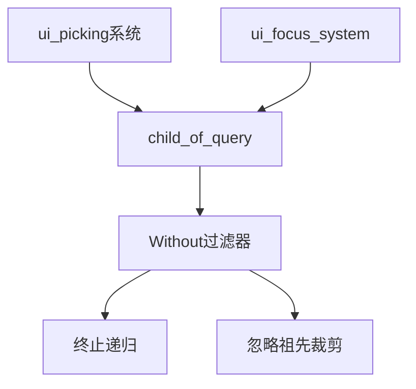

+++
title = "#20064 OverrideClip` interaction fix"
date = "2025-07-11T00:00:00"
draft = false
template = "pull_request_page.html"
in_search_index = false

[extra]
current_language = "zh-cn"
available_languages = {"en" = { name = "English", url = "/pull_request/bevy/2025-07/pr-20064-en-20250711" }, "zh-cn" = { name = "中文", url = "/pull_request/bevy/2025-07/pr-20064-zh-cn-20250711" }}
+++

### OverrideClip 交互修复分析报告

#### 基础信息
- **标题**: `OverrideClip` interaction fix
- **PR链接**: https://github.com/bevyengine/bevy/pull/20064
- **作者**: ickshonpe
- **状态**: 已合并
- **标签**: C-Bug, A-UI, S-Ready-For-Final-Review, D-Straightforward, A-Picking
- **创建时间**: 2025-07-09T16:34:07Z
- **合并时间**: 2025-07-11T05:22:51Z
- **合并者**: alice-i-cecile

#### 描述翻译
**目标**  
UI变换PR中修改了拾取(picking)逻辑，使其递归遍历节点树检查交互是否发生在被裁剪(clipped)的节点上。`OverrideClip`仅影响节点的本地裁剪矩形(local clipping rect)，因此当节点存在被裁剪的祖先时，有效的交互可能被忽略。

**解决方案**  
在拾取系统的`child_of_query`中添加`Without<OverrideClip>`查询过滤器。

**测试**  
使用修改后的`button`示例测试变更：
```rust
//! This example illustrates how to create a button that changes color and text based on its
//! interaction state.

use bevy::{color::palettes::basic::*, input_focus::InputFocus, prelude::*, winit::WinitSettings};

fn main() {
    App::new()
        .add_plugins(DefaultPlugins)
        // Only run the app when there is user input. This will significantly reduce CPU/GPU use.
        .insert_resource(WinitSettings::desktop_app())
        // `InputFocus` must be set for accessibility to recognize the button.
        .init_resource::<InputFocus>()
        .add_systems(Startup, setup)
        .add_systems(Update, button_system)
        .run();
}

const NORMAL_BUTTON: Color = Color::srgb(0.15, 0.15, 0.15);
const HOVERED_BUTTON: Color = Color::srgb(0.25, 0.25, 0.25);
const PRESSED_BUTTON: Color = Color::srgb(0.35, 0.75, 0.35);

fn button_system(
    mut input_focus: ResMut<InputFocus>,
    mut interaction_query: Query<
        (
            Entity,
            &Interaction,
            &mut BackgroundColor,
            &mut BorderColor,
            &mut Button,
            &Children,
        ),
        Changed<Interaction>,
    >,
    mut text_query: Query<&mut Text>,
) {
    for (entity, interaction, mut color, mut border_color, mut button, children) in
        &mut interaction_query
    {
        let mut text = text_query.get_mut(children[0]).unwrap();

        match *interaction {
            Interaction::Pressed => {
                input_focus.set(entity);
                **text = "Press".to_string();
                *color = PRESSED_BUTTON.into();
                *border_color = BorderColor::all(RED.into());

                // The accessibility system's only update the button's state when the `Button` component is marked as changed.
                button.set_changed();
            }
            Interaction::Hovered => {
                input_focus.set(entity);
                **text = "Hover".to_string();
                *color = HOVERED_BUTTON.into();
                *border_color = BorderColor::all(Color::WHITE);
                button.set_changed();
            }
            Interaction::None => {
                input_focus.clear();
                **text = "Button".to_string();
                *color = NORMAL_BUTTON.into();
                *border_color = BorderColor::all(Color::BLACK);
            }
        }
    }
}

fn setup(mut commands: Commands, assets: Res<AssetServer>) {
    // ui camera
    commands.spawn(Camera2d);
    commands.spawn(button(&assets));
}

fn button(asset_server: &AssetServer) -> impl Bundle + use<> {
    (
        Node {
            width: Val::Percent(100.0),
            height: Val::Percent(100.0),
            align_items: AlignItems::Center,
            justify_content: JustifyContent::Center,
            ..default()
        },
        children![(
            Node {
                width: Val::Px(0.),
                height: Val::Px(0.),
                overflow: Overflow::clip(),
                ..default()
            },
            children![(
                //OverrideClip,
                Button,
                Node {
                    position_type: PositionType::Absolute,
                    width: Val::Px(150.0),
                    height: Val::Px(65.0),
                    border: UiRect::all(Val::Px(5.0)),
                    // horizontally center child text
                    justify_content: JustifyContent::Center,
                    // vertically center child text
                    align_items: AlignItems::Center,
                    ..default()
                },
                BorderColor::all(Color::WHITE),
                BorderRadius::MAX,
                BackgroundColor(Color::BLACK),
                children![(
                    Text::new("Button"),
                    TextFont {
                        font: asset_server.load("fonts/FiraSans-Bold.ttf"),
                        font_size: 33.0,
                        ..default()
                    },
                    TextColor(Color::srgb(0.9, 0.9, 0.9)),
                    TextShadow::default(),
                )]
            )],
        )],
    )
}
```
在main分支上按钮会忽略交互，应用此PR后应能正确响应。

---

### PR技术分析

#### 问题背景
UI系统的拾取(picking)功能在之前的[transform PR](https://github.com/bevyengine/bevy/pull/19891)中被修改为递归遍历UI树，检查交互点是否位于被裁剪节点内。这种实现存在一个边界情况：当节点包含`OverrideClip`组件时，该组件应使节点**忽略祖先的裁剪状态**，只使用自身的裁剪矩形。但在原实现中，递归检查会错误地考虑祖先节点的裁剪状态，导致本应有效的交互被错误过滤。

#### 解决方案
核心修改是在递归查询中添加`Without<OverrideClip>`过滤器，改变UI树遍历的终止条件：
1. 当遇到`OverrideClip`节点时，停止向上递归
2. 仅检查当前节点的裁剪状态
3. 忽略所有祖先节点的裁剪影响

这符合`OverrideClip`的设计语义——该组件明确表示节点应独立于祖先的裁剪状态。

#### 实现细节
修改主要集中在两个关键系统：
1. **焦点系统(ui_focus_system)**：处理UI元素焦点状态
2. **拾取后端(ui_picking)**：处理实际的交互检测

具体代码变更：

**文件: crates/bevy_ui/src/focus.rs**
```diff
- child_of_query: Query<&ChildOf>,
+ child_of_query: Query<&ChildOf, Without<OverrideClip>>,
```
```diff
 pub fn clip_check_recursive(
     point: Vec2,
     entity: Entity,
     clipping_query: &Query<'_, '_, (&ComputedNode, &UiGlobalTransform, &Node)>,
-    child_of_query: &Query<&ChildOf>,
+    child_of_query: &Query<&ChildOf, Without<OverrideClip>>,
 ) -> bool {
```
1. 为`child_of_query`添加`Without<OverrideClip>`过滤器
2. 更新`clip_check_recursive`函数的签名以匹配新查询类型
3. 添加文档说明：当实体有`OverrideClip`组件时忽略继承的裁剪

**文件: crates/bevy_ui/src/picking_backend.rs**
```diff
- child_of_query: Query<&ChildOf>,
+ child_of_query: Query<&ChildOf, Without<OverrideClip>>,
```
1. 保持与焦点系统相同的查询修改
2. 确保两个系统使用一致的裁剪检查逻辑

#### 技术影响
1. **行为修正**：带有`OverrideClip`的节点现在正确响应交互，不再受祖先裁剪状态影响
2. **性能影响**：递归检查在遇到`OverrideClip`时提前终止，可能减少查询深度
3. **API一致性**：所有使用`clip_check_recursive`的地方都遵循相同的行为

#### 验证方法
作者提供了可直接验证的UI按钮示例：
1. 原实现：按钮被祖先裁剪，交互无响应
2. 本PR后：按钮正确触发`Pressed/Hovered`状态
测试用例覆盖了典型的交互场景，验证了修复的有效性。

---

### 关键文件变更

#### crates/bevy_ui/src/focus.rs (+7/-4)
**变更原因**：  
修正焦点系统对`OverrideClip`节点的处理逻辑，确保递归检查在遇到该组件时终止。

**代码变更**：
```diff
@@ -1,10 +1,12 @@
-use crate::{ui_transform::UiGlobalTransform, ComputedNode, ComputedNodeTarget, Node, UiStack};
+use crate::{
+    ui_transform::UiGlobalTransform, ComputedNode, ComputedNodeTarget, Node, OverrideClip, UiStack,
+};
 use bevy_ecs::{
     change_detection::DetectChangesMut,
     entity::{ContainsEntity, Entity},
     hierarchy::ChildOf,
     prelude::{Component, With},
-    query::QueryData,
+    query::{QueryData, Without},
     reflect::ReflectComponent,
     system::{Local, Query, Res},
 };
@@ -157,7 +159,7 @@ pub fn ui_focus_system(
     ui_stack: Res<UiStack>,
     mut node_query: Query<NodeQuery>,
     clipping_query: Query<(&ComputedNode, &UiGlobalTransform, &Node)>,
-    child_of_query: Query<&ChildOf>,
+    child_of_query: Query<&ChildOf, Without<OverrideClip>>,
 ) {
     let primary_window = primary_window.iter().next();
 
@@ -325,11 +327,12 @@ pub fn ui_focus_system(
 }
 
 /// Walk up the tree child-to-parent checking that `point` is not clipped by any ancestor node.
+/// If `entity` has an [`OverrideClip`] component it ignores any inherited clipping and returns true.
 pub fn clip_check_recursive(
     point: Vec2,
     entity: Entity,
     clipping_query: &Query<'_, '_, (&ComputedNode, &UiGlobalTransform, &Node)>,
-    child_of_query: &Query<&ChildOf>,
+    child_of_query: &Query<&ChildOf, Without<OverrideClip>>,
 ) -> bool {
     if let Ok(child_of) = child_of_query.get(entity) {
         let parent = child_of.0;
```

#### crates/bevy_ui/src/picking_backend.rs (+1/-1)
**变更原因**：  
保持拾取系统与焦点系统的行为一致性，使用相同的`OverrideClip`处理逻辑。

**代码变更**：
```diff
@@ -109,7 +109,7 @@ pub fn ui_picking(
     node_query: Query<NodeQuery>,
     mut output: EventWriter<PointerHits>,
     clipping_query: Query<(&ComputedNode, &UiGlobalTransform, &Node)>,
-    child_of_query: Query<&ChildOf>,
+    child_of_query: Query<&ChildOf, Without<OverrideClip>>,
 ) {
     // For each camera, the pointer and its position
     let mut pointer_pos_by_camera = HashMap::<Entity, HashMap<PointerId, Vec2>>::default();
```

---

### 组件关系图


### 延伸阅读
1. [Bevy UI 裁剪系统文档](https://github.com/bevyengine/bevy/blob/main/crates/bevy_ui/src/clipping.rs)
2. [ECS 查询过滤器官方指南](https://bevy-cheatbook.github.io/programming/queries.html)
3. [UI 交互原理解析](https://github.com/bevyengine/bevy/discussions/19891)（原始PR讨论）
4. [OverrideClip 设计背景](https://github.com/bevyengine/bevy/pull/10039)（引入该组件的PR）