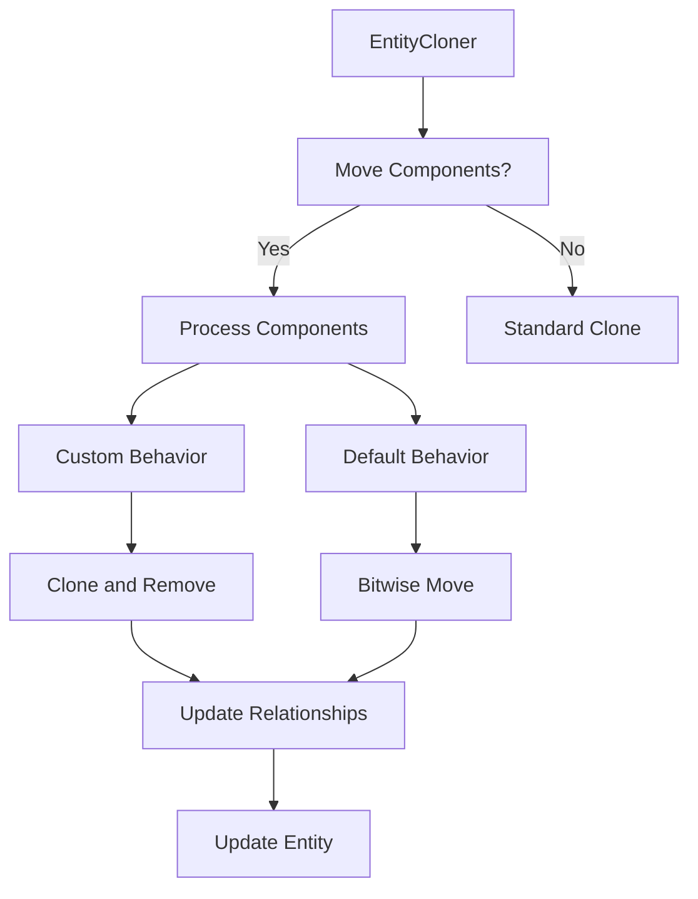

+++
title = "#20065 allow `EntityCloner` to move components without `Clone` or `Reflect`"
date = "2025-07-14T00:00:00"
draft = false
template = "pull_request_page.html"
in_search_index = true

[taxonomies]
list_display = ["show"]

[extra]
current_language = "en"
available_languages = {"en" = { name = "English", url = "/pull_request/bevy/2025-07/pr-20065-en-20250714" }, "zh-cn" = { name = "中文", url = "/pull_request/bevy/2025-07/pr-20065-zh-cn-20250714" }}
labels = ["C-Bug", "A-ECS", "D-Complex"]
+++

### Analysis of PR #20065: allow `EntityCloner` to move components without `Clone` or `Reflect`

#### Basic Information
- **Title**: allow `EntityCloner` to move components without `Clone` or `Reflect`
- **PR Link**: https://github.com/bevyengine/bevy/pull/20065
- **Author**: eugineerd
- **Status**: MERGED
- **Labels**: C-Bug, A-ECS, S-Ready-For-Final-Review, D-Complex, X-Uncontroversial
- **Created**: 2025-07-09T17:09:31Z
- **Merged**: 2025-07-14T23:03:10Z
- **Merged By**: alice-i-cecile

#### Description
**Objective**  
Fix #18079  

**Solution**  
- `EntityCloner` can now move components that don't have `Clone` or `Reflect` implementation.  
- Components with `ComponentCloneBehavior::Ignore` will not be moved.  
- Components with `ComponentCloneBehavior::Custom` will be cloned using their defined `ComponentCloneFn` and then removed from the source entity to respect their `queue_deferred` logic.  
- Relationships still need to be `Clone` or `Reflect` to be movable.  
- Custom relationship data is now correctly preserved when cloned or moved using `EntityCloner`.  

**Testing**  
- Added new tests for moving components  

---

### Technical Analysis

#### The Problem and Context
The original `EntityCloner` required components to implement `Clone` or `Reflect` to be moved. This was problematic for components containing non-cloneable resources (e.g., file handles) or complex state where cloning wasn't semantically appropriate. Issue #18079 highlighted this limitation, particularly for workflows needing true component movement rather than cloning. The technical constraint was that moving components required special handling to:
1. Transfer ownership without cloning
2. Handle custom clone behaviors
3. Maintain relationship integrity
4. Avoid triggering incorrect drop logic

#### Solution Approach
The solution extends `EntityCloner` with a move mode that:
1. Uses bitwise copies for default components
2. Preserves custom clone behaviors
3. Adds specialized handling for relationships
4. Introduces a "moved" marker to skip drop logic

Key engineering decisions:
- Replaced the default clone handler with a move handler when moving components
- Added a state machine to track moved vs cloned components
- Implemented a two-phase removal process to handle different component types
- Enhanced relationship cloning to work with moved entities

#### Implementation Details
The core changes occur in `clone_entities.rs` where `EntityCloner` gains move capabilities:

```rust
// In clone_entity_internal()
if state.move_components {
    // Replace default handler with move tracker
    state.default_clone_fn = |_, ctx| ctx.move_component();
}

// During component processing
if ctx.state.move_components {
    if ctx.target_component_moved {
        moved_components.push(component);
    }
    else if !ctx.target_component_written() {
        deferred_cloned_component_ids.push(component);
    }
}

// Post-clone removal logic
source_entity.remove_by_ids_with_caller(
    &moved_components,
    MaybeLocation::caller(),
    RelationshipHookMode::RunIfNotLinked,
    |sparse_sets, mut table, components, bundle| {
        // Bitwise copy without drop
        unsafe {
            core::ptr::copy_nonoverlapping(...);
            bundle_scratch.push_ptr(...);
        }
        (false, ()) // Skip drop
    },
);
```

Relationship handling was updated in `relationship/mod.rs` to support moves:
```rust
// Updated clone_relationship_target()
else if context.moving() {
    context.queue_deferred(|world, _mapper| {
        world.modify_component_with_relationship_hook_mode(
            entity,
            RelationshipHookMode::Skip, // Bypass hooks
            |r| r.set_risky(target)
        );
    });
}
```

#### Technical Insights
Key technical aspects:
1. **Move vs Clone Semantics**:
   - Components with `ComponentCloneBehavior::Ignore` are skipped
   - Custom-cloned components are processed then removed
   - Default components are bitwise-copied and forgotten

2. **Performance Considerations**:
   - Bitwise copies avoid allocation overhead
   - Two removal passes optimize for bulk operations
   - Relationship updates are deferred to minimize lookups

3. **Edge Case Handling**:
   - Components with remove hooks still trigger them
   - Relationships maintain integrity during moves
   - Custom clone behaviors respect deferred logic

4. **Safety**:
   - Uses `unsafe` for bitwise copies but validates layouts
   - Maintains entity location consistency
   - Preserves relationship invariants

#### Impact
These changes:
1. Enable true component movement without cloning constraints
2. Maintain backward compatibility with existing clone behaviors
3. Improve performance for move operations
4. Fix relationship preservation during moves
5. Add comprehensive test coverage for move scenarios

The solution maintains ECS integrity while providing new flexibility for system designs requiring true ownership transfer.

---

### Visual Representation



---

### Key Files Changed

1. **crates/bevy_ecs/src/entity/clone_entities.rs** (+539/-10)  
   Core move logic implementation:
   ```rust
   // Added move tracking in ComponentCloneCtx
   pub struct ComponentCloneCtx<'a, 'b> {
       target_component_moved: bool, // New field
       // ...
   }
   
   // New move method
   fn move_component(&mut self) {
       self.target_component_moved = true;
       self.target_component_written = true;
   }
   
   // Enhanced removal logic
   source_entity.remove_by_ids_with_caller(
       &moved_components,
       // ...,
       |sparse_sets, mut table, components, bundle| {
           // Bitwise copy implementation
       }
   );
   ```

2. **crates/bevy_ecs/src/relationship/mod.rs** (+156/-16)  
   Relationship move support:
   ```rust
   // Specialized clone behavior
   impl<C: RelationshipTarget + Clone> RelationshipTargetCloneBehaviorViaClone 
       for &&&&RelationshipCloneBehaviorSpecialization<C> 
   {
       fn default_clone_behavior(&self) -> ComponentCloneBehavior {
           ComponentCloneBehavior::Custom(|source, context| {
               // Custom move handling
           })
       }
   }
   ```

3. **crates/bevy_ecs/src/world/entity_ref.rs** (+24/-9)  
   Extended removal API:
   ```rust
   pub(crate) fn remove_by_ids_with_caller<T: 'static>(
       &mut self,
       component_ids: &[ComponentId],
       caller: MaybeLocation,
       relationship_hook_mode: RelationshipHookMode,
       pre_remove: impl FnOnce(/*...*/) -> (bool, T),
   ) -> &mut Self
   ```

4. **crates/bevy_ecs/src/system/commands/entity_command.rs** (+14/-2)  
   Command documentation update:
   ```rust
   /// Moves the specified components of an entity
   /// 
   /// Components with [`Ignore`] clone behavior will not be moved
   /// Components with [`Custom`] behavior will be cloned then removed
   pub fn move_components<B: Bundle>(target: Entity) -> impl EntityCommand
   ```

5. **crates/bevy_ecs/src/system/commands/mod.rs** (+9/-4)  
   Command implementation:
   ```rust
   /// Moves components to another entity
   ///
   /// Note: Triggers remove/insert hooks
   pub fn move_components<B: Bundle>(&mut self, target: Entity) -> &mut Self
   ```

---

### Further Reading
1. [Entity Component System Architecture](https://en.wikipedia.org/wiki/Entity_component_system)
2. [Rust Ownership Semantics](https://doc.rust-lang.org/book/ch04-01-what-is-ownership.html)
3. [Bevy ECS Documentation](https://bevyengine.org/learn/book/next/ecs/)