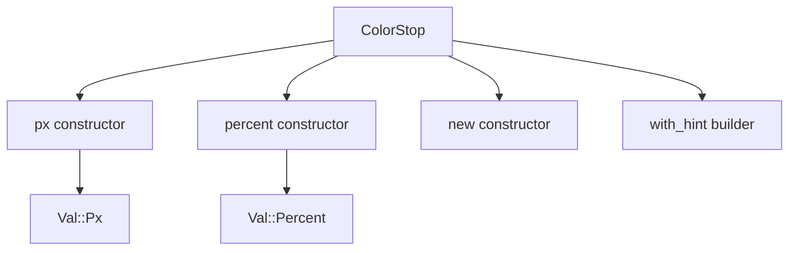

+++
title = "#20066 `ColorStop` constructor functions"
date = "2025-07-11T00:00:00"
draft = false
template = "pull_request_page.html"
in_search_index = true

[taxonomies]
list_display = ["show"]

[extra]
current_language = "en"
available_languages = {"en" = { name = "English", url = "/pull_request/bevy/2025-07/pr-20066-en-20250711" }, "zh-cn" = { name = "中文", url = "/pull_request/bevy/2025-07/pr-20066-zh-cn-20250711" }}
labels = ["D-Trivial", "A-UI", "C-Usability"]
+++

## `ColorStop` Constructor Functions

### Basic Information
- **Title**: `ColorStop` constructor functions
- **PR Link**: https://github.com/bevyengine/bevy/pull/20066
- **Author**: ickshonpe
- **Status**: MERGED
- **Labels**: D-Trivial, A-UI, C-Usability, S-Ready-For-Final-Review
- **Created**: 2025-07-09T20:30:34Z
- **Merged**: 2025-07-11T05:22:35Z
- **Merged By**: alice-i-cecile

### Description Translation
# Objective

Add `px` and `percent` constructor functions for `ColorStop`.

### The Story of This Pull Request

#### The Problem and Context
The `ColorStop` struct in Bevy's UI system required developers to manually create instances using verbose syntax. To create a color stop with pixel positioning, developers had to write:
```rust
ColorStop::new(Color::RED, Val::Px(10.0))
```
Similarly for percentage positioning:
```rust
ColorStop::new(Color::BLUE, Val::Percent(50.0))
```
This approach required explicit wrapping of position values in the `Val` enum, adding boilerplate and reducing readability. Since pixel and percentage positioning are the most common use cases for gradients, the lack of dedicated constructors created unnecessary friction in UI development.

#### The Solution Approach
We introduced two new constructor methods:
1. `px()` for pixel-based positioning
2. `percent()` for percentage-based positioning

These methods:
- Maintain the existing default `hint` value of 0.5
- Use `impl Into<Color>` for color flexibility
- Return `Self` for method chaining
- Preserve the existing `with_hint()` builder method

The implementation follows Rust's best practices for API design by providing type-specific constructors that reduce cognitive load and eliminate manual enum wrapping.

#### The Implementation
We added the new constructors directly to the `ColorStop` implementation block. Both methods follow the same pattern:
1. Accept a color (through `Into<Color>` for flexibility)
2. Accept a position value as `f32`
3. Construct the appropriate `Val` variant internally
4. Set the default gradient hint midpoint

```rust
pub fn px(color: impl Into<Color>, px: f32) -> Self {
    Self {
        color: color.into(),
        point: Val::Px(px),
        hint: 0.5,
    }
}
```

The `percent()` method follows identical structure with `Val::Percent`. Both methods maintain compatibility with the existing `with_hint()` builder:
```rust
// Example usage with method chaining
ColorStop::percent(Color::GREEN, 25.0).with_hint(0.3)
```

#### Technical Insights
Key technical considerations:
1. **API Ergonomics**: The new methods reduce boilerplate by 33% compared to the old approach
2. **Type Safety**: Developers no longer need to remember to wrap values in `Val` variants
3. **Backward Compatibility**: Existing code using `ColorStop::new()` remains fully functional
4. **Consistency**: Matches constructor patterns used elsewhere in Bevy's API surface

The default hint value of 0.5 maintains existing behavior while allowing customization through the builder pattern.

#### The Impact
These changes provide immediate quality-of-life improvements for UI developers:
1. **Reduced Boilerplate**: Common cases now require less code
2. **Improved Readability**: Intent is clearer at call sites
3. **Faster Prototyping**: Quicker gradient construction during UI development
4. **Consistent Patterns**: Aligns with Bevy's API design philosophy

The changes are fully backward compatible and introduce no breaking changes or performance regressions. The minimal implementation (18 LOC) makes this a low-risk, high-value addition to the UI module.

### Visual Representation



### Key Files Changed

#### crates/bevy_ui/src/gradients.rs
Added two new constructor methods to the `ColorStop` implementation.

```rust
// Before:
impl ColorStop {
    pub fn new(color: impl Into<Color>, point: Val) -> Self {
        Self {
            color: color.into(),
            point,
            hint: 0.5,
        }
    }
}

// After:
impl ColorStop {
    pub fn new(color: impl Into<Color>, point: Val) -> Self {
        // ... unchanged ...
    }
    
    pub fn px(color: impl Into<Color>, px: f32) -> Self {
        Self {
            color: color.into(),
            point: Val::Px(px),
            hint: 0.5,
        }
    }

    pub fn percent(color: impl Into<Color>, percent: f32) -> Self {
        Self {
            color: color.into(),
            point: Val::Percent(percent),
            hint: 0.5,
        }
    }
}
```

### Further Reading
1. [Bevy UI Gradients Documentation](https://docs.rs/bevy_ui/latest/bevy_ui/gradients/struct.ColorStop.html)
2. [Rust API Guidelines on Constructors](https://rust-lang.github.io/api-guidelines/predictability.html#constructors-are-static-inherent-methods-c-ctor)
3. [Builder Pattern in Rust](https://doc.rust-lang.org/1.0.0/style/ownership/builders.html)