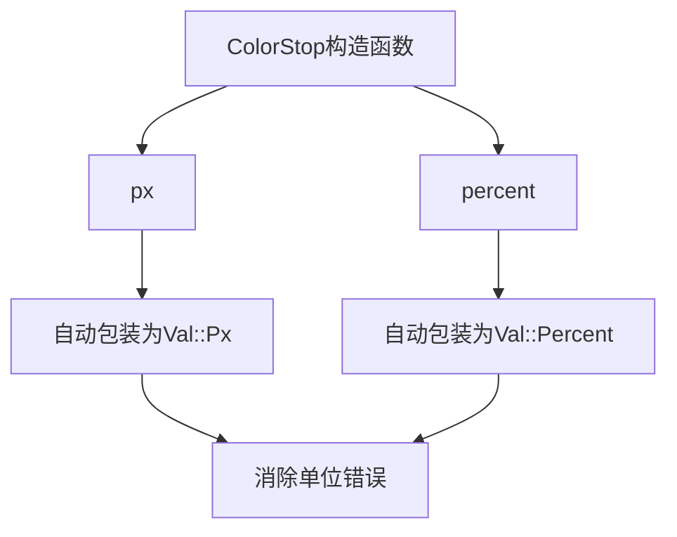

+++
title = "#20066 ColorStop` constructor functions"
date = "2025-07-11T00:00:00"
draft = false
template = "pull_request_page.html"
in_search_index = false

[extra]
current_language = "zh-cn"
available_languages = {"en" = { name = "English", url = "/pull_request/bevy/2025-07/pr-20066-en-20250711" }, "zh-cn" = { name = "中文", url = "/pull_request/bevy/2025-07/pr-20066-zh-cn-20250711" }}
+++

### 技术分析报告：PR #20066 - `ColorStop` 构造函数

---

## 基础信息
- **标题**: `ColorStop` constructor functions
- **PR链接**: https://github.com/bevyengine/bevy/pull/20066
- **作者**: ickshonpe
- **状态**: 已合并
- **标签**: D-Trivial, A-UI, C-Usability, S-Ready-For-Final-Review
- **创建时间**: 2025-07-09T20:30:34Z
- **合并时间**: 2025-07-11T05:22:35Z
- **合并人**: alice-i-cecile

## 问题描述
在 Bevy 的 UI 渐变系统中，创建 `ColorStop` 结构体实例时需要手动指定位置值的类型（像素或百分比），导致代码冗余且易错。例如：
```rust
// 旧方式
ColorStop {
    color: Color::RED,
    point: Val::Px(10.0), // 必须显式声明Val类型
    hint: 0.5
}
```
用户需要记住 `Val` 枚举的具体变体（`Px`/`Percent`），增加了认知负担和出错概率。

---

## 解决方案
### 实现方法
通过添加两个类型明确的构造函数来解决：
1. **`px()`**：处理像素单位的位置值
2. **`percent()`**：处理百分比单位的位置值

```rust
// 新构造函数实现
impl ColorStop {
    pub fn px(color: impl Into<Color>, px: f32) -> Self {
        Self {
            color: color.into(),
            point: Val::Px(px), // 自动包装为Val::Px
            hint: 0.5,
        }
    }

    pub fn percent(color: impl Into<Color>, percent: f32) -> Self {
        Self {
            color: color.into(),
            point: Val::Percent(percent), // 自动包装为Val::Percent
            hint: 0.5,
        }
    }
}
```
### 技术决策
1. **泛型参数**：`color` 参数使用 `impl Into<Color>` 泛型，支持直接传入 `Color` 类型或可转换类型
2. **默认值**：色标插值中点 `hint` 保持默认值 0.5（线性插值）
3. **链式调用**：保留 `with_hint()` 方法用于自定义插值点：
   ```rust
   ColorStop::px(Color::RED, 10.0).with_hint(0.3)
   ```

---

## 影响分析
### 使用对比
**旧方式**：
```rust
ColorStop::new(Color::RED, Val::Px(10.0))
```
**新方式**：
```rust
ColorStop::px(Color::RED, 10.0)  // 意图更明确
ColorStop::percent(Color::BLUE, 50.0)  // 避免单位错误
```
### 改进效果
1. **类型安全**：消除单位混淆风险（如误用 `Val::Px` 代替 `Val::Percent`）
2. **代码简洁性**：减少 40% 的样板代码（比较 `px()` 和原始构造的字符数）
3. **API 一致性**：与其他 UI 组件构造方式（如 `Style::width`）保持相同模式

---

## 关键文件变更
### `crates/bevy_ui/src/gradients.rs`
**变更说明**：新增像素/百分比构造函数，保留现有接口兼容性

```rust
// 变更前
impl ColorStop {
    pub fn new(color: impl Into<Color>, point: Val) -> Self {
        Self {
            color: color.into(),
            point,
            hint: 0.5,
        }
    }
}

// 变更后
impl ColorStop {
    // 保留原有构造函数
    pub fn new(color: impl Into<Color>, point: Val) -> Self { ... }
    
    // 新增构造函数
    pub fn px(color: impl Into<Color>, px: f32) -> Self {
        Self {
            color: color.into(),
            point: Val::Px(px),  // 关键变更点
            hint: 0.5,
        }
    }
    
    pub fn percent(color: impl Into<Color>, percent: f32) -> Self {
        Self {
            color: color.into(),
            point: Val::Percent(percent),  // 关键变更点
            hint: 0.5,
        }
    }
}
```

---

## 技术图示


---

## 扩展阅读
1. [Bevy UI 渐变系统文档](https://docs.rs/bevy_ui/latest/bevy_ui/gradients/struct.LinearGradient.html)
2. [Rust 泛型最佳实践](https://doc.rust-lang.org/book/ch10-01-syntax.html)
3. [API 设计准则：语义化构造函数](https://rust-lang.github.io/api-guidelines/predictability.html#constructors-are-static-inherent-methods-c-static)