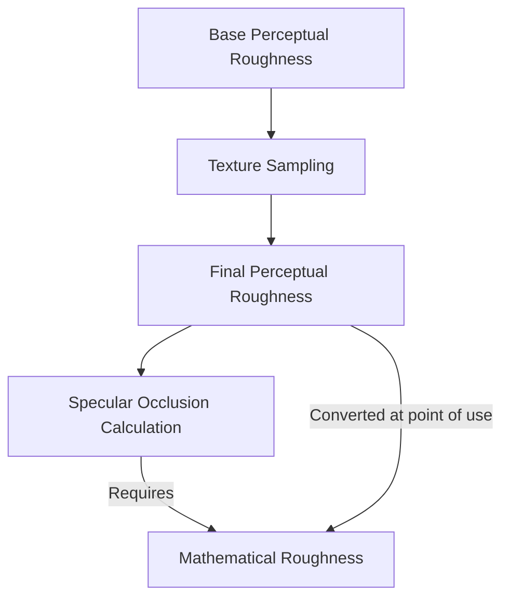

+++
title = "#20067 Fix SSAO specular occlusion roughness bug"
date = "2025-07-11T00:00:00"
draft = false
template = "pull_request_page.html"
in_search_index = true

[taxonomies]
list_display = ["show"]

[extra]
current_language = "en"
available_languages = {"en" = { name = "English", url = "/pull_request/bevy/2025-07/pr-20067-en-20250711" }, "zh-cn" = { name = "中文", url = "/pull_request/bevy/2025-07/pr-20067-zh-cn-20250711" }}
labels = ["C-Bug", "A-Rendering"]
+++

# Analysis: Fix SSAO Specular Occlusion Roughness Bug

## Basic Information
- **Title**: Fix SSAO specular occlusion roughness bug
- **PR Link**: https://github.com/bevyengine/bevy/pull/20067
- **Author**: JMS55
- **Status**: MERGED
- **Labels**: C-Bug, A-Rendering, S-Ready-For-Final-Review
- **Created**: 2025-07-09T20:52:44Z
- **Merged**: 2025-07-11T05:22:35Z
- **Merged By**: alice-i-cecile

## Description Translation
Noticed that we're converting perceptual_roughness to roughness for SSAO specular occlusion up here, _but_ that happens _before_ we sample the metallic_roughness texture map. So we're using the wrong roughness. I assume this is a bug and was not intentional.

Suggest reviewing while hiding the whitespace diff.

## The Story of This Pull Request

### The Problem and Context
The PR addresses a bug in Bevy's physically-based rendering (PBR) pipeline related to screen-space ambient occlusion (SSAO) calculations. Specifically, the specular occlusion computation was using an incorrect roughness value. The root cause was a timing issue in the shader where roughness conversion happened before texture sampling.

In the PBR workflow:
1. Perceptual roughness is either provided directly or sampled from textures
2. This value is converted to mathematical roughness using `perceptualRoughnessToRoughness()`
3. The mathematical roughness is used in lighting calculations

The bug occurred because step 2 (conversion) was happening before step 1 (texture sampling) was complete. This meant materials using metallic-roughness textures had specular occlusion calculations based on unconverted base values rather than final sampled values. The visual impact would be incorrect specular occlusion for textured materials, particularly noticeable in SSAO effects.

### The Solution Approach
The solution required repositioning the roughness conversion in the shader execution flow. Instead of converting perceptual roughness to mathematical roughness early in the process, we delay this conversion until immediately before the specular occlusion calculation. This ensures:
1. Texture sampling completes first
2. We use the final perceptual roughness value
3. The conversion happens just-in-time for the occlusion calculation

No alternative approaches were considered since this was a clear sequencing error. The fix maintains the existing algorithm from Lagarde and Rousiers' 2014 PBR implementation while correcting the input timing.

### The Implementation
The implementation modifies `pbr_fragment.wgsl` with three precise changes:

1. **Remove early roughness conversion**: Eliminates the premature conversion that used base material values
2. **Fix whitespace artifact**: Corrects a minor formatting issue in occlusion texture sampling
3. **Add just-in-time conversion**: Inserts the roughness conversion immediately before specular occlusion calculation

The key technical insight is that `pbr_input.material.perceptual_roughness` contains the final value after texture sampling, making it the correct input for conversion when used at the point of specular occlusion calculation.

### Technical Insights
- **Roughness Conversion**: The `lighting::perceptualRoughnessToRoughness` function squares the perceptual roughness value to obtain mathematical roughness used in lighting equations
- **Data Flow**: The fix ensures the shader uses the final perceptual roughness (after texture sampling) rather than the base material value
- **Performance**: No measurable performance impact since we're moving an existing calculation rather than adding new operations

### The Impact
This correction ensures specular occlusion calculations accurately reflect material properties defined in textures. Materials using metallic-roughness textures will now have correct SSAO interactions with specular highlights. The fix maintains visual consistency between materials with and without textures.

## Visual Representation



## Key Files Changed

### `crates/bevy_pbr/src/render/pbr_fragment.wgsl`
**Changes:** 
1. Removed early roughness conversion that occurred before texture sampling
2. Fixed whitespace in occlusion texture sampling
3. Added roughness conversion at point of specular occlusion calculation

**Code Snippets:**

Before (incorrect timing):
```wgsl
// Before texture sampling
var perceptual_roughness: f32 = pbr_bindings::material.perceptual_roughness;
let roughness = lighting::perceptualRoughnessToRoughness(perceptual_roughness);

// Texture sampling happens later...
#ifdef VERTEX_UVS
if ((flags & pbr_types::STANDARD_MATERIAL_FLAGS_METALLIC_ROUGHNESS_TEXTURE_BIT) != 0u) {
    // Modifies perceptual_roughness but roughness is already calculated
}
#endif

// Later usage with stale roughness value
specular_occlusion = saturate(pow(NdotV + ssao, exp2(-16.0 * roughness - 1.0)) - 1.0 + ssao);
```

After (corrected flow):
```wgsl
var perceptual_roughness: f32 = pbr_bindings::material.perceptual_roughness;

// Texture sampling happens first...
#ifdef VERTEX_UVS
if ((flags & pbr_types::STANDARD_MATERIAL_FLAGS_METALLIC_ROUGHNESS_TEXTURE_BIT) != 0u) {
    // Modifies perceptual_roughness
}
#endif

// Conversion at point of use with final value
let roughness = lighting::perceptualRoughnessToRoughness(pbr_input.material.perceptual_roughness);
specular_occlusion = saturate(pow(NdotV + ssao, exp2(-16.0 * roughness - 1.0)) - 1.0 + ssao);
```

## Further Reading
1. [Moving Frostbite to Physically Based Rendering (2014)](https://www.ea.com/frostbite/news/moving-frostbite-to-pb) - Original reference for specular occlusion technique
2. [Bevy PBR Documentation](https://bevyengine.org/learn/book/features/pbr/) - Bevy's PBR implementation overview
3. [WGSL Spec](https://gpuweb.github.io/gpuweb/wgsl/) - WebGPU Shading Language reference