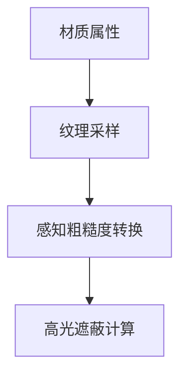

+++
title = "#20067 Fix SSAO specular occlusion roughness bug"
date = "2025-07-11T00:00:00"
draft = false
template = "pull_request_page.html"
in_search_index = false

[extra]
current_language = "zh-cn"
available_languages = {"en" = { name = "English", url = "/pull_request/bevy/2025-07/pr-20067-en-20250711" }, "zh-cn" = { name = "中文", url = "/pull_request/bevy/2025-07/pr-20067-zh-cn-20250711" }}
+++

### 修复 SSAO 高光遮蔽粗糙度计算错误的技术分析报告

#### 基本信息
- **标题**: Fix SSAO specular occlusion roughness bug
- **PR 链接**: https://github.com/bevyengine/bevy/pull/20067
- **作者**: JMS55
- **状态**: 已合并
- **标签**: C-Bug, A-Rendering, S-Ready-For-Final-Review
- **创建时间**: 2025-07-09T20:52:44Z
- **合并时间**: 2025-07-11T05:22:35Z
- **合并者**: alice-i-cecile

#### 描述翻译
注意到我们在 SSAO 高光遮蔽计算中将感知粗糙度(perceptual_roughness)转换为粗糙度(roughness)的操作发生在此处，但这发生在采样金属粗糙度纹理(metallic_roughness texture map)之前。因此我们使用了错误的粗糙度值。我认为这是一个 bug 而非有意设计。

建议审查时隐藏空白差异(whitespace diff)。

---

### PR 技术分析

#### 问题背景
在 Bevy 的 PBR 渲染管线中，屏幕空间环境光遮蔽(SSAO)计算包含两个关键部分：
1. 漫反射遮蔽(diffuse occlusion)
2. 高光遮蔽(specular occlusion)

高光遮蔽计算依赖于材质的粗糙度(roughness)值，其计算公式为：
```wgsl
specular_occlusion = saturate(pow(NdotV + ssao, exp2(-16.0 * roughness - 1.0)) - 1.0 + ssao
```
原始实现存在一个关键缺陷：粗糙度转换发生在材质纹理采样之前。具体流程：
1. 过早地将感知粗糙度(perceptual_roughness)转换为实际粗糙度(roughness)
2. 随后才采样金属粗糙度纹理(metallic_roughness texture)
3. 纹理采样结果会覆盖原始的感知粗糙度值

这导致高光遮蔽计算使用了未更新的错误粗糙度值，尤其在使用纹理贴图时会产生视觉异常。

#### 解决方案
核心修复方案是**延迟粗糙度转换时机**：
1. 移除预处理阶段的过早转换
2. 在需要粗糙度值的精确位置进行实时转换
3. 确保使用纹理采样后的最终感知粗糙度值

工程决策考虑：
- 避免增加额外变量存储中间结果
- 最小化着色器指令影响
- 保持代码可读性

#### 实现细节
关键修改位于 `pbr_fragment.wgsl` 着色器文件：

**1. 移除过早的粗糙度转换**
```wgsl
// 修改前
let roughness = lighting::perceptualRoughnessToRoughness(perceptual_roughness);

// 修改后
// 完全移除该行
```
此步骤消除在纹理采样前进行的错误转换。

**2. 修复空白字符问题（非功能性变更）**
```wgsl
// 修改前
diffuse_occlusion *= 

// 修改后
diffuse_occlusion *=
```
纯格式修正，不影响逻辑。

**3. 在正确位置进行粗糙度转换**
```wgsl
// 修改后新增
let roughness = lighting::perceptualRoughnessToRoughness(pbr_input.material.perceptual_roughness);
specular_occlusion = saturate(pow(NdotV + ssao, exp2(-16.0 * roughness - 1.0)) - 1.0 + ssao;
```
此处 `pbr_input.material.perceptual_roughness` 是经过纹理采样处理后的最终值，确保：
- 纹理采样结果已被应用
- 转换发生在实际使用粗糙度值的精确位置
- 符合 Lagarde-Rousiers 2014 论文的物理正确实现

#### 技术影响
1. **正确性修复**：
   - 解决纹理采样与粗糙度计算的时序依赖问题
   - 确保金属/粗糙度纹理正确影响高光遮蔽
   - 消除因错误粗糙度导致的视觉异常

2. **性能考量**：
   - 新增的转换操作仅在高光遮蔽计算路径执行
   - 未增加额外纹理采样或复杂计算
   - 指令开销可忽略（单次 `perceptualRoughnessToRoughness` 调用）

3. **维护性提升**：
   - 消除隐藏的时序耦合
   - 明确粗糙度数据的生产-消费关系
   - 符合 WGSL 着色器的最佳实践

#### 关键文件变更
**crates/bevy_pbr/src/render/pbr_fragment.wgsl**
```wgsl
// 修改前片段
let roughness = lighting::perceptualRoughnessToRoughness(perceptual_roughness);
...
specular_occlusion = saturate(pow(NdotV + ssao, exp2(-16.0 * roughness - 1.0)) - 1.0 + ssao;

// 修改后片段
...
let roughness = lighting::perceptualRoughnessToRoughness(pbr_input.material.perceptual_roughness);
specular_occlusion = saturate(pow(NdotV + ssao, exp2(-16.0 * roughness - 1.0)) - 1.0 + ssao;
```

#### 组件关系图


#### 延伸阅读
1. Lagarde & Rousiers 2014: [Moving Frostbite to PBR](https://www.ea.com/frostbite/news/moving-frostbite-to-pb)
2. Bevy PBR 渲染原理: [Bevy PBR Rendering](https://bevyengine.org/learn/book/rendering/pbr/)
3. WGSL 规范: [WebGPU Shading Language](https://www.w3.org/TR/WGSL/)