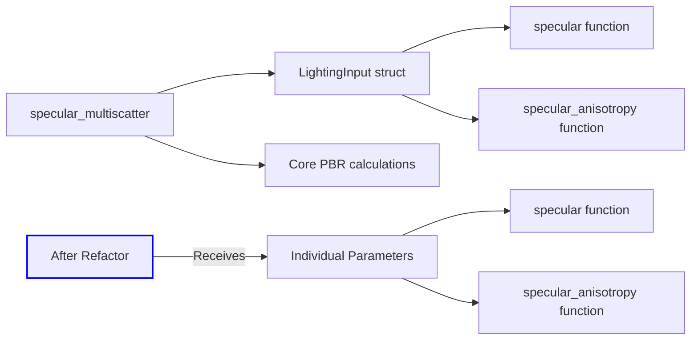

+++
title = "#20068 Adjust specular_multiscatter to not take LightingInput"
date = "2025-07-11T00:00:00"
draft = false
template = "pull_request_page.html"
in_search_index = true

[taxonomies]
list_display = ["show"]

[extra]
current_language = "en"
available_languages = {"en" = { name = "English", url = "/pull_request/bevy/2025-07/pr-20068-en-20250711" }, "zh-cn" = { name = "中文", url = "/pull_request/bevy/2025-07/pr-20068-zh-cn-20250711" }}
labels = ["A-Rendering", "C-Code-Quality"]
+++

## Adjust specular_multiscatter to not take LightingInput

### Basic Information
- **Title**: Adjust specular_multiscatter to not take LightingInput
- **PR Link**: https://github.com/bevyengine/bevy/pull/20068
- **Author**: JMS55
- **Status**: MERGED
- **Labels**: A-Rendering, C-Code-Quality, S-Ready-For-Final-Review
- **Created**: 2025-07-09T20:54:14Z
- **Merged**: 2025-07-11T05:15:07Z
- **Merged By**: alice-i-cecile

### Description Translation
Small refactor for a future bevy_solari PR.

Suggest reviewing while hiding the whitespace diff.

### The Story of This Pull Request
The PR addresses a structural limitation in Bevy's PBR lighting calculations. The original `specular_multiscatter` function required a full `LightingInput` struct pointer as its parameter. This design created unnecessary coupling between the multiscattering calculation and the broader lighting context, limiting flexibility for future rendering features.

The solution refactors `specular_multiscatter` to accept only the essential parameters it actually needs: `D` (distribution term), `V` (visibility term), `F` (Fresnel term), `F0` (base reflectivity), `F_ab` (multiscattering coefficients), and `specular_intensity`. By decoupling the function from the `LightingInput` struct, we achieve:
1. Reduced parameter passing overhead
2. Clearer separation of concerns
3. Better reusability for future rendering techniques

Implementation-wise, the changes are localized but significant. The function signature is modified to remove the `LightingInput` pointer and directly accept the required values. All call sites are updated to pass the necessary parameters individually instead of through the struct. The core computation remains unchanged - only the parameter handling is modified.

The changes also include minor whitespace cleanups (removing trailing whitespace) that improve code consistency but don't affect functionality. As suggested in the PR description, these can be viewed separately by hiding whitespace changes during review.

This refactoring prepares the codebase for future work (referenced as `bevy_solari` PR) that will leverage this more flexible function signature. The modification maintains exact functional equivalence while improving the API design for subsequent rendering enhancements.

### Visual Representation


### Key Files Changed
**crates/bevy_pbr/src/render/pbr_lighting.wgsl**  
Refactored the `specular_multiscatter` function and its call sites.

Before:
```wgsl
fn specular_multiscatter(
    input: ptr<function, LightingInput>,
    D: f32,
    V: f32,
    F: vec3<f32>,
    specular_intensity: f32,
) -> vec3<f32> {
    // Unpack.
    let F0 = (*input).F0_;
    let F_ab = (*input).F_ab;

    var Fr = (specular_intensity * D * V) * F;
    Fr *= 1.0 + F0 * (1.0 / F_ab.x - 1.0);
    return Fr;
}
```

After:
```wgsl
fn specular_multiscatter(
    D: f32,
    V: f32,
    F: vec3<f32>,
    F0: vec3<f32>,
    F_ab: vec2<f32>,
    specular_intensity: f32,
) -> vec3<f32> {
    var Fr = (specular_intensity * D * V) * F;
    Fr *= 1.0 + F0 * (1.0 / F_ab.x - 1.0);
    return Fr;
}
```

Call site update in `specular` function:
```wgsl
// Before:
let Fr = specular_multiscatter(input, D, V, F, specular_intensity);

// After:
let Fr = specular_multiscatter(D, V, F, F0, (*input).F_ab, specular_intensity);
```

Call site update in `specular_anisotropy` function:
```wgsl
// Before:
let Fr = specular_multiscatter(input, Da, Va, Fa, specular_intensity);

// After:
let Fr = specular_multiscatter(Da, Va, Fa, F0, (*input).F_ab, specular_intensity);
```

### Further Reading
1. [Filament PBR Documentation](https://google.github.io/filament/Filament.html#listing_energycompensationimpl) - Reference implementation for multiscattering approximation
2. [WGSL Function Parameter Best Practices](https://www.w3.org/TR/WGSL/#function-declaration-and-calls) - Official specification for efficient parameter passing
3. [Bevy PBR Rendering Guide](https://bevyengine.org/learn/book/features/pbr/) - Official documentation on Bevy's PBR implementation