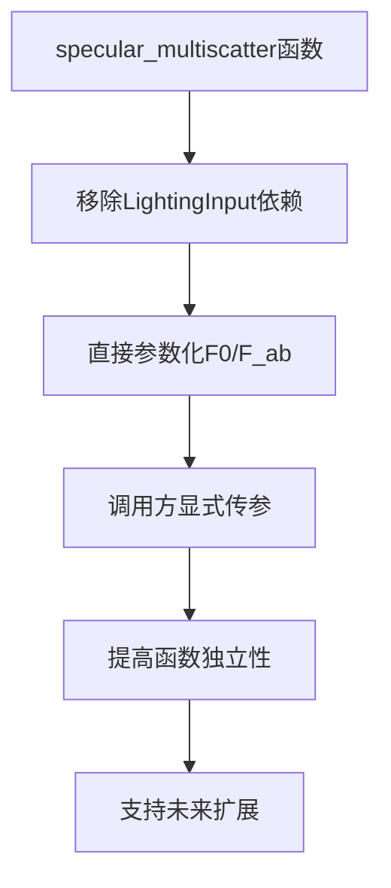

+++
title = "#20068 Adjust specular_multiscatter to not take LightingInput"
date = "2025-07-11T00:00:00"
draft = false
template = "pull_request_page.html"
in_search_index = false

[extra]
current_language = "zh-cn"
available_languages = {"en" = { name = "English", url = "/pull_request/bevy/2025-07/pr-20068-en-20250711" }, "zh-cn" = { name = "中文", url = "/pull_request/bevy/2025-07/pr-20068-zh-cn-20250711" }}
+++

## Adjust specular_multiscatter to not take LightingInput

### 基本信息
- **标题**: Adjust specular_multiscatter to not take LightingInput
- **PR链接**: https://github.com/bevyengine/bevy/pull/20068
- **作者**: JMS55
- **状态**: 已合并
- **标签**: A-Rendering, C-Code-Quality, S-Ready-For-Final-Review
- **创建时间**: 2025-07-09T20:54:14Z
- **合并时间**: 2025-07-11T05:15:07Z
- **合并者**: alice-i-cecile

### 描述翻译
为未来的bevy_solari PR进行小规模重构。
建议查看时隐藏空格差异（whitespace diff）。

### PR的技术故事

#### 问题和背景
在PBR渲染管线中，`specular_multiscatter`函数负责计算多散射高光项。原始实现存在不必要的耦合问题：
```wgsl
fn specular_multiscatter(
    input: ptr<function, LightingInput>,  // 需要整个结构体
    D: f32,
    V: f32,
    F: vec3<f32>,
    specular_intensity: f32,
) -> vec3<f32> {
    let F0 = (*input).F0_;  // 实际只使用两个字段
    let F_ab = (*input).F_ab;
    // ...
}
```
这种设计导致：
1. 函数签名与实际依赖不匹配（仅需`F0`和`F_ab`）
2. 增加了调用方的耦合（必须构造完整LightingInput结构体）
3. 限制了未来扩展（如不同来源的多散射计算）

#### 解决方案
核心修改是将显式依赖参数化：
```wgsl
fn specular_multiscatter(
    D: f32,
    V: f32,
    F: vec3<f32>,
    F0: vec3<f32>,  // 直接传入F0
    F_ab: vec2<f32>,  // 直接传入F_ab
    specular_intensity: f32,
) -> vec3<f32> {
    var Fr = (specular_intensity * D * V) * F;
    Fr *= 1.0 + F0 * (1.0 / F_ab.x - 1.0);
    return Fr;
}
```
这样修改后：
1. 消除对LightingInput的依赖
2. 明确函数实际所需的最小参数集
3. 保持计算逻辑不变（仅参数传递方式变化）

#### 实现细节
所有调用点同步更新：
```wgsl
// 原调用
specular_multiscatter(input, D, V, F, specular_intensity);

// 新调用
specular_multiscatter(D, V, F, F0, (*input).F_ab, specular_intensity);
```
技术要点：
1. 保持物理计算不变（Fr计算逻辑完全相同）
2. 参数顺序优化（相关参数相邻）
3. 兼容现有光照模型（anisotropy等保持不变）

#### 影响和优势
1. **降低耦合**：函数不再依赖渲染管线特定结构体
2. **提高复用性**：未来可独立用于非标准光照场景
3. **明确接口**：参数列表清晰表达实际依赖
4. **零性能开销**：WGSL参数传递无额外开销
5. **为扩展铺路**：支持未来bevy_solari的多散射改进

### 可视化关系


### 关键文件变更

#### `crates/bevy_pbr/src/render/pbr_lighting.wgsl`
**变更描述**：重构多散射计算函数接口，移除对LightingInput结构体的依赖。

**关键代码变更**：
```wgsl
// 变更前
fn specular_multiscatter(
    input: ptr<function, LightingInput>,
    D: f32,
    V: f32,
    F: vec3<f32>,
    specular_intensity: f32,
) -> vec3<f32> {
    // 解包结构体字段
    let F0 = (*input).F0_;
    let F_ab = (*input).F_ab;
    
    var Fr = (specular_intensity * D * V) * F;
    Fr *= 1.0 + F0 * (1.0 / F_ab.x - 1.0);
    return Fr;
}

// 变更后
fn specular_multiscatter(
    D: f32,
    V: f32,
    F: vec3<f32>,
    F0: vec3<f32>,      // 直接作为参数
    F_ab: vec2<f32>,    // 直接作为参数
    specular_intensity: f32,
) -> vec3<f32> {
    var Fr = (specular_intensity * D * V) * F;
    Fr *= 1.0 + F0 * (1.0 / F_ab.x - 1.0);
    return Fr;
}
```

**调用点同步更新**：
```wgsl
// 变更前（specular函数内）
let Fr = specular_multiscatter(input, D, V, F, specular_intensity);

// 变更后
let Fr = specular_multiscatter(D, V, F, F0, (*input).F_ab, specular_intensity);
```

### 延伸阅读
1. [Filament多散射理论](https://google.github.io/filament/Filament.html#listing_energycompensationimpl)
2. [WGSL函数参数最佳实践](https://www.w3.org/TR/WGSL/#function-declaration-and-calls)
3. [Bevy PBR渲染架构](https://bevyengine.org/learn/book/next/pbr/)