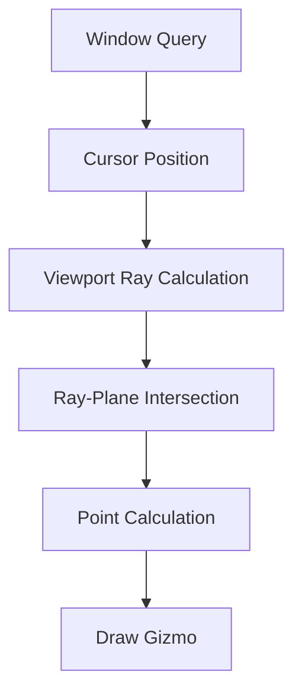

+++
title = "#20071 Refactor `3d_viewport_to_world` example with let chains"
date = "2025-07-10T00:00:00"
draft = false
template = "pull_request_page.html"
in_search_index = true

[taxonomies]
list_display = ["show"]

[extra]
current_language = "en"
available_languages = {"en" = { name = "English", url = "/pull_request/bevy/2025-07/pr-20071-en-20250710" }, "zh-cn" = { name = "中文", url = "/pull_request/bevy/2025-07/pr-20071-zh-cn-20250710" }}
labels = ["D-Trivial", "C-Examples", "C-Code-Quality"]
+++

# Refactor `3d_viewport_to_world` example with let chains

## Basic Information
- **Title**: Refactor `3d_viewport_to_world` example with let chains
- **PR Link**: https://github.com/bevyengine/bevy/pull/20071
- **Author**: tim-blackbird
- **Status**: MERGED
- **Labels**: D-Trivial, C-Examples, C-Code-Quality, S-Ready-For-Final-Review
- **Created**: 2025-07-09T23:25:32Z
- **Merged**: 2025-07-10T02:57:09Z
- **Merged By**: alice-i-cecile

## Description Translation
# Objective

Make use of let chains to reduce LoC where we previously used let else to cut down on indentation. Best of both worlds.

## The Story of This Pull Request

The `3d_viewport_to_world` example needed optimization to improve readability and maintainability. The original implementation used multiple `let else` statements for early returns when required data wasn't available. This approach created several nested conditional blocks that increased indentation levels and made the control flow harder to follow at a glance.

```rust
// Original approach with multiple early returns
let Ok(windows) = windows.single() else { return };
let Some(cursor_position) = windows.cursor_position() else { return };
let Ok(ray) = camera.viewport_to_world(...) else { return };
let Some(distance) = ... else { return };
```

The developer recognized that Rust's let chains feature could consolidate these sequential checks into a single logical block. Let chains allow combining multiple pattern matches in a single `if let` expression using the `&&` operator. This approach maintains the same failure semantics but reduces visual clutter.

The solution modifies the `draw_cursor` system to use a single `if let` chain that combines four separate conditions:
1. Checking for a valid window cursor position
2. Calculating the viewport-to-world ray
3. Checking for ray-plane intersection
4. Calculating the intersection point

```rust
if let Some(cursor_position) = window.cursor_position()
    && let Ok(ray) = camera.viewport_to_world(...)
    && let Some(distance) = ...
{
    // All conditions met - proceed with drawing
}
```

This refactoring achieves several improvements:
1. Reduces total lines of code from 41 to 30
2. Eliminates multiple early return points
3. Groups related condition checks together
4. Makes the success path more visually distinct from failure cases
5. Maintains identical functionality and error handling

An additional optimization changes the window query from `Query<&Window>` to `Single<&Window>`. Since the example only needs the primary window, using `Single` is more efficient and semantically clearer. This change also eliminates the need for separate error handling on the window query.

The changes demonstrate effective use of Rust's let chains feature to simplify control flow in systems with multiple fallible operations. The result is more concise code with improved readability while maintaining the same functionality and error handling behavior.

## Visual Representation



## Key Files Changed

### `examples/3d/3d_viewport_to_world.rs`

**What changed**: Refactored the `draw_cursor` system to use let chains and simplified window handling.

**Why changed**: To reduce code complexity and improve readability while maintaining identical functionality.

**Code diff**:
```diff
 fn draw_cursor(
     camera_query: Single<(&Camera, &GlobalTransform)>,
     ground: Single<&GlobalTransform, With<Ground>>,
-    windows: Query<&Window>,
+    window: Single<&Window>,
     mut gizmos: Gizmos,
 ) {
-    let Ok(windows) = windows.single() else {
-        return;
-    };
-
     let (camera, camera_transform) = *camera_query;
 
-    let Some(cursor_position) = windows.cursor_position() else {
-        return;
-    };
-
-    // Calculate a ray pointing from the camera into the world based on the cursor's position.
-    let Ok(ray) = camera.viewport_to_world(camera_transform, cursor_position) else {
-        return;
-    };
-
-    // Calculate if and where the ray is hitting the ground plane.
-    let Some(distance) =
-        ray.intersect_plane(ground.translation(), InfinitePlane3d::new(ground.up()))
-    else {
-        return;
-    };
-    let point = ray.get_point(distance);
+    if let Some(cursor_position) = window.cursor_position()
+        // Calculate a ray pointing from the camera into the world based on the cursor's position.
+        && let Ok(ray) = camera.viewport_to_world(camera_transform, cursor_position)
+        // Calculate if and at what distance the ray is hitting the ground plane.
+        && let Some(distance) =
+            ray.intersect_plane(ground.translation(), InfinitePlane3d::new(ground.up()))
+    {
+        let point = ray.get_point(distance);
 
-    // Draw a circle just above the ground plane at that position.
-    gizmos.circle(
-        Isometry3d::new(
-            point + ground.up() * 0.01,
-            Quat::from_rotation_arc(Vec3::Z, ground.up().as_vec3()),
-        ),
-        0.2,
-        Color::WHITE,
-    );
+        // Draw a circle just above the ground plane at that position.
+        gizmos.circle(
+            Isometry3d::new(
+                point + ground.up() * 0.01,
+                Quat::from_rotation_arc(Vec3::Z, ground.up().as_vec3()),
+            ),
+            0.2,
+            Color::WHITE,
+        );
+    }
 }
```

## Further Reading

1. [Rust Reference: Let Chains](https://doc.rust-lang.org/reference/expressions/if-expr.html#let-chains) - Official documentation on let chain syntax
2. [Bevy ECS: Query System](https://bevyengine.org/learn/book/getting-started/ecs/#queries) - How queries work in Bevy's ECS
3. [Rust Pattern Matching](https://doc.rust-lang.org/book/ch18-00-patterns.html) - Comprehensive guide to pattern matching in Rust
4. [Bevy Gizmos Documentation](https://docs.rs/bevy_gizmos/latest/bevy_gizmos/) - Reference for drawing debug visuals in Bevy

## Full Code Diff
```
diff --git a/examples/3d/3d_viewport_to_world.rs b/examples/3d/3d_viewport_to_world.rs
index 9aabd6f629caf..883121779a635 100644
--- a/examples/3d/3d_viewport_to_world.rs
+++ b/examples/3d/3d_viewport_to_world.rs
@@ -13,41 +13,30 @@ fn main() {
 fn draw_cursor(
     camera_query: Single<(&Camera, &GlobalTransform)>,
     ground: Single<&GlobalTransform, With<Ground>>,
-    windows: Query<&Window>,
+    window: Single<&Window>,
     mut gizmos: Gizmos,
 ) {
-    let Ok(windows) = windows.single() else {
-        return;
-    };
-
     let (camera, camera_transform) = *camera_query;
 
-    let Some(cursor_position) = windows.cursor_position() else {
-        return;
-    };
-
-    // Calculate a ray pointing from the camera into the world based on the cursor's position.
-    let Ok(ray) = camera.viewport_to_world(camera_transform, cursor_position) else {
-        return;
-    };
-
-    // Calculate if and where the ray is hitting the ground plane.
-    let Some(distance) =
-        ray.intersect_plane(ground.translation(), InfinitePlane3d::new(ground.up()))
-    else {
-        return;
-    };
-    let point = ray.get_point(distance);
+    if let Some(cursor_position) = window.cursor_position()
+        // Calculate a ray pointing from the camera into the world based on the cursor's position.
+        && let Ok(ray) = camera.viewport_to_world(camera_transform, cursor_position)
+        // Calculate if and at what distance the ray is hitting the ground plane.
+        && let Some(distance) =
+            ray.intersect_plane(ground.translation(), InfinitePlane3d::new(ground.up()))
+    {
+        let point = ray.get_point(distance);
 
-    // Draw a circle just above the ground plane at that position.
-    gizmos.circle(
-        Isometry3d::new(
-            point + ground.up() * 0.01,
-            Quat::from_rotation_arc(Vec3::Z, ground.up().as_vec3()),
-        ),
-        0.2,
-        Color::WHITE,
-    );
+        // Draw a circle just above the ground plane at that position.
+        gizmos.circle(
+            Isometry3d::new(
+                point + ground.up() * 0.01,
+                Quat::from_rotation_arc(Vec3::Z, ground.up().as_vec3()),
+            ),
+            0.2,
+            Color::WHITE,
+        );
+    }
 }
 
 #[derive(Component)]
```