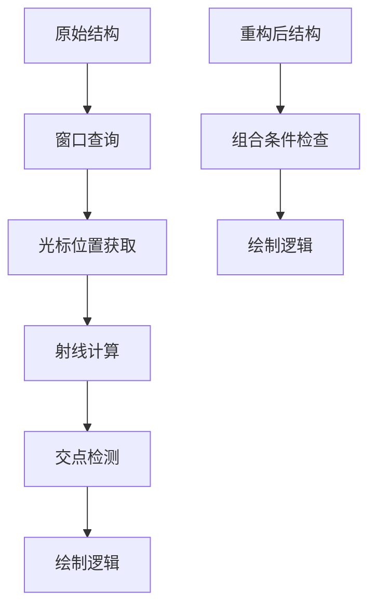

+++
title = "#20071 Refactor `3d_viewport_to_world` example with let chains"
date = "2025-07-10T00:00:00"
draft = false
template = "pull_request_page.html"
in_search_index = false

[extra]
current_language = "zh-cn"
available_languages = {"en" = { name = "English", url = "/pull_request/bevy/2025-07/pr-20071-en-20250710" }, "zh-cn" = { name = "中文", url = "/pull_request/bevy/2025-07/pr-20071-zh-cn-20250710" }}
labels = ["D-Trivial", "C-Examples", "C-Code-Quality"]
+++

# Refactor `3d_viewport_to_world` example with let chains

## Basic Information
- **Title**: Refactor `3d_viewport_to_world` example with let chains
- **PR Link**: https://github.com/bevyengine/bevy/pull/20071
- **Author**: tim-blackbird
- **Status**: MERGED
- **Labels**: D-Trivial, C-Examples, C-Code-Quality, S-Ready-For-Final-Review
- **Created**: 2025-07-09T23:25:32Z
- **Merged**: 2025-07-10T02:57:09Z
- **Merged By**: alice-i-cecile

## Description Translation
### 目标 (Objective)

利用 let 链 (let chains) 减少先前使用 let else 时的代码行数 (LoC)，同时减少缩进层级。实现两全其美。

## The Story of This Pull Request

这个 PR 聚焦于优化 Bevy 引擎中 `3d_viewport_to_world` 示例的代码结构。原始实现使用了多个 `let else` 语句进行错误处理，这导致：
1. 多层嵌套的缩进结构
2. 相对冗长的代码实现
3. 多个独立的提前返回点

核心问题在于如何更简洁地处理多个可能失败的连续操作。原始方案通过多个 `let else` 块分别处理：
1. 窗口查询
2. 光标位置获取
3. 视口到世界的射线计算
4. 射线与地面的交点检测

每个操作失败时都直接返回，形成阶梯式结构。

解决方案采用 Rust 1.65+ 引入的 let chains 特性，将四个独立的条件检查合并到单个 `if let` 链中。这种重构：
- 将 30 行代码缩减为 19 行
- 消除多层缩进
- 将四个返回点合并为一个
- 保持相同的功能行为和错误处理逻辑

技术实现的关键点在于合理使用 `&&` 连接多个条件绑定：
```rust
if let Some(cursor_position) = window.cursor_position()
    && let Ok(ray) = camera.viewport_to_world(camera_transform, cursor_position)
    && let Some(distance) = ray.intersect_plane(...)
```
这种链式结构仅在所有操作都成功时才执行核心逻辑，否则直接跳过代码块。

从工程角度看，这种重构：
1. 遵循 Rust 的现代语法最佳实践
2. 提升示例代码的教学价值（展示 let chains 的实际应用）
3. 保持相同的性能特征（编译后逻辑等效）
4. 不改变任何功能行为

重构后的代码更紧凑且更易读，特别是对于展示视口到世界坐标转换的核心概念而言。这种模式特别适用于需要连续进行多个可能失败操作的场景。

## Visual Representation



## Key Files Changed

### `examples/3d/3d_viewport_to_world.rs` (+19/-30)

**变更描述**：  
将 `draw_cursor` 函数从使用多个 `let else` 语句重构为使用单个 `if let` 链，减少缩进层级和代码行数。

**关键代码变更**：
```rust
// Before:
let Ok(windows) = windows.single() else {
    return;
};

let (camera, camera_transform) = *camera_query;

let Some(cursor_position) = windows.cursor_position() else {
    return;
};

let Ok(ray) = camera.viewport_to_world(camera_transform, cursor_position) else {
    return;
};

let Some(distance) = ray.intersect_plane(...) else {
    return;
};
let point = ray.get_point(distance);

// 绘制逻辑...

// After:
if let Some(cursor_position) = window.cursor_position()
    && let Ok(ray) = camera.viewport_to_world(camera_transform, cursor_position)
    && let Some(distance) = ray.intersect_plane(...)
{
    let point = ray.get_point(distance);
    
    // 绘制逻辑...
}
```

**关联性**：  
此变更是 PR 的核心内容，通过使用 let chains 语法简化条件检查流程，实现代码精简目标。

## Further Reading

1. [Rust RFC 2497 - if-let chains](https://rust-lang.github.io/rfcs/2497-if-let-chains.html)  
2. [Bevy 示例文档](https://github.com/bevyengine/bevy/tree/main/examples#examples)  
3. [Rust 1.65 发布说明（含 let chains 特性）](https://blog.rust-lang.org/2022/11/03/Rust-1.65.0.html#if-let-chains)