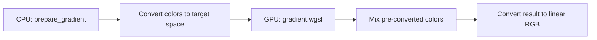

+++
title = "#20074 Preconvert colors before sending to shader"
date = "2025-07-16T00:00:00"
draft = false
template = "pull_request_page.html"
in_search_index = true

[taxonomies]
list_display = ["show"]

[extra]
current_language = "en"
available_languages = {"en" = { name = "English", url = "/pull_request/bevy/2025-07/pr-20074-en-20250716" }, "zh-cn" = { name = "中文", url = "/pull_request/bevy/2025-07/pr-20074-zh-cn-20250716" }}
labels = ["A-Rendering", "C-Performance", "A-UI", "C-Code-Quality", "M-Deliberate-Rendering-Change"]
+++

## Preconvert colors before sending to shader

### Basic Information
- **Title**: Preconvert colors before sending to shader  
- **PR Link**: https://github.com/bevyengine/bevy/pull/20074  
- **Author**: tylercritchlow  
- **Status**: MERGED  
- **Labels**: A-Rendering, C-Performance, A-UI, C-Code-Quality, S-Ready-For-Final-Review, M-Deliberate-Rendering-Change  
- **Created**: 2025-07-10T02:48:22Z  
- **Merged**: 2025-07-16T16:27:05Z  
- **Merged By**: alice-i-cecile  

### Description Translation
**Objective**  
- Fixes #20008 - Preconvert colors before sending them to the UI gradients shader for better performance  

**Solution**  
- Modified `prepare_gradient` in `gradient.rs` to convert colors from `LinearRgba` to `Srgba` on the CPU before sending to the GPU  
- Updated the gradient shader to remove per-pixel color space conversions since colors are now pre-converted  
- Added documentation to clarify that vertex colors are in sRGB space  

This optimization reduces the number of power operations per pixel from 3 to 1:  
- **Before**: Convert start color to sRGB, convert end color to sRGB, mix, convert back to linear (3 pow operations per pixel)  
- **After**: Colors pre-converted on CPU, mix in sRGB space, convert back to linear (1 pow operation per pixel)  

**Testing**  
- Verified that the UI gradient examples (`cargo run --example gradients`) compile and render correctly  
- The visual output should remain identical while performance improves, especially for large gradient areas  
- Changes maintain the same color interpolation behavior (mixing in sRGB space)  

To test:  
1. Run `cargo run --example gradients` or `cargo run --example stacked_gradients`  
2. Verify gradients render correctly  

### The Story of This Pull Request

The problem began with performance profiling of UI gradients in Bevy. Analysis revealed that the gradient shader was performing expensive per-pixel color space conversions during rendering. Specifically, for each pixel in a gradient, the shader was converting both start and end colors from linear RGB to sRGB, mixing them, then converting the result back to linear RGB. This required three power operations per pixel, which became a significant bottleneck for scenes with large gradient areas or many gradients.

The core issue was identified in the shader's color handling approach. By performing color space conversions on the GPU for every fragment, the engine incurred unnecessary computational overhead. This was particularly problematic for UI elements where gradients are common and performance is critical for smooth rendering.

The solution shifted the color conversion work from the GPU to the CPU. Instead of sending linear RGB colors to the GPU and converting them per-pixel, we now preconvert colors to their target color space during gradient preparation on the CPU. This required:
1. Creating a new conversion function (`convert_color_to_space`) to handle different color spaces
2. Modifying the gradient preparation system to use this conversion
3. Simplifying the shader logic to remove per-pixel conversions

The implementation introduced a centralized color conversion function that handles all supported color spaces (Oklaba, Oklcha, Srgba, LinearRgba, Hsla, Hsva). This function converts colors during the `prepare_gradient` stage:

```rust
fn convert_color_to_space(color: LinearRgba, space: InterpolationColorSpace) -> [f32; 4] {
    match space {
        InterpolationColorSpace::Srgba => {
            let srgba: Srgba = color.into();
            [srgba.red, srgba.green, srgba.blue, srgba.alpha]
        }
        // Other color space conversions...
    }
}
```

In the shader, the major simplification was removing all color-to-space conversion functions since colors now arrive pre-converted. The shader now focuses solely on mixing colors in the target space and converting the final result back to linear RGB:

```wgsl
fn interpolate_gradient(...) -> vec4<f32> {
    // ...
    return convert_to_linear_rgba(mix_colors(start_color, end_color, t));
}
```

The mixing functions were also optimized. For example, the HSL mixing was simplified to operate directly on pre-converted values:

```wgsl
fn mix_hsla(a: vec4<f32>, b: vec4<f32>, t: f32) -> vec4<f32> {
    return vec4(
        fract(a.x + (fract(b.x - a.x + 0.5) - 0.5) * t),
        mix(a.y, b.y, t),
        mix(a.z, b.z, t),
        mix(a.w, b.w, t)
    );
}
```

To validate the changes and measure performance impact, a new stress test example (`many_gradients.rs`) was added. This example renders a configurable number of gradients with options to test different color spaces and animation patterns:

```rust
fn main() {
    let args: Args = argh::from_env();
    App::new()
        // ...
        .add_systems(Startup, setup)
        .add_systems(Update, animate_gradients)
        .run();
}
```

The key performance improvement comes from reducing GPU operations. Previously, each pixel required three pow operations (two for conversion to sRGB, one for conversion back to linear). Now only one pow operation is needed per pixel (for the final conversion back to linear). This change is particularly impactful for:
- Large gradient areas
- Scenes with many gradients
- Lower-powered devices

Visual output remains identical to the previous implementation since the same color space conversions are applied - just at a different stage in the pipeline. The solution maintains backward compatibility while significantly improving rendering performance for gradient-heavy UI scenes.

### Visual Representation



### Key Files Changed

1. **crates/bevy_ui_render/src/gradient.rs**  
   Added color conversion logic on CPU before sending to GPU  
   
   ```rust
   // Added conversion function
   fn convert_color_to_space(color: LinearRgba, space: InterpolationColorSpace) -> [f32; 4] {
       match space {
           InterpolationColorSpace::Srgba => {
               let srgba: Srgba = color.into();
               [srgba.red, srgba.green, srgba.blue, srgba.alpha]
           }
           // Other color space conversions...
       }
   }
   
   // Modified gradient preparation
   pub fn prepare_gradient(...) {
       // ...
       let start_color = convert_color_to_space(start_stop.0, gradient.color_space);
       let end_color = convert_color_to_space(end_stop.0, gradient.color_space);
       // ...
   }
   ```

2. **crates/bevy_ui_render/src/gradient.wgsl**  
   Simplified shader by removing per-pixel conversions  
   
   ```wgsl
   // Removed conversion functions like:
   // fn linear_rgba_to_oklaba() {...}
   // fn mix_linear_rgba_in_srgba_space() {...}
   
   // Added optimized mixing functions
   fn mix_hsla(a: vec4<f32>, b: vec4<f32>, t: f32) -> vec4<f32> {
       return vec4(
           fract(a.x + (fract(b.x - a.x + 0.5) - 0.5) * t),
           mix(a.y, b.y, t),
           mix(a.z, b.z, t),
           mix(a.w, b.w, t)
       );
   }
   
   // Unified color conversion at end
   fn convert_to_linear_rgba(color: vec4<f32>) -> vec4<f32> {
   #ifdef IN_SRGB
       return vec4(pow(color.rgb, vec3(2.2)), color.a);
   #else
       // Other conversions...
   #endif
   }
   ```

3. **examples/stress_tests/many_gradients.rs**  
   Added new performance test for gradients  
   
   ```rust
   // Configurable gradient test
   fn setup(mut commands: Commands, args: Res<Args>) {
       // ...
       parent.spawn((
           Node { /* ... */ },
           BackgroundGradient(vec![Gradient::Linear(gradient)]),
           GradientNode { index: i },
       ));
   }
   
   // Gradient animation system
   fn animate_gradients(mut gradients: Query<(&mut BackgroundGradient, &GradientNode)>) {
       // Update gradient colors based on time
   }
   ```

4. **Cargo.toml**  
   Added new example to workspace  
   
   ```toml
   [[example]]
   name = "many_gradients"
   path = "examples/stress_tests/many_gradients.rs"
   ```

5. **examples/README.md**  
   Added documentation for new example  
   
   ```markdown
   [Many Gradients](../examples/stress_tests/many_gradients.rs) | Stress test for gradient rendering performance
   ```

### Further Reading
1. [Bevy UI Rendering Architecture](https://bevyengine.org/learn/book/features/ui/)  
2. [WGSL Shading Language Specification](https://gpuweb.github.io/gpuweb/wgsl/)  
3. [Color Spaces in Computer Graphics](https://developer.nvidia.com/gpugems/gpugems3/part-iv-image-effects/chapter-24-importance-being-linear)  
4. [Performance Optimization Techniques in Rendering](https://developer.nvidia.com/gdc/gdc12-presentation)