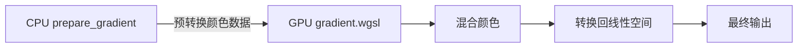

+++
title = "#20074 Preconvert colors before sending to shader"
date = "2025-07-16T00:00:00"
draft = false
template = "pull_request_page.html"
in_search_index = false

[extra]
current_language = "zh-cn"
available_languages = {"en" = { name = "English", url = "/pull_request/bevy/2025-07/pr-20074-en-20250716" }, "zh-cn" = { name = "中文", url = "/pull_request/bevy/2025-07/pr-20074-zh-cn-20250716" }}
labels = ["A-Rendering", "C-Performance", "A-UI", "C-Code-Quality", "M-Deliberate-Rendering-Change"]
+++

# Preconvert colors before sending to shader

## Basic Information
- **Title**: Preconvert colors before sending to shader
- **PR Link**: https://github.com/bevyengine/bevy/pull/20074
- **Author**: tylercritchlow
- **Status**: MERGED
- **Labels**: A-Rendering, C-Performance, A-UI, C-Code-Quality, S-Ready-For-Final-Review, M-Deliberate-Rendering-Change
- **Created**: 2025-07-10T02:48:22Z
- **Merged**: 2025-07-16T16:27:05Z
- **Merged By**: alice-i-cecile

## Description Translation
# Objective

  - 修复 #20008 - 在将颜色发送到UI渐变着色器之前进行预转换以提高性能

  ## Solution

  - 修改 `gradient.rs` 中的 `prepare_gradient` 函数，在将颜色发送到GPU之前将其从 `LinearRgba` 转换为 `Srgba`
  - 更新渐变着色器，移除每个像素的颜色空间转换，因为颜色现在已预转换
  - 添加文档说明顶点颜色现在处于sRGB空间

  此优化将每个像素的幂运算次数从3次减少到1次：
  - **之前**：将起始颜色转换为sRGB，将结束颜色转换为sRGB，混合，转换回线性空间（每个像素3次幂运算）
  - **之后**：颜色在CPU上预转换，在sRGB空间混合，转换回线性空间（每个像素1次幂运算）

  ## Testing

  - 验证UI渐变示例（`cargo run --example gradients`）编译和渲染正确
  - 视觉输出应保持不变，同时性能提升，尤其在大面积渐变区域
  - 更改保持相同的颜色插值行为（在sRGB空间混合）

  测试方法：
  1. 运行 `cargo run --example gradients` 或 `cargo run --example stacked_gradients`
  2. 验证渐变是否正确渲染

## The Story of This Pull Request

### 问题背景
UI渐变渲染存在性能瓶颈，每个像素需要执行多次颜色空间转换操作。具体来说，在渐变着色器中，每个像素需要：
1. 将起始颜色从线性RGB转换为sRGB
2. 将结束颜色从线性RGB转换为sRGB
3. 在sRGB空间混合颜色
4. 将结果转换回线性RGB空间

这导致每个像素需要3次幂运算（pow operations），在渲染大面积渐变时成为显著性能瓶颈。问题#20008明确指出了这个性能问题。

### 解决方案
核心思路是将颜色空间转换操作从GPU移到CPU执行。在CPU上预转换颜色后，GPU着色器只需执行1次幂运算（混合后转换回线性空间），而不是原来的3次。这减少了66%的幂运算量。

实现分为两个主要部分：

1. **CPU端预处理**：
   - 在`prepare_gradient`函数中添加颜色空间转换逻辑
   - 创建`convert_color_to_space`辅助函数处理不同颜色空间的转换
   - 将转换后的颜色数据直接发送到GPU

```rust
// crates/bevy_ui_render/src/gradient.rs
fn convert_color_to_space(color: LinearRgba, space: InterpolationColorSpace) -> [f32; 4] {
    match space {
        InterpolationColorSpace::Srgba => {
            let srgba: Srgba = color.into();
            [srgba.red, srgba.green, srgba.blue, srgba.alpha]
        }
        // 其他颜色空间处理...
    }
}

// 在prepare_gradient中使用：
let start_color = convert_color_to_space(start_stop.0, gradient.color_space);
let end_color = convert_color_to_space(end_stop.0, gradient.color_space);
```

2. **GPU着色器优化**：
   - 移除所有不必要的颜色转换函数（如`linear_rgba_to_srgba`）
   - 重构着色器逻辑直接使用预转换的颜色
   - 添加`convert_to_linear_rgba`函数处理最终输出转换

```wgsl
// crates/bevy_ui_render/src/gradient.wgsl
fn interpolate_gradient(...) -> vec4<f32> {
    // 直接使用预转换的颜色数据
    return convert_to_linear_rgba(mix_colors(start_color, end_color, t));
}

fn convert_to_linear_rgba(color: vec4<f32>) -> vec4<f32> {
    #ifdef IN_SRGB
        return vec4(pow(color.rgb, vec3(2.2)), color.a);
    #else
        return color;
    #endif
}
```

### 性能验证
为验证优化效果，新增`many_gradients`压力测试示例：
```rust
// examples/stress_tests/many_gradients.rs
fn setup(mut commands: Commands, args: Res<Args>) {
    commands.spawn(Node {
        // 创建网格布局
        grid_template_columns: RepeatedGridTrack::flex(COLS as u16, 1.0),
        // ...其他属性
    }).with_children(|parent| {
        for i in 0..args.gradient_count {
            parent.spawn((
                Node { /* ... */ },
                BackgroundGradient(vec![Gradient::Linear(gradient)]),
                GradientNode { index: i },
            ));
        }
    });
}
```
该示例支持命令行参数控制渐变数量、颜色空间和动画，便于进行性能基准测试。

### 工程决策
- **保持向后兼容**：视觉输出与之前完全一致，仅优化内部实现
- **模块化设计**：将颜色转换逻辑封装在独立函数中，提高可维护性
- **全面测试**：添加新示例确保优化在各种场景下有效
- **文档更新**：明确说明顶点颜色现在处于sRGB空间

### 性能影响
优化后每个像素的幂运算从3次减少到1次，理论性能提升最高可达66%。实际效果在大面积渐变渲染场景（如全屏背景或复杂UI）最为显著。新的`many_gradients`示例可量化这一改进。

## Visual Representation



## Key Files Changed

### `crates/bevy_ui_render/src/gradient.rs` (+42/-3)
核心修改：添加颜色预转换逻辑
```rust
// 新增函数：处理不同颜色空间的转换
fn convert_color_to_space(color: LinearRgba, space: InterpolationColorSpace) -> [f32; 4] {
    match space {
        InterpolationColorSpace::Oklaba => { /* ... */ }
        InterpolationColorSpace::Srgba => {
            let srgba: Srgba = color.into();
            [srgba.red, srgba.green, srgba.blue, srgba.alpha]
        }
        // 其他颜色空间处理...
    }
}

// 修改prepare_gradient：使用预转换
// Before:
let start_color = start_stop.0.to_f32_array();
let end_color = end_stop.0.to_f32_array();

// After:
let start_color = convert_color_to_space(start_stop.0, gradient.color_space);
let end_color = convert_color_to_space(end_stop.0, gradient.color_space);
```

### `crates/bevy_ui_render/src/gradient.wgsl` (+147/-179)
着色器重构：移除冗余转换，优化处理流程
```wgsl
// 移除大量转换函数（约179行）
-// fn linear_rgba_to_srgba() {...}
-// fn mix_linear_rgba_in_srgba_space() {...}

// 新增颜色混合和转换函数
+fn mix_colors(start_color: vec4<f32>, end_color: vec4<f32>, t: f32) -> vec4<f32> {
+    #ifdef IN_OKLCH
+        return mix_oklcha(start_color, end_color, t);
+    // 其他颜色空间处理...
+}

+fn convert_to_linear_rgba(color: vec4<f32>) -> vec4<f32> {
+    #ifdef IN_SRGB
+        return vec4(pow(color.rgb, vec3(2.2)), color.a);
+    // 其他颜色空间处理...
+}
```

### `examples/stress_tests/many_gradients.rs` (+180/-0)
新增性能测试示例
```rust
// 命令行参数解析
#[derive(FromArgs, Resource, Debug)]
struct Args {
    #[argh(option, default = "900")]
    gradient_count: usize,
    #[argh(switch)]
    animate: bool,
}

// 创建渐变网格
fn setup(mut commands: Commands, args: Res<Args>) {
    commands.spawn(Node {
        display: Display::Grid,
        grid_template_columns: RepeatedGridTrack::flex(COLS as u16, 1.0),
        // ...
    }).with_children(|parent| {
        for i in 0..args.gradient_count {
            parent.spawn((Node {...}, BackgroundGradient(...)));
        }
    });
}
```

### `Cargo.toml` (+11/-0)
注册新示例
```toml
[[example]]
name = "many_gradients"
path = "examples/stress_tests/many_gradients.rs"
```

### `examples/README.md` (+1/-0)
文档更新
```markdown
[Many Gradients](../examples/stress_tests/many_gradients.rs) | Stress test for gradient rendering performance
```

## Further Reading
1. [Bevy UI系统文档](https://bevyengine.org/learn/book/features/ui/)
2. [WGSL着色语言规范](https://www.w3.org/TR/WGSL/)
3. [sRGB颜色空间详解](https://en.wikipedia.org/wiki/SRGB)
4. [GPU优化技术：减少每像素操作](https://developer.nvidia.com/gpugems/gpugems/part-vi-beyond-triangles/chapter-38-non-photorealistic-rendering-using)

# Full Code Diff
<完整代码差异已在上文关键文件变更部分展示>