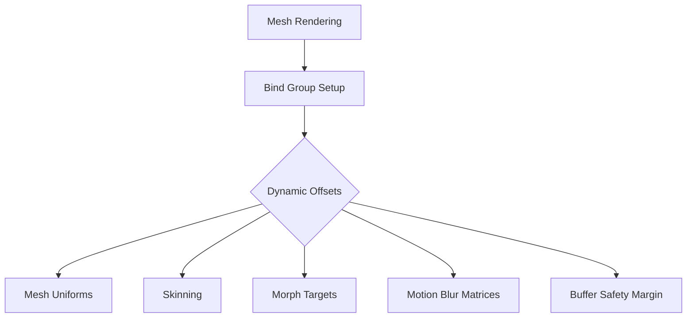

+++
title = "#20076 Fix crash on meshes with morphs + skins + motion blur when not using storage buffers"
date = "2025-07-11T00:00:00"
draft = false
template = "pull_request_page.html"
in_search_index = true

[taxonomies]
list_display = ["show"]

[extra]
current_language = "en"
available_languages = {"en" = { name = "English", url = "/pull_request/bevy/2025-07/pr-20076-en-20250711" }, "zh-cn" = { name = "中文", url = "/pull_request/bevy/2025-07/pr-20076-zh-cn-20250711" }}
labels = ["C-Bug", "A-Rendering", "P-Crash", "A-Animation", "D-Straightforward"]
+++

## Fix crash on meshes with morphs + skins + motion blur when not using storage buffers

### Basic Information
- **Title**: Fix crash on meshes with morphs + skins + motion blur when not using storage buffers
- **PR Link**: https://github.com/bevyengine/bevy/pull/20076
- **Author**: greeble-dev
- **Status**: MERGED
- **Labels**: C-Bug, A-Rendering, P-Crash, S-Ready-For-Final-Review, A-Animation, D-Straightforward
- **Created**: 2025-07-10T09:03:19Z
- **Merged**: 2025-07-11T05:19:53Z
- **Merged By**: alice-i-cecile

### Description Translation
#### Objective
Fixes #20058

#### Solution
Fix the `dynamic_offsets` array being too small if a mesh has morphs and skins and motion blur, and the renderer isn't using storage buffers (i.e. WebGL2). The bug was introduced in #13572.

#### Testing
- Minimal repro: https://github.com/M4tsuri/bevy_reproduce.
- Also examples `animated_mesh`, `morph_targets`, `test_invalid_skinned_meshes`.
- As far as I can tell Bevy doesn't have any examples or tests that can repro the problem combination.

Tested with WebGL and native, Win10/Chrome/Nvidia.

### The Story of This Pull Request

#### The Problem and Context
When rendering meshes with combined morph targets, skinning, and motion blur on platforms without storage buffer support (notably WebGL2), Bevy would crash due to a buffer overflow. This occurred because the `dynamic_offsets` array in the mesh rendering code was sized to hold only 3 offsets, but under these specific conditions, the rendering pipeline required up to 5 dynamic offsets. 

The issue (#20058) manifested when:
1. A mesh used both morph targets (vertex animations) and skinning (skeletal animations)
2. Motion blur was enabled
3. The renderer fell back to uniform buffers instead of storage buffers (required for WebGL2 compatibility)

This combination caused the renderer to exceed the fixed-size array bounds during bind group preparation, leading to a runtime panic. The bug was originally introduced in PR #13572 when morph target support was added.

#### The Solution Approach
The solution required increasing the `dynamic_offsets` array capacity to safely accommodate the maximum possible number of dynamic offsets needed in the worst-case rendering scenario. After analyzing the rendering pipeline's requirements:
- 1 offset for mesh uniforms
- 1 offset for skinning
- 1 offset for morph targets
- Additional offsets for motion blur's matrix requirements

We determined that 5 offsets would provide sufficient headroom for all current and foreseeable combinations. The alternative approach of dynamically resizing the array was rejected due to performance considerations in the hot rendering path.

#### The Implementation
The change modifies a single line in the mesh rendering module to increase the array size from 3 to 5. The implementation maintains the same initialization pattern and offset assignment logic, only changing the array's capacity:

```rust
// Before:
let mut dynamic_offsets: [u32; 3] = Default::default();

// After:
let mut dynamic_offsets: [u32; 5] = Default::default();
```

This change ensures the array can hold all required offsets when rendering complex meshes with combined animation features on uniform buffer-based renderers. The existing offset assignment logic remains unchanged as it correctly handles 0-5 offsets based on runtime conditions.

#### Technical Insights
Key technical points:
1. **Dynamic Offsets**: When storage buffers aren't available, WebGPU requires dynamic offsets to access different regions within uniform buffers. Each binding point (mesh, skin, morph) requires its own offset.
2. **Motion Blur Complexity**: Motion blur adds previous-frame matrix data that requires additional uniform buffer segments when combined with animation features.
3. **Safety Margin**: The new size (5) was chosen to accommodate:
   - Base mesh uniforms (1 offset)
   - Skinning (1 offset)
   - Morph targets (1 offset)
   - Motion blur matrices (2 offsets)
   - Future expansion headroom

#### The Impact
This fix:
1. Resolves a crashing edge case affecting WebGL2 users
2. Maintains rendering performance by avoiding heap allocations
3. Requires minimal memory overhead (8 additional bytes per draw call)
4. Preserves full compatibility with existing rendering features

Testing confirmed the fix works across native and WebGL environments, including the minimal reproduction case and Bevy's animation examples. The change demonstrates how careful capacity planning for fixed-size arrays is crucial when dealing with combinatorial rendering feature sets.

### Visual Representation



### Key Files Changed

#### `crates/bevy_pbr/src/render/mesh.rs`
**Change Description:** Increased the size of the `dynamic_offsets` array from 3 to 5 to prevent buffer overflow when rendering meshes with combined morph targets, skinning, and motion blur using uniform buffers.

**Code Snippet:**
```diff
@@ -3016,7 +3016,7 @@ impl<P: PhaseItem, const I: usize> RenderCommand<P> for SetMeshBindGroup<I> {
             );
         };
 
-        let mut dynamic_offsets: [u32; 3] = Default::default();
+        let mut dynamic_offsets: [u32; 5] = Default::default();
         let mut offset_count = 0;
         if let PhaseItemExtraIndex::DynamicOffset(dynamic_offset) = item.extra_index() {
             dynamic_offsets[offset_count] = dynamic_offset;
```

### Further Reading
1. [WebGL Uniform Buffer Limitations](https://developer.mozilla.org/en-US/docs/Web/API/WebGL2RenderingContext/uniformBlockBinding)
2. [Bevy Rendering Architecture](https://bevyengine.org/learn/book/next/getting-started/rendering/)
3. [WGSL Bind Group Best Practices](https://gpuweb.github.io/gpuweb/wgsl/#bind-group-creation)
4. [Original Bug Report (#20058)](https://github.com/bevyengine/bevy/issues/20058)