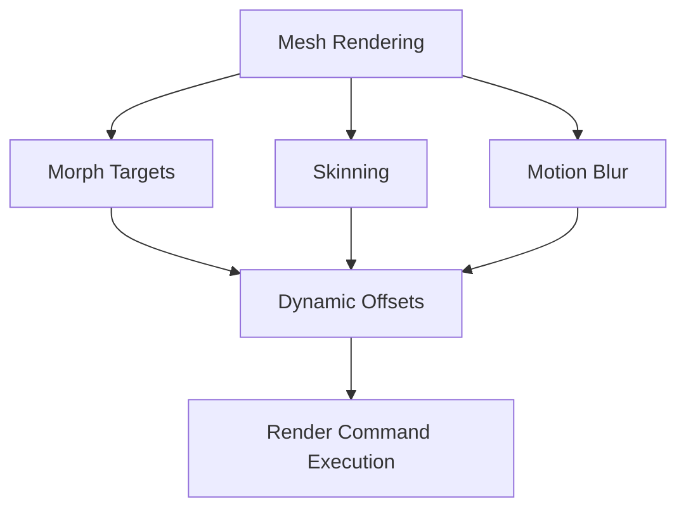

+++
title = "#20076 Fix crash on meshes with morphs + skins + motion blur when not using storage buffers"
date = "2025-07-11T00:00:00"
draft = false
template = "pull_request_page.html"
in_search_index = false

[extra]
current_language = "zh-cn"
available_languages = {"en" = { name = "English", url = "/pull_request/bevy/2025-07/pr-20076-en-20250711" }, "zh-cn" = { name = "中文", url = "/pull_request/bevy/2025-07/pr-20076-zh-cn-20250711" }}
labels = ["C-Bug", "A-Rendering", "P-Crash", "A-Animation", "D-Straightforward"]
+++

# Fix crash on meshes with morphs + skins + motion blur when not using storage buffers

## Basic Information
- **Title**: Fix crash on meshes with morphs + skins + motion blur when not using storage buffers
- **PR Link**: https://github.com/bevyengine/bevy/pull/20076
- **Author**: greeble-dev
- **Status**: MERGED
- **Labels**: C-Bug, A-Rendering, P-Crash, S-Ready-For-Final-Review, A-Animation, D-Straightforward
- **Created**: 2025-07-10T09:03:19Z
- **Merged**: 2025-07-11T05:19:53Z
- **Merged By**: alice-i-cecile

## Description Translation
### 目标
修复 #20058

### 解决方案
修复当网格具有变形目标(morphs)、蒙皮(skins)和动态模糊(motion blur)，且渲染器未使用存储缓冲区(storage buffers)(例如WebGL2)时，`dynamic_offsets`数组过小的问题。该错误在#13572中引入。

### 测试
- 最小复现仓库：https://github.com/M4tsuri/bevy_reproduce
- 测试示例：`animated_mesh`、`morph_targets`、`test_invalid_skinned_meshes`
- 据我所知，Bevy没有能复现此问题组合的示例或测试
在WebGL和原生环境(Win10/Chrome/Nvidia)下测试通过

## The Story of This Pull Request

### 问题背景
在特定渲染配置下，使用变形目标(morphs)、蒙皮(skins)和动态模糊(motion blur)的网格会导致崩溃。此问题在#13572引入，主要影响不使用存储缓冲区(storage buffers)的环境（如WebGL2）。崩溃发生在`dynamic_offsets`数组越界访问时，因为该数组预留的空间不足。

### 技术根源
根本问题在于`dynamic_offsets`数组的初始大小设置不足：
```rust
let mut dynamic_offsets: [u32; 3] = Default::default();
```
当同时启用变形目标、蒙皮和动态模糊时，需要5个动态偏移量(dynamic offsets)：
1. 蒙皮(skinning) - 1个偏移量
2. 变形目标(morphs) - 1个偏移量
3. 动态模糊(motion blur) - 3个偏移量（当前帧、上一帧和速度）

原代码中数组大小3无法容纳5个偏移量，导致越界访问和崩溃。

### 解决方案实现
修复方案直接明了：将`dynamic_offsets`数组大小从3扩展到5：
```rust
let mut dynamic_offsets: [u32; 5] = Default::default();
```
这个修改确保数组有足够空间存储所有可能的偏移量组合。代码保持原有逻辑不变，仅调整数组容量：
1. 初始化5元素数组
2. 按需填充偏移量
3. 传递有效偏移量范围给渲染API

### 验证与测试
作者采用了分层验证策略：
1. 最小复现用例：使用独立仓库验证崩溃条件和修复效果
2. 现有示例测试：确保`animated_mesh`、`morph_targets`等核心功能不受影响
3. 跨环境测试：覆盖WebGL和原生环境，确认修复在不同图形后端有效

由于Bevy本身缺乏同时组合三种特性(morphs+skins+motion blur)的测试用例，外部最小复现仓库成为关键验证手段。

### 技术启示
此修复演示了几个重要工程原则：
1. **显式容量管理**：固定大小数组需明确考虑所有可能的用例组合
2. **组合特性测试**：新特性引入时需测试与现有功能的组合边界情况
3. **环境差异性**：WebGL等受限环境更易暴露显存/缓冲区管理问题

潜在改进点：未来可考虑改用动态集合(Vec)避免固定大小限制，但这需要评估渲染热路径的性能影响。

## Visual Representation



## Key Files Changed

### crates/bevy_pbr/src/render/mesh.rs
**修改原因**：修复dynamic_offsets数组大小不足导致的越界访问

**代码变更**：
```rust
// 修改前：
let mut dynamic_offsets: [u32; 3] = Default::default();

// 修改后：
let mut dynamic_offsets: [u32; 5] = Default::default();
```

**关联性**：这是PR的唯一修改点，直接解决崩溃问题。通过增加数组容量，确保在组合使用morphs、skins和motion blur时仍有足够空间存储所有动态偏移量。

## Further Reading
1. [WebGL2 Storage Buffers 限制](https://webgl2fundamentals.org/webgl/lessons/webgl2-whats-new.html)
2. [Bevy 渲染管线架构](https://bevyengine.org/learn/book/getting-started/rendering/)
3. [动态偏移量在渲染中的应用](https://gpuweb.github.io/gpuweb/#dom-gpurenderpassencoder-setbindgroup)