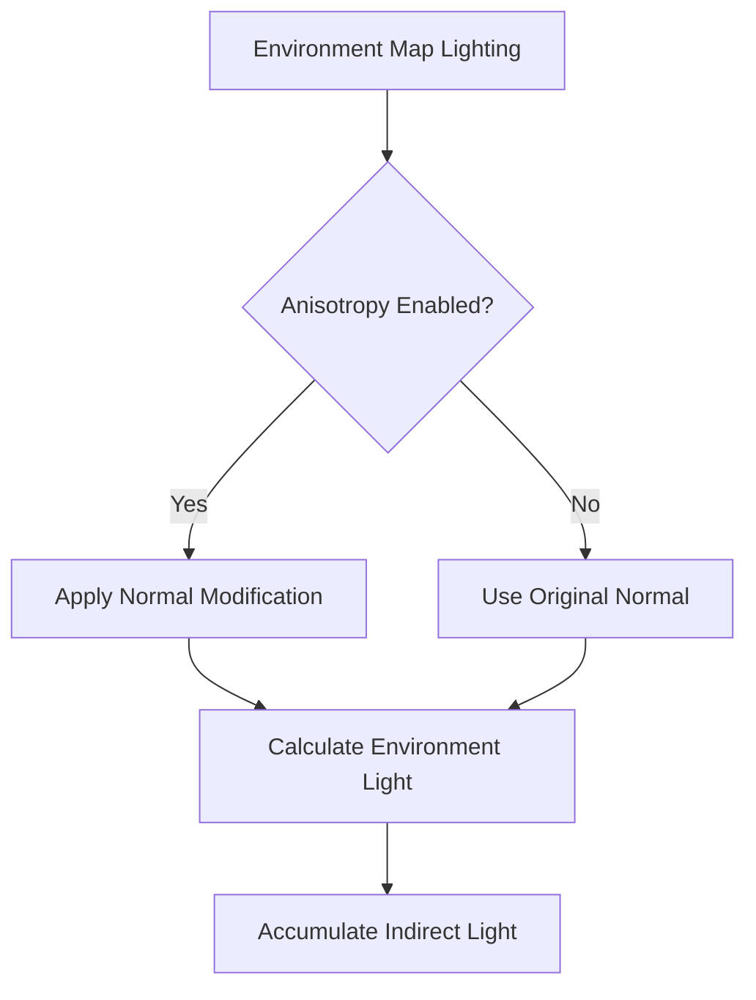

+++
title = "#20077 Fix anisotropy not working when material is lit by environment map light"
date = "2025-07-14T00:00:00"
draft = false
template = "pull_request_page.html"
in_search_index = true

[taxonomies]
list_display = ["show"]

[extra]
current_language = "en"
available_languages = {"en" = { name = "English", url = "/pull_request/bevy/2025-07/pr-20077-en-20250714" }, "zh-cn" = { name = "中文", url = "/pull_request/bevy/2025-07/pr-20077-zh-cn-20250714" }}
labels = ["C-Bug", "A-Rendering", "D-Straightforward", "M-Deliberate-Rendering-Change"]
+++

## Fix anisotropy not working when material is lit by environment map light

### Basic Information
- **Title**: Fix anisotropy not working when material is lit by environment map light
- **PR Link**: https://github.com/bevyengine/bevy/pull/20077
- **Author**: marlyx
- **Status**: MERGED
- **Labels**: C-Bug, A-Rendering, S-Ready-For-Final-Review, X-Uncontroversial, D-Straightforward, M-Deliberate-Rendering-Change
- **Created**: 2025-07-10T14:12:36Z
- **Merged**: 2025-07-14T22:01:45Z
- **Merged By**: alice-i-cecile

### Description Translation
Fixes objects being lit by environment map light not having the anisotropy effect applied correctly. The contribution of light from the environment map with anisotropy is calculated but immediately discarded. Instead what is applied is the regular environment map contribution (calculated without anisotropy) that happen right after.

This patch fixes the logic here to what I think is the intended one. Only calculate contribution once, with or without anisotropy depending on shader specialization.

## Solution

- Properly apply normal modification if anisotropy is enabled.
- Remove duplicate environment map light calculation

## Testing
Tested this by running the anisotropy example and comparing main vs PR results. See images below.

---

## Showcase

Main:


PR:


### The Story of This Pull Request

#### The Problem
The core issue was that anisotropic materials weren't correctly rendering environment map lighting in Bevy's PBR pipeline. When anisotropy was enabled, the shader would calculate environment lighting with the modified normal (bent_normal) but then discard that result. Instead, it used a separate calculation done with the original normal. This happened because:

1. The anisotropy modification was applied unconditionally at the start
2. The actual environment lighting calculation happened later without using the modified normal
3. The initial anisotropic calculation was unused

This resulted in anisotropic materials appearing incorrectly when lit by environment maps, as shown in the "Main" screenshot where the anisotropic effect is missing.

#### The Solution Approach
The fix required two coordinated changes:
1. Move the anisotropy modification logic inside the conditional block where environment lighting is actually applied
2. Eliminate the duplicate environment lighting calculation

This ensures:
- Anisotropy modification only occurs when needed
- The modified normal is used in the actual lighting calculation
- No redundant calculations are performed

#### Implementation Details
The changes were localized to the PBR lighting function in `pbr_functions.wgsl`. The key restructuring:

```wgsl
// BEFORE:
#ifdef STANDARD_MATERIAL_ANISOTROPY
    var bent_normal_lighting_input = lighting_input;
    bend_normal_for_anisotropy(&bent_normal_lighting_input);
    let environment_map_lighting_input = &bent_normal_lighting_input;
#else
    let environment_map_lighting_input = &lighting_input;
#endif

let environment_light = environment_map::environment_map_light( ... );

if (!use_ssr) {
    let environment_light = environment_map::environment_map_light( ... );
    // Add to indirect light
}
```

```wgsl
// AFTER:
if (!use_ssr) {
#ifdef STANDARD_MATERIAL_ANISOTROPY
    var bent_normal_lighting_input = lighting_input;
    bend_normal_for_anisotropy(&bent_normal_lighting_input);
    let environment_map_lighting_input = &bent_normal_lighting_input;
#else
    let environment_map_lighting_input = &lighting_input;
#endif

    let environment_light = environment_map::environment_map_light( ... );
    // Add to indirect light
}
```

The restructuring:
1. Moves the anisotropy modification inside the screen space reflections (SSR) conditional
2. Uses a single environment lighting calculation
3. Ensures the modified normal is used when anisotropy is enabled

#### Technical Insights
The fix demonstrates good shader optimization practices:
1. **Conditional Execution**: Moves potentially expensive normal modification behind the SSR check
2. **Code Deduplication**: Eliminates redundant environment light calculations
3. **Scope Minimization**: Limits variable scope by declaring `bent_normal_lighting_input` only when needed

The change maintains compatibility with other rendering features like screen space reflections, since the SSR case remains unchanged.

#### The Impact
These changes fix anisotropic environment lighting with no performance cost. The "PR" screenshot demonstrates the restored anisotropic effect. The solution:
- Fixes incorrect rendering of anisotropic materials
- Maintains feature parity with other rendering paths
- Reduces shader instruction count by removing duplicate work

### Visual Representation



### Key Files Changed

#### `crates/bevy_pbr/src/render/pbr_functions.wgsl`
Changes restructured environment lighting logic to properly handle anisotropic materials.

**Before:**
```wgsl
// Environment map light (indirect)
#ifdef ENVIRONMENT_MAP

#ifdef STANDARD_MATERIAL_ANISOTROPY
    var bent_normal_lighting_input = lighting_input;
    bend_normal_for_anisotropy(&bent_normal_lighting_input);
    let environment_map_lighting_input = &bent_normal_lighting_input;
#else   // STANDARD_MATERIAL_ANISOTROPY
    let environment_map_lighting_input = &lighting_input;
#endif  // STANDARD_MATERIAL_ANISOTROPY

    let environment_light = environment_map::environment_map_light(
        environment_map_lighting_input,
        &clusterable_object_index_ranges,
        found_diffuse_indirect,
    );

    // If screen space reflections are going to be used for this material, don't
    // accumulate environment map light yet. The SSR shader will do it.
#ifdef SCREEN_SPACE_REFLECTIONS
    let use_ssr = ssr::should_use_ssr();
#else   // SCREEN_SPACE_REFLECTIONS
    let use_ssr = false;
#endif  // SCREEN_SPACE_REFLECTIONS

    if (!use_ssr) {
        let environment_light = environment_map::environment_map_light(
            &lighting_input,
            &clusterable_object_index_ranges,
            found_diffuse_indirect
        );

        indirect_light += environment_light.diffuse * diffuse_occlusion +
            environment_light.specular * specular_occlusion;
    }
```

**After:**
```wgsl
// Environment map light (indirect)
#ifdef ENVIRONMENT_MAP
    // If screen space reflections are going to be used for this material, don't
    // accumulate environment map light yet. The SSR shader will do it.
#ifdef SCREEN_SPACE_REFLECTIONS
    let use_ssr = ssr::should_use_ssr();
#else   // SCREEN_SPACE_REFLECTIONS
    let use_ssr = false;
#endif  // SCREEN_SPACE_REFLECTIONS
    
    if (!use_ssr) {
#ifdef STANDARD_MATERIAL_ANISOTROPY
        var bent_normal_lighting_input = lighting_input;
        bend_normal_for_anisotropy(&bent_normal_lighting_input);
        let environment_map_lighting_input = &bent_normal_lighting_input;
#else   // STANDARD_MATERIAL_ANISOTROPY
        let environment_map_lighting_input = &lighting_input;
#endif  // STANDARD_MATERIAL_ANISOTROPY

        let environment_light = environment_map::environment_map_light(
            environment_map_lighting_input,
            &clusterable_object_index_ranges,
            found_diffuse_indirect,
        );

        indirect_light += environment_light.diffuse * diffuse_occlusion +
            environment_light.specular * specular_occlusion;
    }
```

### Further Reading
1. [Bevy PBR Rendering Documentation](https://bevyengine.org/learn/book/features/pbr/)
2. [Physically Based Rendering: Light Scattering](https://pbr-book.org/3ed-2018/Light_Transport_I_Surface_Reflection/Sampling_Light_Sources)
3. [Anisotropic Lighting Models](https://developer.nvidia.com/gpugems/gpugems2/part-iii-high-quality-rendering/chapter-20-real-time-anisotropic-lighting-models)