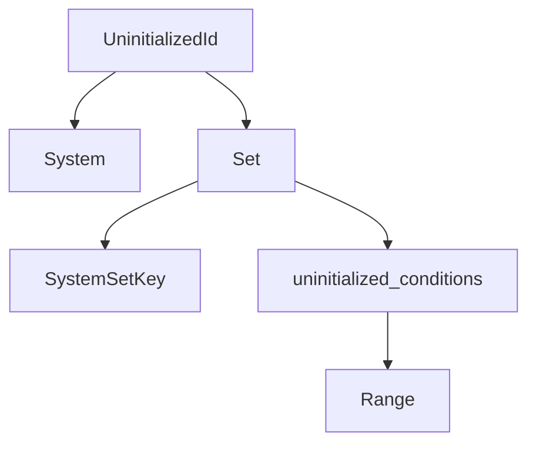

+++
title = "#20080 Thoroughly document `UninitializedId` semantics"
date = "2025-07-12T00:00:00"
draft = false
template = "pull_request_page.html"
in_search_index = true

[taxonomies]
list_display = ["show"]

[extra]
current_language = "en"
available_languages = {"en" = { name = "English", url = "/pull_request/bevy/2025-07/pr-20080-en-20250712" }, "zh-cn" = { name = "中文", url = "/pull_request/bevy/2025-07/pr-20080-zh-cn-20250712" }}
labels = ["C-Docs", "A-ECS", "C-Code-Quality", "D-Straightforward"]
+++

## Thoroughly document `UninitializedId` semantics

### Basic Information
- **Title**: Thoroughly document `UninitializedId` semantics
- **PR Link**: https://github.com/bevyengine/bevy/pull/20080
- **Author**: ItsDoot
- **Status**: MERGED
- **Labels**: C-Docs, A-ECS, C-Code-Quality, S-Ready-For-Final-Review, D-Straightforward
- **Created**: 2025-07-11T00:07:46Z
- **Merged**: 2025-07-12T04:16:07Z
- **Merged By**: alice-i-cecile

### Description Translation
# Objective

Clean up documentation around `UninitializedId`, which has slightly confusing semantics.

## Solution

Added documentation comments on `UninitializedId`.

### The Story of This Pull Request

The PR addresses documentation gaps in Bevy's ECS scheduler around the `UninitializedId` type. This type handles deferred initialization of schedule graph nodes when direct World access isn't available. The existing implementation was functional but lacked clear documentation about its purpose and internal semantics, particularly regarding how it tracks uninitialized conditions for system sets.

The core issue was that `UninitializedId` served two distinct purposes: tracking uninitialized systems and uninitialized system set conditions, but this distinction wasn't clearly documented. For system sets, the implementation used a `first_uninit_condition` index, which implied that all conditions after that index needed initialization. However, this approach wasn't sufficiently documented and didn't clearly explain why system sets required different handling than systems.

The solution involved three key improvements:
1. Adding comprehensive doc comments to the `UninitializedId` enum and its variants
2. Renaming `first_uninit_condition` to `uninitialized_conditions` to better reflect its purpose
3. Changing the type from `usize` to `Range<usize>` to more precisely represent the slice of uninitialized conditions

The documentation now clearly explains:
- Why initialization must be deferred (`&mut World` access requirement)
- The structural difference between system initialization (single node) vs system set initialization (multiple possible condition appends)
- How the range-based tracking solves the problem of multiple `configure_sets` calls

The initialization logic was updated to use the range directly when processing uninitialized system set conditions:

```rust
for condition in &mut self.system_sets.conditions[key][uninitialized_conditions] {
    condition.access = condition.condition.initialize(world);
}
```

This change maintains the same runtime behavior but makes the code more explicit about which conditions are being initialized. The range-based approach provides stronger guarantees than the previous index method since it precisely delimits the affected conditions rather than relying on an open-ended "all conditions after this index" approach.

### Visual Representation



### Key Files Changed

**crates/bevy_ecs/src/schedule/schedule.rs** (+28/-9)  
Added documentation and improved condition tracking semantics:

```rust
// Before:
enum UninitializedId {
    System(SystemKey),
    Set {
        key: SystemSetKey,
        first_uninit_condition: usize,
    },
}

// After:
/// A node in a [`ScheduleGraph`] with a system or conditions that have not been
/// initialized yet.
///
/// We have to defer initialization of nodes in the graph until we have
/// `&mut World` access, so we store these in a list ([`ScheduleGraph::uninit`])
/// until then. In most cases, initialization occurs upon the first run of the
/// schedule.
enum UninitializedId {
    /// A system and its conditions that have not been initialized yet.
    System(SystemKey),
    /// A system set's conditions that have not been initialized yet.
    Set {
        key: SystemSetKey,
        /// The range of indices in [`SystemSets::conditions`] that correspond
        /// to conditions that have not been initialized yet.
        ///
        /// [`SystemSets::conditions`] for a given set may be appended to
        /// multiple times (e.g. when `configure_sets` is called multiple with
        /// the same set), so we need to track which conditions in that list
        /// are newly added and not yet initialized.
        ///
        /// Systems don't need this tracking because each `add_systems` call
        /// creates separate nodes in the graph with their own conditions,
        /// so all conditions are initialized together.
        uninitialized_conditions: Range<usize>,
    },
}
```

Initialization logic update:
```rust
// Before:
for condition in self.system_sets.conditions[key]
    .iter_mut()
    .skip(first_uninit_condition)
{
    condition.access = condition.condition.initialize(world);
}

// After:
for condition in &mut self.system_sets.conditions[key][uninitialized_conditions] 
{
    condition.access = condition.condition.initialize(world);
}
```

### Further Reading
1. [Bevy ECS Scheduler Documentation](https://docs.rs/bevy_ecs/latest/bevy_ecs/schedule/struct.Schedule.html)
2. [System Sets in Bevy](https://bevy-cheatbook.github.io/programming/system-sets.html)
3. [Rust Range Documentation](https://doc.rust-lang.org/std/ops/struct.Range.html)