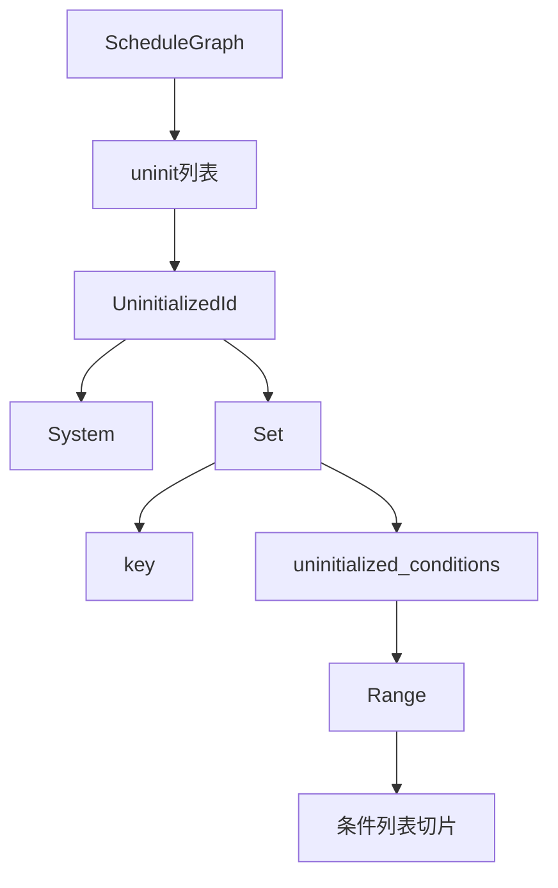

+++
title = "#20080 Thoroughly document `UninitializedId` semantics"
date = "2025-07-12T00:00:00"
draft = false
template = "pull_request_page.html"
in_search_index = false

[extra]
current_language = "zh-cn"
available_languages = {"en" = { name = "English", url = "/pull_request/bevy/2025-07/pr-20080-en-20250712" }, "zh-cn" = { name = "中文", url = "/pull_request/bevy/2025-07/pr-20080-zh-cn-20250712" }}
+++

## Thoroughly document `UninitializedId` semantics

### 基本信息
- **标题**: Thoroughly document `UninitializedId` semantics
- **PR链接**: https://github.com/bevyengine/bevy/pull/20080
- **作者**: ItsDoot
- **状态**: MERGED
- **标签**: C-Docs, A-ECS, C-Code-Quality, S-Ready-For-Final-Review, D-Straightforward
- **创建时间**: 2025-07-11T00:07:46Z
- **合并时间**: 2025-07-12T04:16:07Z
- **合并者**: alice-i-cecile

### 描述翻译
# Objective

清理围绕`UninitializedId`的文档，其语义有些令人困惑。

## Solution

在`UninitializedId`上添加了文档注释。

---

## 这个PR的故事

### 问题和背景
在Bevy的ECS调度系统中，`ScheduleGraph`负责管理系统和系统集的执行顺序。某些节点初始化需要`&mut World`访问权限，这只能在首次运行调度时完成。这些未初始化的节点存储在`ScheduleGraph::uninit`列表中，使用`UninitializedId`枚举来标识。

原始实现存在两个主要问题：
1. `UninitializedId`的文档不足，导致其语义不明确
2. 系统集的条件初始化逻辑使用简单的起始索引(`first_uninit_condition`)，无法正确处理多次添加条件的情况

当多次调用`configure_sets`为同一系统集添加条件时，系统集的条件列表会被追加。原始实现只记录初始添加时的起始索引，导致后续添加的条件无法正确初始化。

### 解决方案
PR通过以下方式解决问题：
1. 为`UninitializedId`添加详细文档注释，明确其用途和语义
2. 将`first_uninit_condition`替换为范围类型`Range<usize>`，准确跟踪需要初始化的条件区间
3. 优化初始化逻辑，直接使用范围切片访问条件

### 实现细节
核心修改集中在`UninitializedId`枚举及其使用上：

**文档增强**：
为枚举和变体添加了详细注释：
```rust
/// A node in a [`ScheduleGraph`] with a system or conditions that have not been
/// initialized yet.
///
/// We have to defer initialization of nodes in the graph until we have
/// `&mut World` access, so we store these in a list ([`ScheduleGraph::uninit`])
/// until then. In most cases, initialization occurs upon the first run of the
/// schedule.
enum UninitializedId {
    /// A system and its conditions that have not been initialized yet.
    System(SystemKey),
    /// A system set's conditions that have not been initialized yet.
    Set {
        key: SystemSetKey,
        /// The range of indices in [`SystemSets::conditions`] that correspond
        /// to conditions that have not been initialized yet.
        ///
        /// [`SystemSets::conditions`] for a given set may be appended to
        /// multiple times (e.g. when `configure_sets` is called multiple with
        /// the same set), so we need to track which conditions in that list
        /// are newly added and not yet initialized.
        ///
        /// Systems don't need this tracking because each `add_systems` call
        /// creates separate nodes in the graph with their own conditions,
        /// so all conditions are initialized together.
        uninitialized_conditions: Range<usize>,
    },
}
```

**数据结构变更**：
将索引字段替换为范围：
```diff
 Set {
     key: SystemSetKey,
-    first_uninit_condition: usize,
+    uninitialized_conditions: Range<usize>,
 }
```

**初始化逻辑优化**：
使用范围切片直接访问需要初始化的条件：
```diff
 UninitializedId::Set {
     key,
-    first_uninit_condition,
+    uninitialized_conditions,
 } => {
-    for condition in self.system_sets.conditions[key]
-        .iter_mut()
-        .skip(first_uninit_condition)
+    for condition in &mut self.system_sets.conditions[key][uninitialized_conditions]
     {
         condition.access = condition.condition.initialize(world);
     }
 }
```

### 技术洞察
1. **范围优于索引**：使用`Range<usize>`代替单个索引，解决了多次添加条件时的初始化边界问题
2. **系统与系统集差异**：
   - 系统：每次`add_systems`创建独立节点，所有条件一起初始化
   - 系统集：条件列表可被多次追加，需要精确跟踪每次添加的范围
3. **延迟初始化模式**：通过`UninitializedId`实现了需要`&mut World`的资源的延迟初始化

### 影响
1. **文档清晰化**：明确了`UninitializedId`在调度初始化中的作用
2. **正确性提升**：确保所有新添加的系统集条件都能正确初始化
3. **维护性增强**：范围操作使代码更健壮，避免隐式的`skip`逻辑

## 可视化表示



## 关键文件变更

### `crates/bevy_ecs/src/schedule/schedule.rs` (+28/-9)

**变更说明**：
增强`UninitializedId`的文档并修复系统集条件初始化逻辑，确保多次添加条件时能正确初始化。

**关键代码片段**：
```rust
// 变更前:
enum UninitializedId {
    System(SystemKey),
    Set {
        key: SystemSetKey,
        first_uninit_condition: usize,
    },
}

// 添加系统集条件时:
self.uninit.push(UninitializedId::Set {
    key,
    first_uninit_condition: system_set_conditions.len(),
});

// 初始化系统集条件时:
for condition in self.system_sets.conditions[key]
    .iter_mut()
    .skip(first_uninit_condition)
```

```rust
// 变更后:
enum UninitializedId {
    /// A system and its conditions... 
    System(SystemKey),
    /// A system set's conditions...
    Set {
        key: SystemSetKey,
        uninitialized_conditions: Range<usize>,
    },
}

// 添加系统集条件时:
let start = system_set_conditions.len();
self.uninit.push(UninitializedId::Set {
    key,
    uninitialized_conditions: start..(start + conditions.len()),
});

// 初始化系统集条件时:
for condition in &mut self.system_sets.conditions[key][uninitialized_conditions]
```

## 延伸阅读
1. [Bevy ECS调度系统文档](https://bevyengine.org/learn/book/next/programming/ecs/schedules)
2. [Rust范围类型文档](https://doc.rust-lang.org/std/ops/struct.Range.html)
3. [实体组件系统模式](https://en.wikipedia.org/wiki/Entity_component_system)