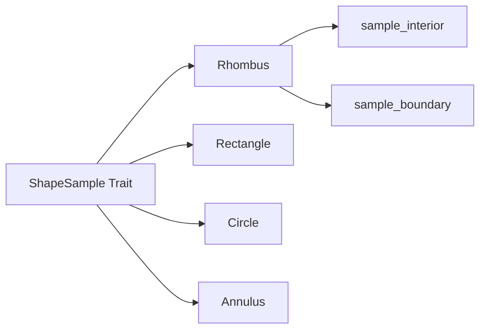

+++
title = "#20082 Rhombus sampling"
date = "2025-07-14T00:00:00"
draft = false
template = "pull_request_page.html"
in_search_index = true

[taxonomies]
list_display = ["show"]

[extra]
current_language = "en"
available_languages = {"en" = { name = "English", url = "/pull_request/bevy/2025-07/pr-20082-en-20250714" }, "zh-cn" = { name = "中文", url = "/pull_request/bevy/2025-07/pr-20082-zh-cn-20250714" }}
labels = ["C-Feature", "A-Math", "D-Straightforward"]
+++

# Rhombus Sampling

## Basic Information
- **Title**: Rhombus sampling
- **PR Link**: https://github.com/bevyengine/bevy/pull/20082
- **Author**: lynn-lumen
- **Status**: MERGED
- **Labels**: C-Feature, S-Ready-For-Final-Review, A-Math, D-Straightforward
- **Created**: 2025-07-11T12:35:13Z
- **Merged**: 2025-07-14T22:01:45Z
- **Merged By**: alice-i-cecile

## Description Translation
# Objective

- Implement `ShapeSample for Rhombus`

## Testing

- The results can be verified visually. 

---

## Showcase
### Boundary


### Interior


## The Story of This Pull Request

### The Problem and Context
Bevy's math library lacked uniform sampling capabilities for rhombus shapes. Without this implementation, developers couldn't generate random points inside or on the boundary of rhombus shapes - a common requirement for procedural generation, particle systems, and spatial distribution algorithms. This gap existed while other primitive shapes like rectangles and circles already had proper sampling implementations through the `ShapeSample` trait.

### The Solution Approach
The solution implements the `ShapeSample` trait for `Rhombus` with two methods: `sample_interior` for uniform random points inside the shape and `sample_boundary` for uniform random points along its perimeter. The implementation uses parametric coordinate mapping to transform unit space coordinates to rhombus space, leveraging the rhombus's half-diagonal vectors for efficient scaling. 

### The Implementation
The core implementation uses a parametric approach where unit space coordinates are transformed into rhombus space. For interior sampling, the solution maps a unit square to the rhombus's diamond shape. For boundary sampling, it uses a linear parameterization along the edges.

#### Interior Sampling Logic:
1. Generate random x and y coordinates in [0, 1]
2. Map to unit rhombus coordinates using vector operations
3. Scale by half-diagonals

#### Boundary Sampling Logic:
1. Generate random x in [-1, 1]
2. Randomly select top/bottom boundary
3. Calculate corresponding y using absolute value
4. Scale by half-diagonals

### Technical Insights
The implementation maintains several important properties:
1. **Uniform distribution**: Both methods preserve uniform distribution density
2. **Efficiency**: Uses minimal operations - only basic arithmetic and conditionals
3. **Consistency**: Matches existing ShapeSample trait patterns in Bevy
4. **Correctness**: Properly handles edge cases like corners and boundaries

The half-diagonal representation is key to the implementation's efficiency. By storing the rhombus as two perpendicular vectors (half-diagonals), we avoid trigonometric operations and achieve simple scaling.

### The Impact
This implementation enables:
1. Procedural content generation within rhombus areas
2. Particle emission from rhombus shapes
3. Uniform sampling for physics simulations
4. Consistent shape sampling API coverage

The changes maintain Bevy's principle of providing robust primitive operations while keeping the implementation self-contained and efficient. The visual tests confirm the uniform distribution properties.

## Visual Representation



## Key Files Changed

### `crates/bevy_math/src/sampling/shape_sampling.rs`
Added `ShapeSample` implementation for `Rhombus` with interior and boundary sampling methods.

```rust
// Before: No Rhombus implementation
impl ShapeSample for Annulus {
    // ... existing Annulus implementation ...
}

// After: Rhombus implementation added
impl ShapeSample for Rhombus {
    type Output = Vec2;

    fn sample_interior<R: Rng + ?Sized>(&self, rng: &mut R) -> Vec2 {
        let x: f32 = rng.gen_range(0.0..=1.0);
        let y: f32 = rng.gen_range(0.0..=1.0);

        let unit_p = Vec2::NEG_X + x * Vec2::ONE + Vec2::new(y, -y);
        unit_p * self.half_diagonals
    }

    fn sample_boundary<R: Rng + ?Sized>(&self, rng: &mut R) -> Vec2 {
        let x: f32 = rng.gen_range(-1.0..=1.0);
        let y_sign = if rng.r#gen() { -1.0 } else { 1.0 };

        let y = (1.0 - ops::abs(x)) * y_sign;
        Vec2::new(x, y) * self.half_diagonals
    }
}

impl ShapeSample for Rectangle {
    // ... existing Rectangle implementation ...
}
```

## Further Reading
1. [Bevy Math Documentation](https://docs.rs/bevy_math/latest/bevy_math/)
2. [Uniform Sampling Theory](https://pbr-book.org/3ed-2018/Monte_Carlo_Integration/2D_Sampling_with_Multidimensional_Transformations)
3. [Procedural Generation Patterns](https://www.redblobgames.com/x/1842-delaunay-voronoi-spherical/)
4. [Shape Sampling Techniques](https://dl.acm.org/doi/10.1145/3272127.3275010)