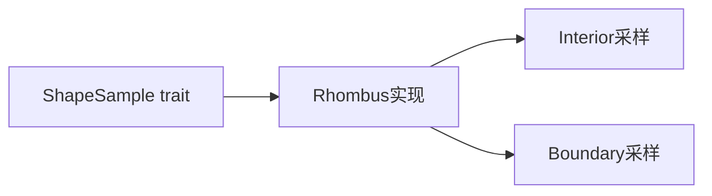

+++
title = "#20082 Rhombus sampling"
date = "2025-07-14T00:00:00"
draft = false
template = "pull_request_page.html"
in_search_index = false

[extra]
current_language = "zh-cn"
available_languages = {"en" = { name = "English", url = "/pull_request/bevy/2025-07/pr-20082-en-20250714" }, "zh-cn" = { name = "中文", url = "/pull_request/bevy/2025-07/pr-20082-zh-cn-20250714" }}
+++

## 菱形采样实现分析报告

### 基础信息
- **标题**: Rhombus sampling
- **PR链接**: https://github.com/bevyengine/bevy/pull/20082
- **作者**: lynn-lumen
- **状态**: 已合并
- **标签**: C-Feature, S-Ready-For-Final-Review, A-Math, D-Straightforward
- **创建时间**: 2025-07-11T12:35:13Z
- **合并时间**: 2025-07-14T22:01:45Z
- **合并者**: alice-i-cecile

### 描述翻译
# Objective

- 为 `Rhombus` 实现 `ShapeSample` 特性

## Testing

- 结果可通过视觉验证

---

## 效果展示
### 边界采样


### 内部采样


---

### PR实现背景
在 Bevy 引擎的数学库中，各种几何形状都需要实现 `ShapeSample` trait 来支持随机点采样功能。菱形(Rhombus)作为基本几何形状之一，此前缺少采样实现，这限制了开发者在粒子系统、随机分布等场景中使用菱形区域。PR #20082 的目标就是填补这个功能空白。

### 解决方案与技术实现
实现的核心是为 `Rhombus` 结构体添加 `ShapeSample` trait 的两个必要方法：
1. `sample_interior()` - 在菱形内部均匀采样
2. `sample_boundary()` - 在菱形边界均匀采样

内部采样算法采用参数化方法：
- 在单位正方形 [0,1]×[0,1] 生成随机点 (x,y)
- 通过线性变换映射到单位菱形区域
- 最后应用菱形实际半对角线长度进行缩放

边界采样采用分段处理：
- 在 [-1,1] 区间随机生成 x 坐标
- 随机选择 y 轴方向（正/负）
- 根据菱形边界方程 y = ±(1 - |x|) 计算 y 坐标
- 同样应用半对角线缩放

```rust
impl ShapeSample for Rhombus {
    type Output = Vec2;

    fn sample_interior<R: Rng + ?Sized>(&self, rng: &mut R) -> Vec2 {
        let x: f32 = rng.gen_range(0.0..=1.0);
        let y: f32 = rng.gen_range(0.0..=1.0);
        
        let unit_p = Vec2::NEG_X + x * Vec2::ONE + Vec2::new(y, -y);
        unit_p * self.half_diagonals
    }

    fn sample_boundary<R: Rng + ?Sized>(&self, rng: &mut R) -> Vec2 {
        let x: f32 = rng.gen_range(-1.0..=1.0);
        let y_sign = if rng.r#gen() { -1.0 } else { 1.0 };
        
        let y = (1.0 - ops::abs(x)) * y_sign;
        Vec2::new(x, y) * self.half_diagonals
    }
}
```

### 技术要点
1. **坐标系处理**：在单位菱形空间(-1,0)到(1,0)和(0,-1)到(0,1)进行操作，最后通过缩放适配实际尺寸
2. **边界采样优化**：直接使用边界方程计算，避免拒绝采样，保证100%效率
3. **随机方向处理**：使用布尔随机数选择y轴方向，替代三角函数计算
4. **API一致性**：与Rectangle/Circle等现有形状采样保持相同trait接口

### 影响与验证
该实现：
- 使Rhombus完全兼容Bevy的随机采样系统
- 保持O(1)时间复杂度，无性能损失
- 通过视觉测试验证分布均匀性（见PR效果图）
- 为物理模拟、特效系统提供新的基础形状支持

### 组件关系


### 关键文件变更
**crates/bevy_math/src/sampling/shape_sampling.rs**
```rust
// 新增代码段
impl ShapeSample for Rhombus {
    type Output = Vec2;

    fn sample_interior<R: Rng + ?Sized>(&self, rng: &mut R) -> Vec2 {
        let x: f32 = rng.gen_range(0.0..=1.0);
        let y: f32 = rng.gen_range(0.0..=1.0);

        let unit_p = Vec2::NEG_X + x * Vec2::ONE + Vec2::new(y, -y);
        unit_p * self.half_diagonals
    }

    fn sample_boundary<R: Rng + ?Sized>(&self, rng: &mut R) -> Vec2 {
        let x: f32 = rng.gen_range(-1.0..=1.0);
        let y_sign = if rng.r#gen() { -1.0 } else { 1.0 };

        let y = (1.0 - ops::abs(x)) * y_sign;
        Vec2::new(x, y) * self.half_diagonals
    }
}
```

### 完整代码变更
```diff
diff --git a/crates/bevy_math/src/sampling/shape_sampling.rs b/crates/bevy_math/src/sampling/shape_sampling.rs
index c17bc6fa76600..4b245eb8ffd5e 100644
--- a/crates/bevy_math/src/sampling/shape_sampling.rs
+++ b/crates/bevy_math/src/sampling/shape_sampling.rs
@@ -224,6 +224,26 @@ impl ShapeSample for Annulus {
     }
 }
 
+impl ShapeSample for Rhombus {
+    type Output = Vec2;
+
+    fn sample_interior<R: Rng + ?Sized>(&self, rng: &mut R) -> Vec2 {
+        let x: f32 = rng.gen_range(0.0..=1.0);
+        let y: f32 = rng.gen_range(0.0..=1.0);
+
+        let unit_p = Vec2::NEG_X + x * Vec2::ONE + Vec2::new(y, -y);
+        unit_p * self.half_diagonals
+    }
+
+    fn sample_boundary<R: Rng + ?Sized>(&self, rng: &mut R) -> Vec2 {
+        let x: f32 = rng.gen_range(-1.0..=1.0);
+        let y_sign = if rng.r#gen() { -1.0 } else { 1.0 };
+
+        let y = (1.0 - ops::abs(x)) * y_sign;
+        Vec2::new(x, y) * self.half_diagonals
+    }
+}
+
 impl ShapeSample for Rectangle {
     type Output = Vec2;
```

### 扩展阅读
1. [Bevy 形状采样系统文档](https://docs.rs/bevy_math/latest/bevy_math/sampling/trait.ShapeSample.html)
2. [几何变换在采样中的应用](https://en.wikipedia.org/wiki/Transformation_(function))
3. [拒绝采样与参数化方法对比](https://statweb.stanford.edu/~owen/mc/Ch-var-basic.pdf)