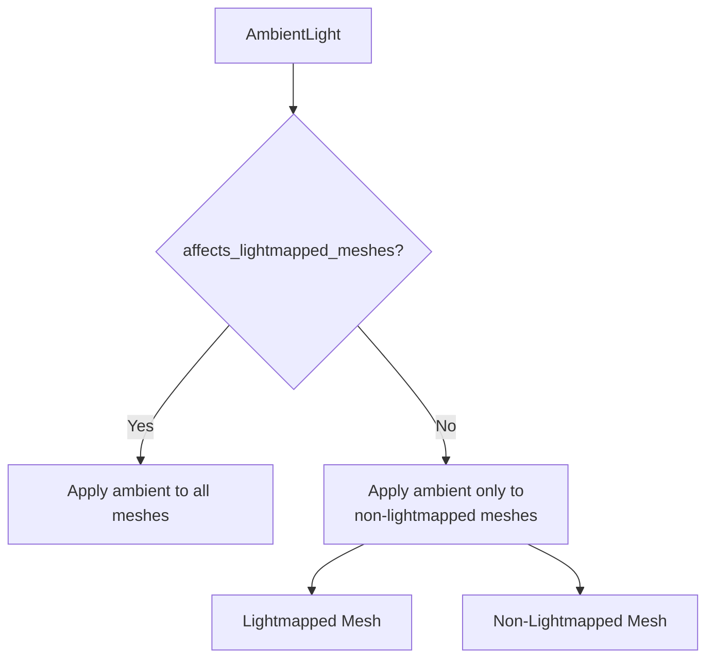

+++
title = "#20083"
date = "2025-07-14T00:00:00"
draft = false
template = "pull_request_page.html"
in_search_index = true

[taxonomies]
list_display = ["show"]

[extra]
current_language = "en"
available_languages = {"en" = { name = "English", url = "/pull_request/bevy/2025-07/pr-20083-en-20250714" }, "zh-cn" = { name = "中文", url = "/pull_request/bevy/2025-07/pr-20083-zh-cn-20250714" }}
+++

## Technical Analysis of PR #20083: Fix AmbientLight::affects_lightmapped_meshes not working

### The Problem and Context
The core issue addressed in this PR stems from how Bevy handles ambient light calculations for lightmapped meshes. When using lightmapped materials (where lighting information is pre-baked into textures), the `AmbientLight::affects_lightmapped_meshes` setting wasn't being respected in the forward renderer. This caused ambient light to always affect lightmapped meshes, potentially resulting in double-counting of ambient light contributions (since ambient light might already be baked into the lightmap). This behavior contradicted the setting's intended purpose of allowing artists to control whether runtime ambient light should affect lightmapped objects.

### The Solution Approach
The fix required modifying how ambient light calculations are conditionally applied in Bevy's physically based rendering (PBR) shader. The solution involves:
1. Adding conditional logic to skip ambient light contributions when rendering lightmapped meshes with `affects_lightmapped_meshes` disabled
2. Cleaning up unused shader variables to make space for the new control flag
3. Passing the ambient light setting to the shader via the `Lights` uniform struct

The implementation specifically targets the forward renderer, as implementing this for deferred rendering would require more extensive changes to the g-buffer format.

### The Implementation
The changes occur in two WGSL shader files. First, in `mesh_view_types.wgsl`, we clean up unused environment map variables and add the new control flag:

```wgsl
// Before:
struct Lights {
    // ... existing fields ...
    environment_map_smallest_specular_mip_level: u32,
    environment_map_intensity: f32,
};

// After:
struct Lights {
    // ... existing fields ...
    ambient_light_affects_lightmapped_meshes: u32
};
```

This modification removes two unused variables (`environment_map_smallest_specular_mip_level` and `environment_map_intensity`) that weren't referenced in either WGSL or Rust code, freeing up space for the new `ambient_light_affects_lightmapped_meshes` flag.

The core logic change happens in `pbr_functions.wgsl` where we conditionally apply ambient light:

```wgsl
// Before:
indirect_light += ambient::ambient_light(...);

// After:
#ifdef LIGHTMAP
let enable_ambient = view_bindings::lights.ambient_light_affects_lightmapped_meshes != 0u;
#else
let enable_ambient = true;
#endif

if (enable_ambient) {
    indirect_light += ambient::ambient_light(...);
}
```

This change:
1. Checks if the current material has a lightmap (via `LIGHTMAP` define)
2. Reads the ambient light setting from the uniform buffer
3. Only applies ambient light contributions when either:
   - The mesh isn't lightmapped, OR
   - The mesh is lightmapped AND `affects_lightmapped_meshes` is enabled

### Technical Insights
The implementation demonstrates several sound engineering practices:
1. **Conditional Compilation**: Uses `#ifdef` to avoid runtime branching costs when lightmaps aren't used
2. **Data Packing**: Replaces unused uniform variables with needed functionality without increasing struct size
3. **Backward Compatibility**: Maintains existing behavior for non-lightmapped meshes
4. **Explicit Control**: Uses unsigned integer flags (0/1) for unambiguous state transmission

The PR leaves an important technical question unresolved: whether ambient light should be conditionally applied when `DIFFUSE_TRANSMISSION` is enabled. This requires further investigation into how transmitted light interacts with ambient contributions.

### The Impact
These changes achieve the intended behavior:
1. Lightmapped meshes now properly respect `affects_lightmapped_meshes`
2. Non-lightmapped meshes continue receiving ambient light normally
3. The fix is contained to shader code with minimal CPU-side changes
4. Unused variables are cleaned up, reducing potential confusion

As demonstrated in the PR's comparison images, meshes without lightmaps now correctly receive ambient light while lightmapped meshes can exclude it when desired. This gives artists precise control over ambient lighting contributions.



### Key Files Changed

**crates/bevy_pbr/src/render/mesh_view_types.wgsl**
```wgsl
// Before:
struct Lights {
    cluster_factors: vec4<f32>,
    n_directional_lights: u32,
    spot_light_shadowmap_offset: i32,
    environment_map_smallest_specular_mip_level: u32,
    environment_map_intensity: f32,
};

// After:
struct Lights {
    cluster_factors: vec4<f32>,
    n_directional_lights: u32,
    spot_light_shadowmap_offset: i32,
    ambient_light_affects_lightmapped_meshes: u32
};
```
This change replaces unused environment map properties with the new ambient light control flag, maintaining struct size while adding needed functionality.

**crates/bevy_pbr/src/render/pbr_functions.wgsl**
```wgsl
// Before:
indirect_light += ambient::ambient_light(...);

// After:
#ifdef LIGHTMAP
    let enable_ambient = view_bindings::lights.ambient_light_affects_lightmapped_meshes != 0u;
#else
    let enable_ambient = true;
#endif
if (enable_ambient) {
    indirect_light += ambient::ambient_light(...);
}
```
This implements the core conditional logic, skipping ambient light calculations for lightmapped meshes when requested.

### Further Reading
1. [Bevy PBR Shading Model](https://bevyengine.org/learn/book/getting-started/features/#pbr)
2. [Lightmapping Techniques](https://developer.nvidia.com/gpugems/gpugems2/part-iii-high-quality-rendering/chapter-10-real-time-global-illumination-lightmaps)
3. [WGSL Shader Language Specification](https://gpuweb.github.io/gpuweb/wgsl/)