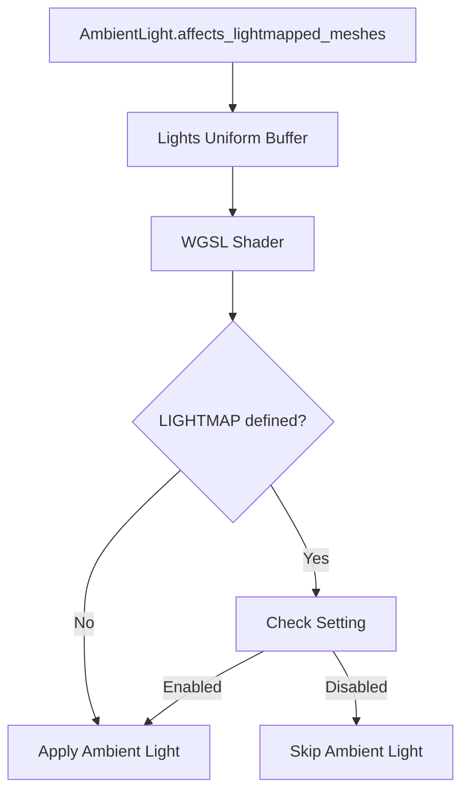

+++
title = "#20083 Fix AmbientLight::affects_lightmapped_meshes not working"
date = "2025-07-14T00:00:00"
draft = false
template = "pull_request_page.html"
in_search_index = false

[extra]
current_language = "zh-cn"
available_languages = {"en" = { name = "English", url = "/pull_request/bevy/2025-07/pr-20083-en-20250714" }, "zh-cn" = { name = "中文", url = "/pull_request/bevy/2025-07/pr-20083-zh-cn-20250714" }}
labels = ["A-Rendering", "D-Straightforward"]
+++

# Fix AmbientLight::affects_lightmapped_meshes not working

## Basic Information
- **Title**: Fix AmbientLight::affects_lightmapped_meshes not working
- **PR Link**: https://github.com/bevyengine/bevy/pull/20083
- **Author**: marlyx
- **Status**: MERGED
- **Labels**: A-Rendering, S-Ready-For-Final-Review, D-Straightforward
- **Created**: 2025-07-11T13:50:17Z
- **Merged**: 2025-07-14T22:03:42Z
- **Merged By**: alice-i-cecile

## Description Translation
### 目标
修复光照贴图材质不遵守 AmbientLight::affects_lightmapped_meshes 设置的问题。

注意：此修复仅在前向渲染器(forward renderer)中生效。要使该设置在延迟渲染器(deferred renderer)中工作，可能需要在G-buffer中编码更多信息或类似操作。如果遗漏了在延迟渲染器中生效的明显方法，请告知。

### 解决方案
- 当材质网格具有光照贴图时，根据affects_lightmapped_meshes设置有条件地应用环境光
- 移除看似残留的`Lights`(wgsl)成员：`environment_map_smallest_specular_mip_level`和`environment_map_intensity`（这些在Rust等效结构`GpuLights`中不存在，也未在wgsl代码中使用）

### 待解决问题
- 如果材质启用了`DIFFUSE_TRANSMISSION`，环境光也会混合到透射光中。是否应该用相同的条件来保护这部分？

### 测试
运行了修改版的光照贴图示例，其中添加了明亮的红色环境光，且小立方体未添加光照贴图（以便观察环境光对无光照贴图网格的影响）

---

### 展示
#### Main: 带明亮红色环境光的光照贴图示例，小盒子无光照贴图


(当`affects_lightmapped_meshes = false`时，所有网格仍接收环境光)

#### 本PR: 带明亮红色环境光的光照贴图示例，小盒子无光照贴图


(当`affects_lightmapped_meshes = false`时，仅小盒子接收环境光)

## The Story of This Pull Request

### 问题背景
在Bevy的渲染系统中，环境光(AmbientLight)包含一个`affects_lightmapped_meshes`设置，用于控制环境光是否影响使用光照贴图(lightmap)的网格。光照贴图是预计算的光照信息，通常用于静态物体以获得性能优势。然而，当前实现存在缺陷：即使将`affects_lightmapped_meshes`设为false，环境光仍会作用于光照贴图网格，导致双重光照计算和不正确的视觉结果。

### 解决方案
核心问题是WGSL着色器代码中缺少对`affects_lightmapped_meshes`标志的条件检查。解决方案涉及：
1. 在`Lights`结构体中添加新字段传递设置状态
2. 在环境光计算处添加条件分支
3. 移除未使用的遗留字段

### 实现细节
修改集中在两个WGSL文件：

**1. mesh_view_types.wgsl**
- 移除未使用的`environment_map_smallest_specular_mip_level`和`environment_map_intensity`字段
- 添加`ambient_light_affects_lightmapped_meshes: u32`字段传递设置状态

```wgsl
// Before:
struct Lights {
    cluster_factors: vec4<f32>,
    n_directional_lights: u32,
    spot_light_shadowmap_offset: i32,
    environment_map_smallest_specular_mip_level: u32,
    environment_map_intensity: f32,
};

// After:
struct Lights {
    cluster_factors: vec4<f32>,
    n_directional_lights: u32,
    spot_light_shadowmap_offset: i32,
    ambient_light_affects_lightmapped_meshes: u32
};
```

**2. pbr_functions.wgsl**
- 添加条件检查逻辑，当网格有光照贴图且设置禁用时跳过环境光计算
- 保持非光照贴图网格的环境光计算不变

```wgsl
// Before:
indirect_light += ambient::ambient_light(in.world_position, in.N, in.V, NdotV, diffuse_color, F0, perceptual_roughness, diffuse_occlusion);

// After:
#ifdef LIGHTMAP
    let enable_ambient = view_bindings::lights.ambient_light_affects_lightmapped_meshes != 0u;
#else   // LIGHTMAP
    let enable_ambient = true;
#endif  // LIGHTMAP
if (enable_ambient) {
    indirect_light += ambient::ambient_light(in.world_position, in.N, in.V, NdotV, diffuse_color, F0, perceptual_roughness, diffuse_occlusion);
}
```

### 技术考量
1. **条件执行策略**：使用`#ifdef`预处理指令确保仅对光照贴图网格进行设置检查，避免其他场景的性能开销
2. **数据类型选择**：使用`u32`而非布尔值因WGSL限制，需显式比较`!= 0u`
3. **前向渲染限制**：解决方案明确声明仅适用于前向渲染路径，延迟渲染需额外工作
4. **透射光处理**：开放性问题指出漫透射(DIFFUSE_TRANSMISSION)可能需相同处理

### 影响与验证
1. **功能修正**：`affects_lightmapped_meshes`设置现在按预期工作
2. **代码清理**：移除未使用的着色器字段减少资源占用
3. **视觉验证**：通过修改的光照贴图示例对比修复前后效果
   - 修复前：所有网格接收环境光（包括光照贴图网格）
   - 修复后：仅非光照贴图网格接收环境光

### 遗留问题
透射光中的环境光混合是否应受相同条件约束仍需讨论，这取决于透射是否应被视为直接光照的一部分。

## Visual Representation



## Key Files Changed

### 1. crates/bevy_pbr/src/render/mesh_view_types.wgsl (+1/-2)
**修改目的**：更新Lights结构体以传递环境光设置状态，同时清理未使用字段

```wgsl
// Before:
struct Lights {
    cluster_factors: vec4<f32>,
    n_directional_lights: u32,
    spot_light_shadowmap_offset: i32,
    environment_map_smallest_specular_mip_level: u32, // 未使用
    environment_map_intensity: f32, // 未使用
};

// After:
struct Lights {
    cluster_factors: vec4<f32>,
    n_directional_lights: u32,
    spot_light_shadowmap_offset: i32,
    ambient_light_affects_lightmapped_meshes: u32 // 新增字段
};
```

### 2. crates/bevy_pbr/src/render/pbr_functions.wgsl (+10/-1)
**修改目的**：实现环境光应用的条件逻辑，根据光照贴图状态和设置决定是否计算环境光贡献

```wgsl
// 修改前:
indirect_light += ambient::ambient_light(...); // 无条件应用

// 修改后:
// 条件检查是否应应用环境光
#ifdef LIGHTMAP
    let enable_ambient = view_bindings::lights.ambient_light_affects_lightmapped_meshes != 0u;
#else
    let enable_ambient = true;
#endif
if (enable_ambient) {
    indirect_light += ambient::ambient_light(...); // 条件应用
}
```

## Further Reading
1. [Bevy光照系统文档](https://bevyengine.org/learn/book/features/pbr/)
2. [WGSL着色语言规范](https://www.w3.org/TR/WGSL/)
3. [光照贴图技术原理](https://en.wikipedia.org/wiki/Lightmap)
4. [前向与延迟渲染对比](https://learnopengl.com/Advanced-Lighting/Deferred-Shading)