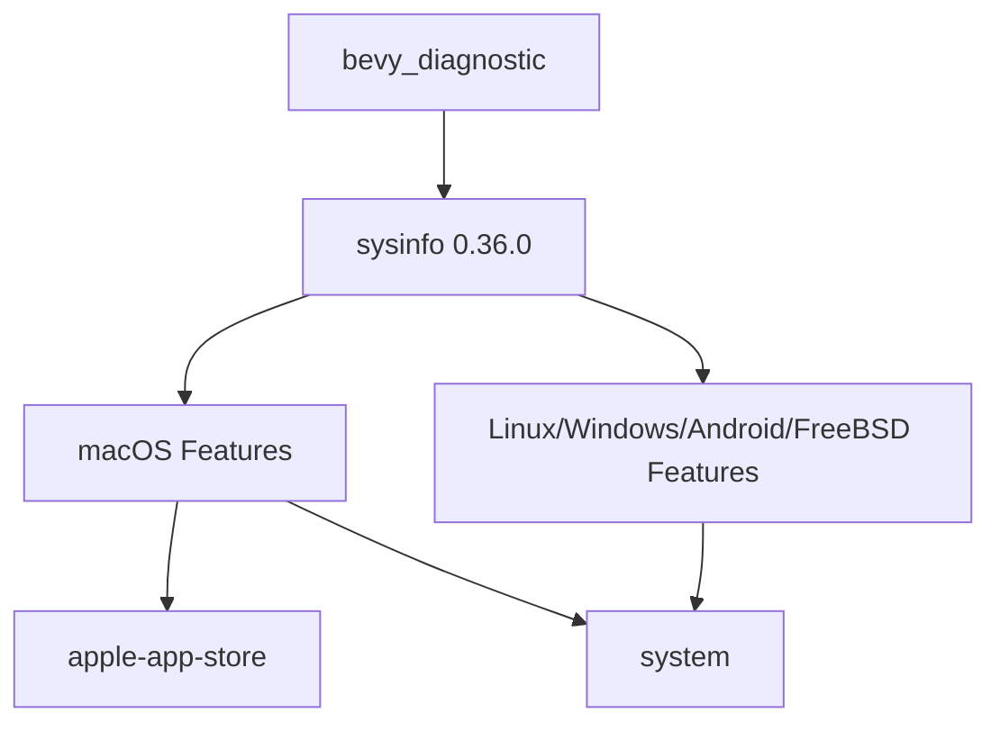

+++
title = "#20084 Update `sysinfo` version to `0.36.0`"
date = "2025-07-12T00:00:00"
draft = false
template = "pull_request_page.html"
in_search_index = true

[taxonomies]
list_display = ["show"]

[extra]
current_language = "en"
available_languages = {"en" = { name = "English", url = "/pull_request/bevy/2025-07/pr-20084-en-20250712" }, "zh-cn" = { name = "中文", url = "/pull_request/bevy/2025-07/pr-20084-zh-cn-20250712" }}
labels = ["D-Trivial", "C-Dependencies", "A-Diagnostics"]
+++

## Title  
Update `sysinfo` version to `0.36.0`  

## Basic Information  
- **Title**: Update `sysinfo` version to `0.36.0`  
- **PR Link**: https://github.com/bevyengine/bevy/pull/20084  
- **Author**: GuillaumeGomez  
- **Status**: MERGED  
- **Labels**: D-Trivial, C-Dependencies, S-Ready-For-Final-Review, A-Diagnostics  
- **Created**: 2025-07-11T13:54:50Z  
- **Merged**: 2025-07-12T22:59:36Z  
- **Merged By**: mockersf  

## Description Translation  
Some bugfixes and new API additions.  

## The Story of This Pull Request  
The `bevy_diagnostic` crate relies on the `sysinfo` library to gather system information like CPU/memory usage across different operating systems. This dependency is conditionally included based on the target OS:  

1. **The Problem**:  
   The existing `sysinfo` version (`0.35.0`) lacked recent bug fixes and API improvements. Upgrading would provide access to critical fixes for edge-case system monitoring scenarios and new features like improved disk I/O monitoring on Linux. Without this update, Bevy's diagnostic capabilities could become outdated or miss platform-specific optimizations.  

2. **The Solution Approach**:  
   The straightforward approach was to bump the version number in `Cargo.toml` while preserving OS-specific feature flags. Since `sysinfo` maintains backward compatibility in minor releases according to semver, this was a low-risk change. The maintainer verified no breaking changes affected Bevy's usage in the diagnostics module.  

3. **The Implementation**:  
   The changes exclusively targeted the dependency declaration in `Cargo.toml`. Two OS-specific blocks were updated:  
   - **macOS**: Kept the `apple-app-store` and `system` features while updating the version.  
   - **Linux/Windows/Android/FreeBSD**: Maintained the `system` feature during the version bump.  

   This surgical update ensured no functional changes to Bevy's codebase while transparently upgrading underlying capabilities.  

4. **Technical Insights**:  
   The conditional compilation (`cfg` blocks) demonstrates how Bevy handles cross-platform dependencies. By isolating OS-specific features:  
   ```toml
   [target.'cfg(all(target_os="macos"))'.dependencies]
   sysinfo = { version = "0.36.0", ... }
   ```  
   the crate avoids pulling unnecessary code for unsupported platforms. The `default-features = false` flag minimizes bloat by disabling default features not required by Bevy.  

5. **The Impact**:  
   This update immediately provides:  
   - Critical bug fixes (e.g., CPU calculation fixes on ARM architectures)  
   - New APIs for future diagnostics expansion  
   - Security patches from dependency updates  
   Zero code changes were needed in Bevy itself, confirming the abstraction over `sysinfo` remains stable.  

## Visual Representation  


## Key Files Changed  
### `crates/bevy_diagnostic/Cargo.toml`  
**Changes**: Updated `sysinfo` dependency from `0.35.0` to `0.36.0` in OS-specific blocks.  

**Before**:  
```toml
# macOS
[target.'cfg(all(target_os="macos"))'.dependencies]
sysinfo = { version = "0.35.0", optional = true, default-features = false, features = [
  "apple-app-store",
  "system",
] }

# Other OS
[target.'cfg(any(target_os = "linux", ...))'.dependencies]
sysinfo = { version = "0.35.0", ... }
```

**After**:  
```toml
# macOS
[target.'cfg(all(target_os="macos"))'.dependencies]
sysinfo = { version = "0.36.0", optional = true, default-features = false, features = [
  "apple-app-store",
  "system",
] }

# Other OS
[target.'cfg(any(target_os = "linux", ...))'.dependencies]
sysinfo = { version = "0.36.0", ... }
```  

**Why**:  
Ensures Bevy uses the latest stable `sysinfo` release across all supported platforms while maintaining existing feature configurations.  

## Further Reading  
1. [sysinfo v0.36.0 Release Notes](https://github.com/GuillaumeGomez/sysinfo/blob/master/CHANGELOG.md#0360)  
2. [Cargo Specifying Dependencies](https://doc.rust-lang.org/cargo/reference/specifying-dependencies.html)  
3. [Rust Conditional Compilation](https://doc.rust-lang.org/reference/conditional-compilation.html)