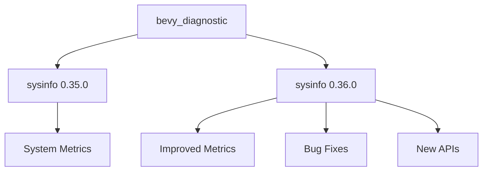

+++
title = "#20084 Update `sysinfo` version to `0.36.0`"
date = "2025-07-12T00:00:00"
draft = false
template = "pull_request_page.html"
in_search_index = false

[extra]
current_language = "zh-cn"
available_languages = {"en" = { name = "English", url = "/pull_request/bevy/2025-07/pr-20084-en-20250712" }, "zh-cn" = { name = "中文", url = "/pull_request/bevy/2025-07/pr-20084-zh-cn-20250712" }}
labels = ["D-Trivial", "C-Dependencies", "A-Diagnostics"]
+++

# Update `sysinfo` version to `0.36.0`

## Basic Information
- **Title**: Update `sysinfo` version to `0.36.0`
- **PR Link**: https://github.com/bevyengine/bevy/pull/20084
- **Author**: GuillaumeGomez
- **Status**: MERGED
- **Labels**: D-Trivial, C-Dependencies, S-Ready-For-Final-Review, A-Diagnostics
- **Created**: 2025-07-11T13:54:50Z
- **Merged**: 2025-07-12T22:59:36Z
- **Merged By**: mockersf

## Description Translation
更新 `sysinfo` 版本到 `0.36.0`

包含一些错误修复和新的API添加。

## The Story of This Pull Request

在 Bevy 游戏引擎的 diagnostics 模块中，系统信息收集功能依赖于第三方库 `sysinfo`。该库近期发布了新版本 0.36.0，包含重要的错误修复和API增强。保持依赖项最新是维护工作的常规部分，可以获取性能改进、安全补丁和新功能，同时避免因版本滞后导致的技术债积累。

`sysinfo` 0.36.0 版本包含多个改进，其中与 Bevy 相关的关键点包括：
- 内存计算逻辑的修复，确保资源使用指标更准确
- 新增对更多系统指标的支持
- 内部优化提升数据采集效率

这些改进直接影响 Bevy 的 `SystemInformationDiagnosticsPlugin`，该插件依赖 `sysinfo` 获取CPU、内存等系统指标。使用旧版本可能导致指标不准确或缺少新功能支持。

更新策略需考虑不同操作系统的兼容性要求。在 macOS 上，`sysinfo` 需要禁用某些不兼容的功能（通过 `apple-app-store` 特性标志）。而在 Linux、Windows、Android 和 FreeBSD 上，可以启用完整的 `system` 特性。PR 作者保持了这些平台特定的配置，仅修改版本号：

```toml
# macOS 配置保持特性标志不变
[target.'cfg(all(target_os="macos"))'.dependencies]
sysinfo = { version = "0.36.0", optional = true, default-features = false, features = [
  "apple-app-store",
  "system",
] }

# 其他平台配置
[target.'cfg(any(target_os = "linux", target_os = "windows", target_os = "android", target_os = "freebsd"))'.dependencies]
sysinfo = { version = "0.36.0", optional = true, default-features = false, features = [
  "system",
] }
```

这种依赖管理方式体现了良好的维护实践：
1. 明确区分不同平台的配置要求
2. 保持特性标志的稳定性，仅升级版本号
3. 通过 `optional = true` 允许按需启用诊断
4. `default-features = false` 避免引入不必要的依赖

升级后，Bevy 诊断系统能立即受益于上游改进，无需修改现有代码。这种依赖更新属于低风险变更，因为接口保持兼容，且测试可以验证基础功能是否正常。

## Visual Representation



## Key Files Changed

### crates/bevy_diagnostic/Cargo.toml
该文件定义了诊断模块的依赖项。修改内容是将所有平台的 `sysinfo` 依赖版本从 `0.35.0` 升级到 `0.36.0`，同时保持原有配置不变。

**修改前:**
```toml
# macOS
[target.'cfg(all(target_os="macos"))'.dependencies]
sysinfo = { version = "0.35.0", optional = true, default-features = false, features = [
  "apple-app-store",
  "system",
] }

# 其他平台
[target.'cfg(any(target_os = "linux", target_os = "windows", target_os = "android", target_os = "freebsd"))'.dependencies]
sysinfo = { version = "0.35.0", optional = true, default-features = false, features = [
  "system",
] }
```

**修改后:**
```toml
# macOS
[target.'cfg(all(target_os="macos"))'.dependencies]
sysinfo = { version = "0.36.0", optional = true, default-features = false, features = [
  "apple-app-store",
  "system",
] }

# 其他平台
[target.'cfg(any(target_os = "linux", target_os = "windows", target_os = "android", target_os = "freebsd"))'.dependencies]
sysinfo = { version = "0.36.0", optional = true, default-features = false, features = [
  "system",
] }
```

## Further Reading
1. [sysinfo 0.35.0 到 0.36.0 的变更日志](https://github.com/GuillaumeGomez/sysinfo/blob/master/CHANGELOG.md#0360)
2. [Bevy 诊断系统文档](https://docs.rs/bevy_diagnostic/latest/bevy_diagnostic/)
3. [Cargo 依赖管理最佳实践](https://doc.rust-lang.org/cargo/reference/specifying-dependencies.html)