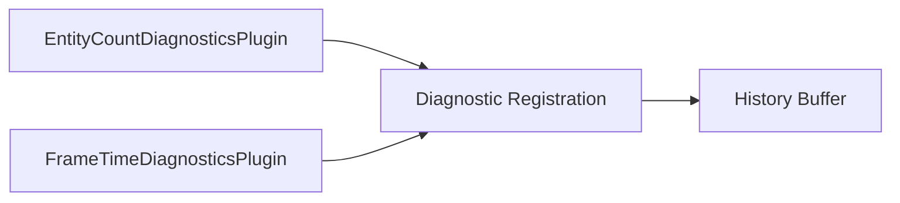

+++
title = "#20085 Add `max_history_length` to `EntityCountDiagnosticsPlugin`"
date = "2025-07-12T00:00:00"
draft = false
template = "pull_request_page.html"
in_search_index = true

[taxonomies]
list_display = ["show"]

[extra]
current_language = "en"
available_languages = {"en" = { name = "English", url = "/pull_request/bevy/2025-07/pr-20085-en-20250712" }, "zh-cn" = { name = "中文", url = "/pull_request/bevy/2025-07/pr-20085-zh-cn-20250712" }}
labels = ["A-Diagnostics"]
+++

# Analysis of PR #20085: Add `max_history_length` to `EntityCountDiagnosticsPlugin`

## Basic Information
- **Title**: Add `max_history_length` to `EntityCountDiagnosticsPlugin`
- **PR Link**: https://github.com/bevyengine/bevy/pull/20085
- **Author**: onbjerg
- **Status**: MERGED
- **Labels**: A-Diagnostics, S-Needs-Review
- **Created**: 2025-07-11T14:18:04Z
- **Merged**: 2025-07-12T23:20:21Z
- **Merged By**: mockersf

## Description Translation
# Objective

I was building out a diagnostics panel in egui when I noticed that I could specify the max history length for the `FrameTimeDiagnosticsPlugin`, but not for the `EntityCountDiagnosticsPlugin`. The objective was to harmonize the two, making the diagnostic history length configurable for both.

## Solution

I added a `EntityCountDiagnosticsPlugin::new`, and a `Default` impl that matches `FrameTimeDiagnosticsPlugin`.

This is a breaking change, given the plugin had no fields previously.

## Testing

I did not test this.

## The Story of This Pull Request

### The Problem and Context
While developing a diagnostics panel using egui, the author noticed an inconsistency in Bevy's diagnostic plugins. The `FrameTimeDiagnosticsPlugin` allowed configuration of its history length through its constructor and `max_history_length` parameter, but the `EntityCountDiagnosticsPlugin` lacked this capability. This limitation prevented developers from controlling how much historical entity count data would be retained, which was particularly important for diagnostic visualization tools that need to display trends over time. The absence of this feature created an unnecessary inconsistency between similar diagnostic plugins.

### The Solution Approach
To address this gap, the author implemented a parallel configuration approach for both plugins. The solution involved:
1. Adding a `max_history_length` parameter to `EntityCountDiagnosticsPlugin`
2. Implementing a constructor (`::new()`) to initialize this parameter
3. Providing a `Default` implementation that uses the existing `DEFAULT_MAX_HISTORY_LENGTH` constant
4. Propagating the configured value to the diagnostic registration
5. Updating usage examples to match the new initialization pattern

This approach maintained consistency with Bevy's existing diagnostic plugin patterns while providing the same level of configurability for both plugins. The implementation intentionally mirrors the structure of `FrameTimeDiagnosticsPlugin` to maintain API consistency across diagnostic utilities.

### The Implementation
The core change modifies the `EntityCountDiagnosticsPlugin` struct to include a `max_history_length` field. Previously, this plugin was a zero-sized type (unit struct), but it now contains configuration data:

```rust
// Before:
#[derive(Default)]
pub struct EntityCountDiagnosticsPlugin;

// After:
pub struct EntityCountDiagnosticsPlugin {
    pub max_history_length: usize,
}
```

The plugin now uses the standard pattern seen in other Bevy diagnostics plugins by providing explicit initialization methods:

```rust
impl Default for EntityCountDiagnosticsPlugin {
    fn default() -> Self {
        Self::new(DEFAULT_MAX_HISTORY_LENGTH)
    }
}

impl EntityCountDiagnosticsPlugin {
    pub fn new(max_history_length: usize) -> Self {
        Self { max_history_length }
    }
}
```

During plugin initialization, the configured history length is applied to the diagnostic:

```rust
app.register_diagnostic(
    Diagnostic::new(Self::ENTITY_COUNT).with_max_history_length(self.max_history_length),
)
```

This change propagates the configuration to the diagnostic system, ensuring the entity count history buffer uses the specified size.

### Technical Insights
The implementation uses Bevy's existing diagnostic extension pattern where:
1. `Diagnostic::new()` creates a basic diagnostic
2. `.with_max_history_length()` configures its history buffer
3. `register_diagnostic()` adds it to the app's diagnostics collection

The `DEFAULT_MAX_HISTORY_LENGTH` constant (imported from the same crate) ensures consistency with other diagnostics that use the same default value. This approach maintains the established convention while making the configuration explicit.

### The Impact
This change:
1. Harmonizes the API between `EntityCountDiagnosticsPlugin` and `FrameTimeDiagnosticsPlugin`
2. Allows developers to control the history retention for entity count diagnostics
3. Enables more consistent diagnostic visualization in tools like egui panels
4. Fixes an API inconsistency in Bevy's diagnostics system

As noted in the PR description, this is a breaking change since it converts a unit struct to a struct with a field. Existing code using `EntityCountDiagnosticsPlugin` without initialization will break and must be updated to use `EntityCountDiagnosticsPlugin::default()` or explicitly configure the history length.

## Visual Representation



## Key Files Changed

### `crates/bevy_diagnostic/src/entity_count_diagnostics_plugin.rs` (+24/-5)

**Changes**: Added configuration options to control diagnostic history length  
**Why**: To match the capabilities of FrameTimeDiagnosticsPlugin and allow history length configuration  

```rust
// Before:
#[derive(Default)]
pub struct EntityCountDiagnosticsPlugin;

// After:
pub struct EntityCountDiagnosticsPlugin {
    pub max_history_length: usize,
}

impl Default for EntityCountDiagnosticsPlugin {
    fn default() -> Self {
        Self::new(DEFAULT_MAX_HISTORY_LENGTH)
    }
}

impl EntityCountDiagnosticsPlugin {
    pub fn new(max_history_length: usize) -> Self {
        Self { max_history_length }
    }
}
```

```rust
// Before:
app.register_diagnostic(Diagnostic::new(Self::ENTITY_COUNT))

// After:
app.register_diagnostic(
    Diagnostic::new(Self::ENTITY_COUNT).with_max_history_length(self.max_history_length),
)
```

### `examples/diagnostics/log_diagnostics.rs` (+1/-1)

**Changes**: Updated example to use the new initialization pattern  
**Why**: To demonstrate the updated API usage after the breaking change  

```rust
// Before:
EntityCountDiagnosticsPlugin,

// After:
EntityCountDiagnosticsPlugin::default(),
```

## Further Reading
1. [Bevy Diagnostics Documentation](https://docs.rs/bevy/latest/bevy/diagnostic/index.html)
2. [FrameTimeDiagnosticsPlugin Source](https://github.com/bevyengine/bevy/blob/main/crates/bevy_diagnostic/src/frame_time_diagnostics_plugin.rs)
3. [Bevy Plugin System](https://bevy-cheatbook.github.io/programming/plugins.html)