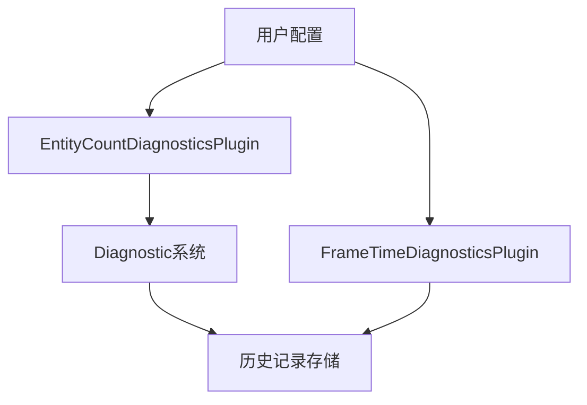

+++
title = "#20085 Add `max_history_length` to `EntityCountDiagnosticsPlugin"
date = "2025-07-12T00:00:00"
draft = false
template = "pull_request_page.html"
in_search_index = false

[extra]
current_language = "zh-cn"
available_languages = {"en" = { name = "English", url = "/pull_request/bevy/2025-07/pr-20085-en-20250712" }, "zh-cn" = { name = "中文", url = "/pull_request/bevy/2025-07/pr-20085-zh-cn-20250712" }}
+++

## 技术分析报告：为 EntityCountDiagnosticsPlugin 添加 max_history_length 配置

### 基本信息
- **标题**: Add `max_history_length` to `EntityCountDiagnosticsPlugin`
- **PR链接**: https://github.com/bevyengine/bevy/pull/20085
- **作者**: onbjerg
- **状态**: MERGED
- **标签**: A-Diagnostics, S-Needs-Review
- **创建时间**: 2025-07-11T14:18:04Z
- **合并时间**: 2025-07-12T23:20:21Z
- **合并人**: mockersf

### 描述翻译
#### 目标
在开发 egui 的诊断面板时，我注意到可以为 `FrameTimeDiagnosticsPlugin` 指定最大历史记录长度，但 `EntityCountDiagnosticsPlugin` 没有对应功能。本次修改的目标是统一这两个插件的功能，使实体数量诊断的历史记录长度也可配置。

#### 解决方案
1. 为 `EntityCountDiagnosticsPlugin` 添加了 `new` 构造函数
2. 实现了匹配 `FrameTimeDiagnosticsPlugin` 的 `Default` trait

注意：这是破坏性变更(breaking change)，因为该插件原先没有字段。

#### 测试
未进行专门测试。

### PR实现过程分析

#### 问题背景
在开发诊断面板时，发现实体计数插件(`EntityCountDiagnosticsPlugin`)缺少历史记录长度配置能力，而帧时间诊断插件(`FrameTimeDiagnosticsPlugin`)已支持该功能。这导致两个核心诊断组件存在不一致的配置接口，影响用户体验和功能扩展性。

#### 解决方案设计
采用一致性设计模式，将 `FrameTimeDiagnosticsPlugin` 的配置方案迁移到实体计数插件：
1. 添加 `max_history_length` 字段存储历史记录上限
2. 通过 `new()` 构造函数暴露配置接口
3. 实现 `Default` trait 提供默认值
4. 在插件初始化时应用该配置到诊断系统

#### 关键实现细节
在诊断系统初始化阶段，通过 `with_max_history_length` 方法将配置值注入诊断器：
```rust
app.register_diagnostic(
    Diagnostic::new(Self::ENTITY_COUNT)
        .with_max_history_length(self.max_history_length)  // 注入配置值
)
```
此修改保留了原有的 `diagnostic_system` 逻辑，仅扩展了配置能力。

#### 破坏性变更处理
由于原插件是单元结构体(unit struct)，添加字段后变为标准结构体，导致实例化方式变化：
```rust
// 旧用法
EntityCountDiagnosticsPlugin

// 新用法
EntityCountDiagnosticsPlugin::default()
```
在示例文件中同步更新了初始化方式，确保兼容性。

#### 设计考量
1. **历史记录管理**：使用 `DEFAULT_MAX_HISTORY_LENGTH` 常量保持默认值一致性
2. **资源开销**：限制历史记录长度可防止内存无限增长
3. **API对称性**：使两个诊断插件的构造函数模式保持一致

### 变更文件详解

#### 1. 实体计数诊断插件实现
**文件路径**: `crates/bevy_diagnostic/src/entity_count_diagnostics_plugin.rs`

**变更目的**：添加历史记录长度配置能力

**关键修改**：
```rust
// 修改前：
#[derive(Default)]
pub struct EntityCountDiagnosticsPlugin;

// 修改后：
pub struct EntityCountDiagnosticsPlugin {
    pub max_history_length: usize,
}

impl Default for EntityCountDiagnosticsPlugin {
    fn default() -> Self {
        Self::new(DEFAULT_MAX_HISTORY_LENGTH)
    }
}

impl EntityCountDiagnosticsPlugin {
    pub fn new(max_history_length: usize) -> Self {
        Self { max_history_length }
    }
}

// 在插件初始化中应用配置：
app.register_diagnostic(
    Diagnostic::new(Self::ENTITY_COUNT)
        .with_max_history_length(self.max_history_length)  // 新增配置注入
)
```

#### 2. 诊断示例更新
**文件路径**: `examples/diagnostics/log_diagnostics.rs`

**变更目的**：适配插件接口变更

**关键修改**：
```rust
// 修改前：
EntityCountDiagnosticsPlugin,

// 修改后：
EntityCountDiagnosticsPlugin::default(),
```

### 组件关系图


### 技术影响
1. **功能增强**：使实体计数诊断支持历史记录限制
2. **API一致性**：统一了核心诊断组件的配置接口
3. **内存安全**：防止诊断数据无限增长
4. **破坏性变更**：需要更新插件初始化方式

### 延伸阅读
1. [Bevy诊断系统文档](https://docs.rs/bevy/latest/bevy/diagnostic/index.html)
2. [实体组件系统(ECS)模式](https://en.wikipedia.org/wiki/Entity_component_system)
3. [Rust默认trait最佳实践](https://doc.rust-lang.org/std/default/trait.Default.html)