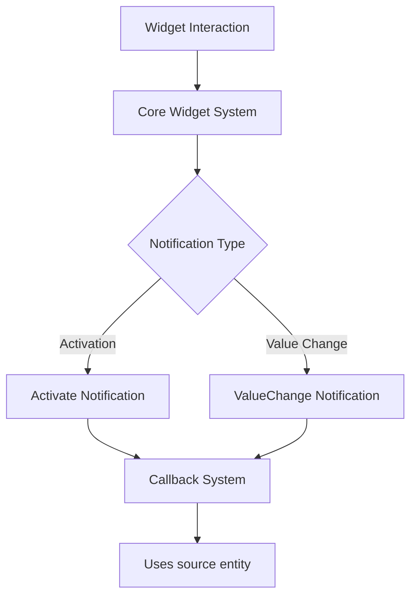

+++
title = "#20086 Changing the notification protocol for core_widgets."
date = "2025-07-13T00:00:00"
draft = false
template = "pull_request_page.html"
in_search_index = true

[taxonomies]
list_display = ["show"]

[extra]
current_language = "en"
available_languages = {"en" = { name = "English", url = "/pull_request/bevy/2025-07/pr-20086-en-20250713" }, "zh-cn" = { name = "中文", url = "/pull_request/bevy/2025-07/pr-20086-zh-cn-20250713" }}
labels = ["A-UI", "C-Usability", "X-Contentious", "D-Straightforward"]
+++

# PR Analysis: Changing the notification protocol for core_widgets

## Basic Information
- **Title**: Changing the notification protocol for core_widgets.
- **PR Link**: https://github.com/bevyengine/bevy/pull/20086
- **Author**: viridia
- **Status**: MERGED
- **Labels**: A-UI, C-Usability, S-Ready-For-Final-Review, X-Contentious, D-Straightforward
- **Created**: 2025-07-11T15:57:30Z
- **Merged**: 2025-07-13T17:45:41Z
- **Merged By**: alice-i-cecile

## Description Translation
Notifications now include the source entity. This is useful for callbacks that are responsible for more than one widget.

Part of #19236 

This is an incremental change only: I have not altered the fundamental nature of callbacks, as this is still in discussion. The only change here is to include the source entity id with the notification.

The existing examples don't leverage this new field, but that will change when I work on the color sliders PR.

I have been careful not to use the word "events" in describing the notification message structs because they are not capital-E `Events` at this time. That may change depending on the outcome of discussions.

@alice-i-cecile

## The Story of This Pull Request

### The Problem and Context
The core_widgets system in Bevy lacked source entity information in its notification callbacks. This made it difficult for systems handling widget interactions to determine which specific widget triggered an action when multiple widgets shared the same callback. The issue was particularly problematic for widgets like radio groups and sliders where a single callback might manage multiple related widgets. Without source entity information, developers had to implement workarounds to identify the originating widget, adding unnecessary complexity to UI systems.

This change is part of a larger effort (#19236) to improve Bevy's UI callback system. The PR author deliberately kept the change incremental, focusing only on adding source entity information without altering the fundamental callback mechanism, as broader architectural discussions about UI events were still ongoing.

### The Solution Approach
The solution introduces two new notification structs that include source entity information:
1. `Activate` for button-like interactions
2. `ValueChange<T>` for value-editing widgets

These structs wrap the existing notification data while adding the source entity. All core widgets (buttons, checkboxes, radio groups, sliders) were modified to use these new notification types. The implementation maintains backward compatibility where possible by keeping similar callback signatures but enhancing them with additional context.

The approach was chosen over alternatives like global event systems because it:
- Provides immediate utility without requiring consensus on the larger UI event architecture
- Maintains the existing callback pattern while adding necessary context
- Minimizes breaking changes to the API surface

### The Implementation
The implementation modified all core widgets to include source entities in their notifications. For example, in `core_button.rs`, the button activation callback was updated to send an `Activate` notification containing the source entity:

```rust
// Before:
commands.notify(&bstate.on_activate);

// After:
commands.notify_with(&bstate.on_activate, Activate(trigger.target()));
```

Similarly, value-based widgets like sliders were updated to use `ValueChange<T>`:

```rust
// Before:
commands.notify_with(&slider.on_change, new_value);

// After:
commands.notify_with(
    &slider.on_change,
    ValueChange {
        source: trigger.target(),
        value: new_value,
    },
);
```

The changes propagated through several areas:
1. **Core widget implementations** were updated to use the new notification types
2. **Feathers UI controls** were modified to match the new callback signatures
3. **Example code** was updated to demonstrate proper usage

The `ValueChange` struct provides a consistent pattern for value-editing widgets:
```rust
pub struct ValueChange<T> {
    pub source: Entity,
    pub value: T,
}
```

### Technical Insights
The key technical insight is that including the source entity enables more robust UI systems while maintaining the existing ECS-based callback approach. The implementation demonstrates how to extend existing patterns with additional context without requiring fundamental architectural changes.

Performance considerations were minimal since the changes only add a single entity ID (a lightweight integer) to existing notifications. The pattern uses Rust's generics effectively to maintain type safety while working with different value types.

The PR maintains a clear distinction between these notifications and Bevy's formal `Events` system, carefully avoiding terminology that might cause confusion during ongoing discussions about UI event architecture.

### The Impact
These changes immediately improve UI system flexibility by:
1. Enabling single callback systems to handle multiple widgets
2. Reducing the need for complex entity lookup logic
3. Providing better context for UI interaction handling

The changes affect all core widgets but maintain backward compatibility through consistent patterns. The examples demonstrate how to migrate existing code to use the new notifications. This sets the foundation for more advanced UI features like the color sliders mentioned in the PR description.

## Visual Representation



## Key Files Changed

### `crates/bevy_core_widgets/src/core_button.rs`
Modified button activation to include source entity in notifications.

```rust
// Before:
commands.notify(&bstate.on_activate);

// After:
commands.notify_with(&bstate.on_activate, Activate(trigger.target()));
```

### `crates/bevy_core_widgets/src/core_slider.rs`
Updated slider to send ValueChange notifications with source entity.

```rust
// Before:
commands.notify_with(&slider.on_change, new_value);

// After:
commands.notify_with(
    &slider.on_change,
    ValueChange {
        source: trigger.target(),
        value: new_value,
    },
);
```

### `examples/ui/core_widgets.rs`
Updated example systems to handle new notification types.

```rust
// Before:
|value: In<f32>, mut widget_states: ResMut<DemoWidgetStates>| {
    widget_states.slider_value = *value;
}

// After:
|value: In<ValueChange<f32>>, mut widget_states: ResMut<DemoWidgetStates>| {
    widget_states.slider_value = value.0.value;
}
```

### `examples/ui/core_widgets_observers.rs`
Modified observer example to use new notification pattern.

```rust
// Before:
|value: In<f32>, mut widget_states: ResMut<DemoWidgetStates>| {
    widget_states.slider_value = *value;
}

// After:
|value: In<ValueChange<f32>>, mut widget_states: ResMut<DemoWidgetStates>| {
    widget_states.slider_value = value.0.value;
}
```

### `crates/bevy_core_widgets/src/lib.rs`
Added new notification structs to the core module.

```rust
pub struct Activate(pub Entity);

pub struct ValueChange<T> {
    pub source: Entity,
    pub value: T,
}
```

## Further Reading
1. Bevy ECS System Parameters: https://bevyengine.org/learn/book/getting-started/ecs/
2. Entity Component System Pattern: https://en.wikipedia.org/wiki/Entity_component_system
3. Observer Pattern in Game Development: https://gameprogrammingpatterns.com/observer.html