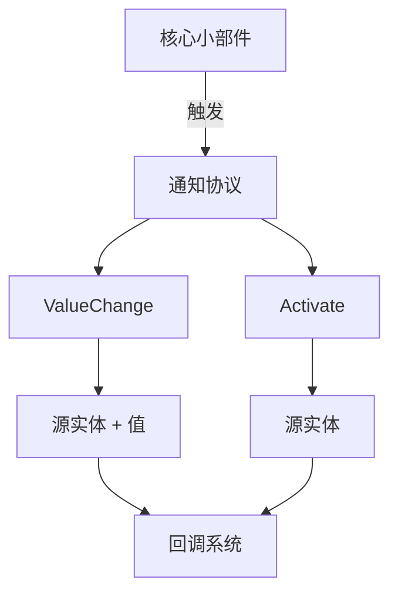

+++
title = "#20086 Changing the notification protocol for core_widgets."
date = "2025-07-13T00:00:00"
draft = false
template = "pull_request_page.html"
in_search_index = false

[extra]
current_language = "zh-cn"
available_languages = {"en" = { name = "English", url = "/pull_request/bevy/2025-07/pr-20086-en-20250713" }, "zh-cn" = { name = "中文", url = "/pull_request/bevy/2025-07/pr-20086-zh-cn-20250713" }}
labels = ["A-UI", "C-Usability", "X-Contentious", "D-Straightforward"]
+++

# 分析报告：Changing the notification protocol for core_widgets

## Basic Information
- **Title**: Changing the notification protocol for core_widgets.
- **PR Link**: https://github.com/bevyengine/bevy/pull/20086
- **Author**: viridia
- **Status**: MERGED
- **Labels**: A-UI, C-Usability, S-Ready-For-Final-Review, X-Contentious, D-Straightforward
- **Created**: 2025-07-11T15:57:30Z
- **Merged**: 2025-07-13T17:45:41Z
- **Merged By**: alice-i-cecile

## Description Translation
通知现在包含源实体。这对于负责多个小部件的回调很有用。

属于 #19236 的一部分

这只是增量更改：我尚未改变回调的基本性质，因为这仍在讨论中。这里唯一的更改是在通知中包含源实体ID。

现有示例未利用这个新字段，但这将在处理颜色滑块PR时改变。

我小心避免在描述通知消息结构时使用"events"这个词，因为它们目前不是大写的`Events`。根据讨论结果，这可能会改变。

@alice-i-cecile

## The Story of This Pull Request

### 问题背景
在Bevy的核心小部件系统中，当小部件（如按钮、滑块、复选框）触发回调时，通知消息缺少来源标识。这导致一个问题：当回调系统需要处理多个小部件时，无法区分事件来源。例如，一个处理多个滑块的回调无法确定哪个滑块触发了值变化。这个问题在issue #19236中被提出。

技术限制在于现有的`Callback`系统传递的数据类型（如`f32`或`bool`）不包含上下文信息。这种设计在小部件数量增加时会降低代码的可维护性和灵活性。

### 解决方案
开发者采用了直接有效的方案：在所有小部件的通知消息中添加源实体ID。具体实现：
1. 创建两个新结构体：`Activate`（用于按钮激活）和`ValueChange<T>`（用于值变化）
2. 修改所有核心小部件（按钮、滑块、复选框、单选按钮）在触发回调时发送包含源实体的消息
3. 更新示例代码适配新协议

这个方案被选择是因为：
- 保持向后兼容性：回调机制不变
- 最小化改动范围：不改变现有回调注册方式
- 为未来事件系统重构预留空间（开发者明确避免使用"events"术语）

### 实现细节
核心修改在`bevy_core_widgets`库中。以按钮组件为例，修改前回调系统无法获取来源实体：

```rust
// 修改前
pub struct CoreButton {
    pub on_activate: Callback,
}

fn button_on_pointer_click(...) {
    commands.notify(&bstate.on_activate);
}
```

修改后包含来源实体信息：

```rust
// 修改后
pub struct CoreButton {
    pub on_activate: Callback<In<Activate>>,
}

fn button_on_pointer_click(...) {
    commands.notify_with(&bstate.on_activate, Activate(trigger.target()));
}
```

新定义的`ValueChange`结构体泛型化处理不同类型数据：

```rust
pub struct ValueChange<T> {
    pub source: Entity,
    pub value: T,
}
```

所有使用核心小部件的模块（如`bevy_feathers`）同步更新了回调签名：

```diff
// bevy_feathers 中的按钮
 pub struct ButtonProps {
-    pub on_click: Callback,
+    pub on_click: Callback<In<Activate>>,
 }
```

### 技术洞察
关键设计决策：
1. **实体标识**：使用`Entity`而非自定义ID，与ECS架构保持一致
2. **类型安全**：`ValueChange<T>`泛型保持数据类型约束
3. **增量迁移**：示例代码逐步更新而非一次性重写

性能考虑：添加`Entity`字段对性能影响可忽略，因为实体ID是轻量级数据（单整数）。架构上，这个改变为更细粒度的事件处理奠定了基础。

### 影响
主要改进：
1. **功能增强**：回调系统可区分事件来源
2. **代码清晰度**：减少为跟踪来源的workaround代码
3. **扩展性**：为多小部件复合组件铺平道路

示例代码更新展示新协议用法：
```rust
// 更新后的回调处理
let on_change_value = commands.register_system(
    |value: In<ValueChange<f32>>, ...| {
        widget_states.slider_value = value.0.value;
    }
);
```

潜在影响：依赖核心小部件的第三方crate需要更新回调处理签名，但修改模式统一且机械。

## Visual Representation



## Key Files Changed

### crates/bevy_core_widgets/src/lib.rs
**修改原因**：定义新的通知协议结构体  
**关键修改**：
```rust
+/// Notification sent by a button or menu item.
+#[derive(Copy, Clone, Debug, PartialEq)]
+pub struct Activate(pub Entity);
+
+/// Notification sent by a widget that edits a scalar value.
+#[derive(Copy, Clone, Debug, PartialEq)]
+pub struct ValueChange<T> {
+    /// The id of the widget that produced this value.
+    pub source: Entity,
+    /// The new value.
+    pub value: T,
+}
```

### crates/bevy_core_widgets/src/core_button.rs
**修改原因**：适配按钮到新协议  
**关键修改**：
```diff
 pub struct CoreButton {
-    pub on_activate: Callback,
+    pub on_activate: Callback<In<Activate>>,
 }

 fn button_on_pointer_click(...) {
-    commands.notify(&bstate.on_activate);
+    commands.notify_with(&bstate.on_activate, Activate(trigger.target()));
 }
```

### crates/bevy_core_widgets/src/core_slider.rs
**修改原因**：适配滑块到新协议  
**关键修改**：
```diff
 pub struct CoreSlider {
-    pub on_change: Callback<In<f32>>,
+    pub on_change: Callback<In<ValueChange<f32>>>,
 }

 fn slider_on_drag(...) {
-    commands.notify_with(&slider.on_change, rounded_value);
+    commands.notify_with(
+        &slider.on_change,
+        ValueChange {
+            source: trigger.target(),
+            value: rounded_value,
+        },
+    );
 }
```

### examples/ui/core_widgets.rs
**修改原因**：更新示例使用新协议  
**关键修改**：
```diff
-    let on_click = commands.register_system(|| {
+    let on_click = commands.register_system(|_: In<Activate>| {
         info!("Button clicked!");
     });
```

### examples/ui/feathers.rs
**修改原因**：更新UI框架示例  
**关键修改**：
```diff
 let radio_exclusion = commands.register_system(
-    |ent: In<Entity>, ...| {
-        if radio == *ent { ... }
+    |ent: In<Activate>, ...| {
+        if radio == ent.0 .0 { ... }
     }
 );
```

## Further Reading
1. [Bevy ECS 实体组件系统文档](https://bevyengine.org/learn/book/next/programming/ecs/)
2. [回调系统设计模式](https://gameprogrammingpatterns.com/observer.html)
3. [Rust 泛型编程指南](https://doc.rust-lang.org/book/ch10-00-generics.html)