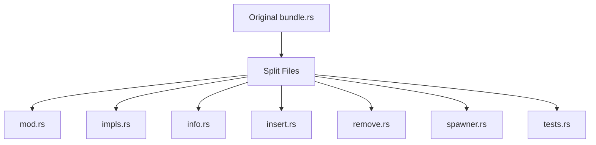

+++
title = "#20088 Split `bundle.rs`"
date = "2025-07-14T00:00:00"
draft = false
template = "pull_request_page.html"
in_search_index = true

[taxonomies]
list_display = ["show"]

[extra]
current_language = "en"
available_languages = {"en" = { name = "English", url = "/pull_request/bevy/2025-07/pr-20088-en-20250714" }, "zh-cn" = { name = "中文", url = "/pull_request/bevy/2025-07/pr-20088-zh-cn-20250714" }}
labels = ["A-ECS", "C-Code-Quality", "P-High", "D-Straightforward"]
+++

## Pull Request Analysis: Split `bundle.rs`

### Basic Information
- **Title**: Split `bundle.rs`
- **PR Link**: https://github.com/bevyengine/bevy/pull/20088
- **Author**: SkiFire13
- **Status**: MERGED
- **Labels**: A-ECS, C-Code-Quality, P-High, S-Ready-For-Final-Review, X-Uncontroversial, D-Straightforward
- **Created**: 2025-07-11T17:33:03Z
- **Merged**: 2025-07-14T18:36:26Z
- **Merged By**: alice-i-cecile

### Description Translation
**Objective**
- `bundle.rs` was becoming too large and needed to be split for better maintainability.

**Solution**
- Split `bundle.rs` into the following files:
  - `bundle/mod.rs`: Contains main traits and documentation
  - `bundle/impls.rs`: Contains trait implementations for components and tuples
  - `bundle/info.rs`: Contains `BundleInfo` and related metadata types
  - `bundle/insert.rs`: Contains bundle insertion logic for existing entities
  - `bundle/remove.rs`: Contains bundle removal logic for existing entities
  - `bundle/spawner.rs`: Contains bundle spawning logic for new entities
  - `bundle/tests.rs`: Contains test cases

**Reviewer Notes**
- Review with `--color-moved` to verify most changes are file moves rather than modifications.

---

## The Story of This Pull Request

### The Problem and Context
The `bundle.rs` file in Bevy's ECS module had grown to over 2,300 lines of code. This size made it difficult to navigate and maintain. Key functionality like bundle insertion, removal, spawning, and metadata management were all contained in a single file, creating cognitive overhead for developers. As Bevy's ECS system evolves, maintaining a monolithic file would become increasingly problematic for code readability and contributor onboarding.

### The Solution Approach
The solution was straightforward: split the monolithic `bundle.rs` into logically separated files based on functionality. This followed Bevy's existing code organization patterns where related functionality is grouped into modules. The approach preserved all existing functionality while improving code organization. Each new file received a focused responsibility:

1. **Core Traits** (`mod.rs`): Fundamental traits like `Bundle` and `DynamicBundle`
2. **Implementations** (`impls.rs`): Concrete implementations for components/tuples
3. **Metadata Management** (`info.rs`): `BundleInfo` and `BundleId` types
4. **Entity Operations** (`insert.rs`, `remove.rs`, `spawner.rs`): Runtime bundle operations
5. **Tests** (`tests.rs`): Dedicated space for test cases

### The Implementation
The PR deleted the original `bundle.rs` and created seven new files. Code was moved between files with minimal modifications, preserving existing functionality. Key aspects:

**Bundle Trait Definitions** (`mod.rs`)
```rust
// Before: All in bundle.rs
// After: Focused trait definitions
pub unsafe trait Bundle: DynamicBundle + Send + Sync + 'static {
    fn component_ids(components: &mut ComponentsRegistrator, ids: &mut impl FnMut(ComponentId));
    fn get_component_ids(components: &Components, ids: &mut impl FnMut(Option<ComponentId>));
}

pub trait DynamicBundle {
    type Effect: BundleEffect;
    fn get_components(self, func: &mut impl FnMut(StorageType, OwningPtr<'_>)) -> Self::Effect;
}
```

**Tuple Implementations** (`impls.rs`)
```rust
// Before: Macro-generated in main file
// After: Isolated implementation details
unsafe impl<C: Component> Bundle for C { ... }

unsafe impl<$($name: Bundle),*> Bundle for ($($name,)*) {
    fn component_ids(components: &mut ComponentsRegistrator, ids: &mut impl FnMut(ComponentId)){
        $(<$name as Bundle>::component_ids(components, ids);)*
    }
}
```

**Bundle Metadata** (`info.rs`)
```rust
// Before: Mixed with operational logic
// After: Dedicated to metadata management
pub struct BundleInfo {
    id: BundleId,
    component_ids: Vec<ComponentId>,
    required_components: Vec<RequiredComponentConstructor>,
    explicit_components_len: usize,
}

pub struct Bundles {
    bundle_infos: Vec<BundleInfo>,
    bundle_ids: TypeIdMap<BundleId>,
    // ... other metadata fields
}
```

**Entity Operations** (`insert.rs`, `remove.rs`, `spawner.rs`)
```rust
// Before: All operations in single file
// After: Separated by operation type
pub(crate) struct BundleInserter<'w> {
    // Fields specific to insertion
    world: UnsafeWorldCell<'w>,
    bundle_info: ConstNonNull<BundleInfo>,
    // ... other insertion-specific fields
}

impl<'w> BundleInserter<'w> {
    pub(crate) unsafe fn insert<T: DynamicBundle>(...) { ... }
}
```

### Technical Insights
The refactoring demonstrates several good software engineering practices:

1. **Separation of Concerns**: Each file now has a single responsibility:
   - `mod.rs`: Type definitions and interfaces
   - `impls.rs`: Concrete implementations
   - `info.rs`: Metadata management
   - Operation files: Runtime behavior

2. **Preservation of Invariants**: By moving code rather than modifying it, the PR maintains critical invariants like:
   - Bundle component ID ordering requirements
   - Safety guarantees in unsafe blocks
   - Archetype graph integrity

3. **Testability**: Isolating tests in their own file makes test maintenance easier.

### The Impact
- **Maintainability**: Reduces average file size from 2,382 lines to under 600 lines
- **Discoverability**: Developers can locate functionality faster through logical file structure
- **Contributor Experience**: Lowers barrier to entry for new contributors
- **Compilation**: May improve incremental compilation times for bundle-related changes

The change aligns with Bevy's code quality standards and provides a foundation for future ECS improvements. The straightforward nature of the change (primarily file moves) minimized risk while delivering significant organizational benefits.

---

## Visual Representation



---

## Key Files Changed

1. **crates/bevy_ecs/src/bundle.rs** (+0/-2382)
   - Entire file removed after being split into multiple files

2. **crates/bevy_ecs/src/bundle/info.rs** (+572/-0)
   - Contains `BundleInfo` and `Bundles` metadata types
   - Key code snippet:
```rust
pub struct BundleInfo {
    pub(super) id: BundleId,
    pub(super) component_ids: Vec<ComponentId>,
    pub(super) required_components: Vec<RequiredComponentConstructor>,
    pub(super) explicit_components_len: usize,
}

pub struct Bundles {
    bundle_infos: Vec<BundleInfo>,
    bundle_ids: TypeIdMap<BundleId>,
    // ... other fields
}
```

3. **crates/bevy_ecs/src/bundle/insert.rs** (+544/-0)
   - Handles inserting bundles into existing entities
   - Key code snippet:
```rust
pub(crate) struct BundleInserter<'w> {
    world: UnsafeWorldCell<'w>,
    bundle_info: ConstNonNull<BundleInfo>,
    // ... other fields
}

impl<'w> BundleInserter<'w> {
    pub(crate) unsafe fn insert<T: DynamicBundle>(...) { ... }
}
```

4. **crates/bevy_ecs/src/bundle/remove.rs** (+449/-0)
   - Handles removing bundles from entities
   - Key code snippet:
```rust
pub(crate) struct BundleRemover<'w> {
    world: UnsafeWorldCell<'w>,
    bundle_info: ConstNonNull<BundleInfo>,
    // ... other fields
}

impl<'w> BundleRemover<'w> {
    pub(crate) unsafe fn remove(...) { ... }
}
```

5. **crates/bevy_ecs/src/bundle/mod.rs** (+266/-0)
   - Main bundle module with core traits
   - Key code snippet:
```rust
pub unsafe trait Bundle: DynamicBundle + Send + Sync + 'static {
    fn component_ids(components: &mut ComponentsRegistrator, ids: &mut impl FnMut(ComponentId));
    fn get_component_ids(components: &Components, ids: &mut impl FnMut(Option<ComponentId>));
}
```

---

## Further Reading
1. [Module System in Rust Book](https://doc.rust-lang.org/book/ch07-02-defining-modules-to-control-scope-and-privacy.html)
2. [Bevy ECS Architecture](https://bevyengine.org/learn/book/getting-started/ecs/)
3. [Rust API Guidelines: Module Structure](https://rust-lang.github.io/api-guidelines/