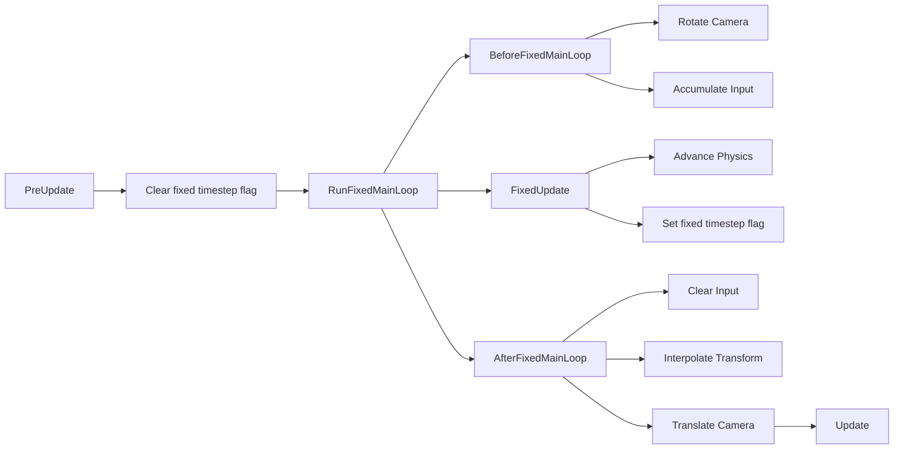

+++
title = "#20089 Port the physics in fixed timestep example to 3D"
date = "2025-07-14T00:00:00"
draft = false
template = "pull_request_page.html"
in_search_index = true

[taxonomies]
list_display = ["show"]

[extra]
current_language = "en"
available_languages = {"en" = { name = "English", url = "/pull_request/bevy/2025-07/pr-20089-en-20250714" }, "zh-cn" = { name = "中文", url = "/pull_request/bevy/2025-07/pr-20089-zh-cn-20250714" }}
labels = ["A-ECS", "C-Examples", "A-Physics", "A-Time", "D-Straightforward", "M-Deliberate-Rendering-Change"]
+++

## Port the physics in fixed timestep example to 3D

### Basic Information
- **Title**: Port the physics in fixed timestep example to 3D
- **PR Link**: https://github.com/bevyengine/bevy/pull/20089
- **Author**: janhohenheim
- **Status**: MERGED
- **Labels**: A-ECS, C-Examples, S-Ready-For-Final-Review, A-Physics, A-Time, D-Straightforward, M-Deliberate-Rendering-Change
- **Created**: 2025-07-11T18:43:38Z
- **Merged**: 2025-07-14T22:03:42Z
- **Merged By**: alice-i-cecile

### Description Translation
# Objective

Since I originally wrote this example, many people on Discord have asked me specifically how to handle camera movement in and around fixed timesteps. I had to write that information up maaaany times, so I believe this is an area where the example falls short of.

## Solution

Let's port the example to 3D, where we can better showcase how to handle the camera. The knowledge is trivially transferable to 2D :)
Also, we don't need to average out continuous input. Just using the last one is fine in practice. Still, we need to keep around the `AccumulatedInput` resource for things like jumping.

## Testing

https://github.com/user-attachments/assets/c1306d36-1f94-43b6-b8f6-af1cbb622698

## Notes

- The current implementation is extremely faithful to how it will look like in practice when writing a 3D game using e.g. Avian. With the exception that Avian does the part with the actual physics of course
- I'd love to showcase how to map sequences of inputs to fixed updates, but winit does not export timestamps
- I'd also like to showcase instantaneous inputs like activating a boost or shooting a laser, but that would make the example even bigger
- Not locking the cursor because doing so correctly on Wasm in the current Bevy version is not trivial at all

### The Story of This Pull Request

This PR addresses a practical gap in Bevy's fixed timestep example. While the original 2D implementation demonstrated basic physics synchronization, it didn't adequately show how to handle camera movement within a fixed timestep architecture - a common pain point reported by users. The author recognized that 3D provides a clearer context for demonstrating camera/physics interactions.

The solution ports the fixed timestep physics example from 2D to 3D while enhancing the camera implementation. Key changes include:

1. **Camera rotation handling**: Added mouse input processing to rotate the camera before physics calculations. This ensures player movement direction aligns with camera orientation:

```rust
fn rotate_camera(
    accumulated_mouse_motion: Res<AccumulatedMouseMotion>,
    player: Single<(&mut Transform, &CameraSensitivity), With<Camera>>,
) {
    let (mut transform, camera_sensitivity) = player.into_inner();
    let delta = accumulated_mouse_motion.delta;
    
    if delta != Vec2::ZERO {
        let delta_yaw = -delta.x * camera_sensitivity.x;
        let delta_pitch = -delta.y * camera_sensitivity.y;
        
        let (yaw, pitch, roll) = transform.rotation.to_euler(EulerRot::YXZ);
        let yaw = yaw + delta_yaw;
        
        const PITCH_LIMIT: f32 = FRAC_PI_2 - 0.01;
        let pitch = (pitch + delta_pitch).clamp(-PITCH_LIMIT, PITCH_LIMIT);
        
        transform.rotation = Quat::from_euler(EulerRot::YXZ, yaw, pitch, roll);
    }
}
```

2. **Input handling redesign**: Simplified from averaging to last-input sampling and restructured to support 3D movement relative to camera orientation:

```rust
fn accumulate_input(
    keyboard_input: Res<ButtonInput<KeyCode>>,
    player: Single<(&mut AccumulatedInput, &mut Velocity)>,
    camera: Single<&Transform, With<Camera>>,
) {
    const SPEED: f32 = 4.0;
    let (mut input, mut velocity) = player.into_inner();
    input.movement = Vec2::ZERO;
    
    // Read keyboard input
    if keyboard_input.pressed(KeyCode::KeyW) { input.movement.y += 1.0 }
    // ... other keys
    
    // Convert to 3D and rotate by camera
    let input_3d = Vec3 { x: input.movement.x, y: 0.0, z: -input.movement.y };
    let rotated_input = camera.rotation * input_3d;
    velocity.0 = rotated_input.clamp_length_max(1.0) * SPEED;
}
```

3. **Schedule reorganization**: Added explicit timing control for camera operations using Bevy's `RunFixedMainLoop` schedule:
   - Camera rotation runs in `BeforeFixedMainLoop` so physics uses current orientation
   - Camera translation runs in `AfterFixedMainLoop` using interpolated player position

4. **New timing flag**: Introduced `DidFixedTimestepRunThisFrame` resource to conditionally clear input only when physics actually executed:

```rust
#[derive(Resource, Debug, Deref, DerefMut, Default)]
pub struct DidFixedTimestepRunThisFrame(bool);

fn clear_fixed_timestep_flag(mut flag: ResMut<DidFixedTimestepRunThisFrame>) {
    flag.0 = false;
}

fn set_fixed_time_step_flag(mut flag: ResMut<DidFixedTimestepRunThisFrame>) {
    flag.0 = true;
}
```

The implementation maintains the core fixed timestep architecture while demonstrating practical patterns:
- Physics runs exclusively in `FixedUpdate`
- Camera rotation precedes physics to ensure correct movement direction
- Camera translation follows physics interpolation for smooth visuals
- Input handling is decoupled from physics execution timing

These changes provide a more realistic reference for game developers implementing camera controls in fixed timestep games. The 3D context better illustrates directional movement relative to camera orientation, and the explicit scheduling demonstrates how to coordinate camera updates with physics simulation.

### Visual Representation



### Key Files Changed

- `examples/movement/physics_in_fixed_timestep.rs` (+234/-60)

#### Before (partial):
```rust
fn handle_input(
    keyboard_input: Res<ButtonInput<KeyCode>>,
    mut query: Query<(&mut AccumulatedInput, &mut Velocity)>,
) {
    const SPEED: f32 = 210.0;
    for (mut input, mut velocity) in query.iter_mut() {
        if keyboard_input.pressed(KeyCode::KeyW) { input.y += 1.0 }
        // ... other keys
        velocity.0 = input.extend(0.0).normalize_or_zero() * SPEED;
    }
}

fn spawn_player(mut commands: Commands, asset_server: Res<AssetServer>) {
    commands.spawn(Camera2d);
    commands.spawn((
        Sprite::from_image(asset_server.load("branding/icon.png")),
        // ... other components
    ));
}
```

#### After (partial):
```rust
fn accumulate_input(
    keyboard_input: Res<ButtonInput<KeyCode>>,
    player: Single<(&mut AccumulatedInput, &mut Velocity)>,
    camera: Single<&Transform, With<Camera>>,
) {
    const SPEED: f32 = 4.0;
    let (mut input, mut velocity) = player.into_inner();
    input.movement = Vec2::ZERO;
    // Read keys...
    let input_3d = Vec3 { x: input.movement.x, y: 0.0, z: -input.movement.y };
    let rotated_input = camera.rotation * input_3d;
    velocity.0 = rotated_input.clamp_length_max(1.0) * SPEED;
}

fn spawn_player(mut commands: Commands) {
    commands.spawn((Camera3d::default(), CameraSensitivity::default()));
    commands.spawn((
        Transform::from_scale(Vec3::splat(0.3)),
        // ... other components
    ));
}
```

The changes transform the example from 2D to 3D, add camera controls, and refine the input handling to demonstrate practical fixed timestep implementation patterns. The physics core remains intact while the camera systems demonstrate how to coordinate variable-rate rendering with fixed-rate simulation.

### Further Reading
1. [Bevy Fixed Timestep Documentation](https://docs.rs/bevy/latest/bevy/core/struct.FixedTime.html)
2. [Game Loop Patterns](https://gameprogrammingpatterns.com/game-loop.html)
3. [Camera Controls in Game Physics](https://www.toptal.com/game/video-game-physics-part-ii-collision-detection-for-solid-objects)
4. [Input Handling in Fixed Timestep](https://gafferongames.com/post/fix_your_timestep/#the-final-touch)