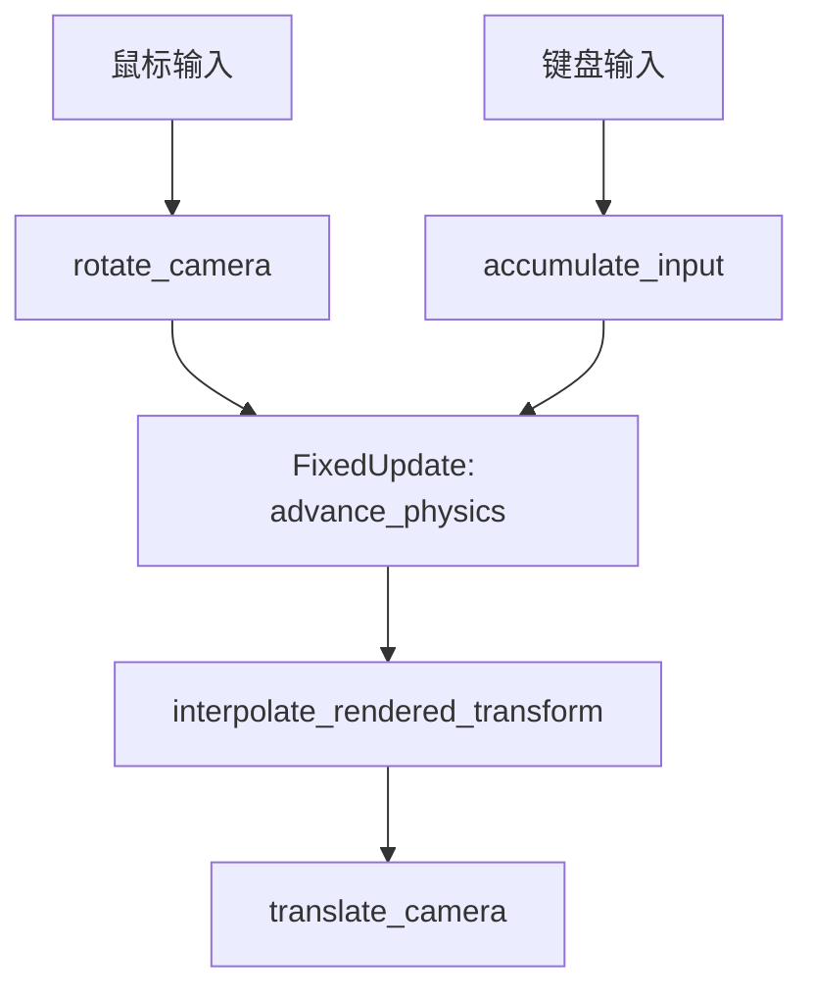

+++
title = "#20089 Port the physics in fixed timestep example to 3D"
date = "2025-07-14T00:00:00"
draft = false
template = "pull_request_page.html"
in_search_index = false

[extra]
current_language = "zh-cn"
available_languages = {"en" = { name = "English", url = "/pull_request/bevy/2025-07/pr-20089-en-20250714" }, "zh-cn" = { name = "中文", url = "/pull_request/bevy/2025-07/pr-20089-zh-cn-20250714" }}
+++

## 分析报告：PR #20089 - Port the physics in fixed timestep example to 3D

### 基本信息
- **标题**: Port the physics in fixed timestep example to 3D
- **PR链接**: https://github.com/bevyengine/bevy/pull/20089
- **作者**: janhohenheim
- **状态**: 已合并
- **标签**: A-ECS, C-Examples, S-Ready-For-Final-Review, A-Physics, A-Time, D-Straightforward, M-Deliberate-Rendering-Change
- **创建时间**: 2025-07-11T18:43:38Z
- **合并时间**: 2025-07-14T22:03:42Z
- **合并人**: alice-i-cecile

### 描述翻译
#### 目标

由于我最初编写这个示例时，许多 Discord 用户反复询问我如何在固定时间步长中处理相机移动。我不得不多次编写这些信息，因此我认为这是当前示例存在的不足。

#### 解决方案

将示例移植到 3D，这样可以更好地展示如何处理相机。这些知识可以轻松转移到 2D :)  
另外，我们不需要平均化连续输入。在实践中只使用最后一个输入即可。不过对于跳跃等操作，我们仍需保留 `AccumulatedInput` 资源。

#### 测试

https://github.com/user-attachments/assets/c1306d36-1f94-43b6-b8f6-af1cbb622698

#### 注意事项

- 当前实现非常接近实际使用 Avian 等工具编写 3D 游戏时的效果（除了 Avian 处理实际物理部分）
- 希望展示如何将输入序列映射到固定更新，但 winit 不导出时间戳
- 也希望展示瞬时输入（如激活推进器或发射激光），但这会使示例更复杂
- 未锁定光标，因为在当前 Bevy 版本中正确实现 Wasm 光标锁定并不简单

---

### 这个 PR 的故事

#### 问题背景
在 Bevy 的固定时间步长物理示例中，开发者经常遇到相机处理的问题。原示例是 2D 的，但实际游戏开发中，3D 相机控制更常见也更有挑战性。主要痛点在于：
1. 相机旋转需要影响物理计算（如 WASD 移动方向）
2. 相机位置又依赖物理模拟结果
3. 固定时间步长和渲染帧率不同步，需要精细的更新顺序控制

作者在 Discord 上反复解答这些问题，说明原示例在相机处理方面存在不足。核心挑战是如何在固定时间步长架构中协调输入、物理计算和相机更新。

#### 解决方案
PR 通过将示例从 2D 移植到 3D 来解决这些问题：
1. **相机控制分离**：将相机更新拆分为旋转（影响物理）和位移（依赖物理结果）
2. **输入处理优化**：简化输入累积策略，只保留最后输入值
3. **执行顺序重构**：精确控制系统在固定时间步长前后的执行顺序
4. **3D 环境搭建**：创建球体阵列作为视觉参考系

关键决策点：
- 选择 3D 而非增强 2D 示例，因 3D 能更好展示相机-物理交互
- 保留 `AccumulatedInput` 结构，为跳跃等瞬时动作留扩展空间
- 使用 `DidFixedTimestepRunThisFrame` 资源精确控制清除输入的时机

#### 技术实现
主要变更集中在执行顺序和 3D 转换：

1. **相机旋转先于物理**  
   在 `BeforeFixedMainLoop` 阶段处理鼠标输入并旋转相机：
   ```rust
   fn rotate_camera(
       accumulated_mouse_motion: Res<AccumulatedMouseMotion>,
       player: Single<(&mut Transform, &CameraSensitivity), With<Camera>>,
   ) {
       // 计算偏航(yaw)和俯仰(pitch)
       let delta_yaw = -delta.x * camera_sensitivity.x;
       let delta_pitch = -delta.y * camera_sensitivity.y;
       
       // 应用旋转限制避免万向节死锁
       const PITCH_LIMIT: f32 = FRAC_PI_2 - 0.01;
       let pitch = (pitch + delta_pitch).clamp(-PITCH_LIMIT, PITCH_LIMIT);
   }
   ```
   注意：这里不乘 delta time，因为鼠标移动已是帧间完整位移量

2. **3D 输入处理**  
   将 2D WASD 输入映射到 3D 空间并考虑相机朝向：
   ```rust
   fn accumulate_input(
       keyboard_input: Res<ButtonInput<KeyCode>>,
       player: Single<(&mut AccumulatedInput, &mut Velocity)>,
       camera: Single<&Transform, With<Camera>>,
   ) {
       // 将 2D 输入转换为 3D 向量 (x, 0, -y)
       let input_3d = Vec3 { x: input.movement.x, y: 0.0, z: -input.movement.y };
       
       // 根据相机旋转调整方向
       let rotated_input = camera.rotation * input_3d;
       
       // 速度计算（使用 clamp_length_max 处理摇杆输入）
       velocity.0 = rotated_input.clamp_length_max(1.0) * SPEED;
   }
   ```

3. **物理与相机位置更新**  
   物理模拟后，在 `AfterFixedMainLoop` 阶段：
   - 插值渲染位置 (`interpolate_rendered_transform`)
   - 同步相机到玩家位置 (`translate_camera`)
   ```rust
   fn translate_camera(
       mut camera: Single<&mut Transform, With<Camera>>,
       player: Single<&Transform, (With<AccumulatedInput>, Without<Camera>)>,
   ) {
       camera.translation = player.translation;
   }
   ```

4. **执行顺序控制**  
   新增资源跟踪固定时间步长执行：
   ```rust
   #[derive(Resource, Default)]
   struct DidFixedTimestepRunThisFrame(bool);
   
   // 每帧开始时重置标记
   fn clear_fixed_timestep_flag(res: ResMut<DidFixedTimestepRunThisFrame>) {
       res.0 = false;
   }
   
   // 固定时间步长执行时设置标记
   fn set_fixed_time_step_flag(res: ResMut<DidFixedTimestepRunThisFrame>) {
       res.0 = true;
   }
   ```

#### 技术洞察
1. **相机更新分离的必要性**：  
   3D 游戏中相机旋转决定移动方向，必须在物理步长前更新；而相机位置依赖物理计算结果，必须在步长后更新。

2. **输入处理策略**：  
   对于连续输入（如 WASD），使用最后输入值足够；但瞬时动作（如跳跃）仍需累积，这解释了为何保留 `AccumulatedInput` 结构。

3. **执行顺序精确控制**：  
   `DidFixedTimestepRunThisFrame` 资源解决了关键问题：仅当物理步长实际执行时才清除输入。这避免了丢帧时的错误状态。

4. **3D 特定处理**：  
   - 欧拉角旋转限制（避免万向节死锁）
   - 输入空间转换（屏幕→世界空间）
   - 相机灵敏度配置组件（便于运行时调整）

#### 影响
1. **教学价值提升**：  
   - 展示 3D 相机与物理的配合模式
   - 演示固定时间步长架构中的输入处理最佳实践
   - 提供可直接复用的 3D 控制模板

2. **代码优化**：  
   - 移除不必要的输入平均计算
   - 明确分离关注点（输入/物理/渲染）
   - 资源使用更精确（避免多余的状态清除）

3. **扩展基础**：  
   保留的 `AccumulatedInput` 结构和执行顺序控制为瞬时动作（如跳跃/射击）留出实现空间。

---

### 组件关系图


---

### 关键文件变更
#### `examples/movement/physics_in_fixed_timestep.rs` (+234/-60)
**变更说明**：将固定时间步长物理示例从 2D 移植到 3D，重构输入处理和相机控制逻辑。

**关键代码片段**：
```rust
// 之前：2D 玩家生成
fn spawn_player(mut commands: Commands, asset_server: Res<AssetServer>) {
    commands.spawn(Camera2d);
    commands.spawn((
        Sprite::from_image(asset_server.load("branding/icon.png")),
        // ... 其他组件
    ));
}

// 之后：3D 玩家生成
fn spawn_player(mut commands: Commands) {
    commands.spawn((Camera3d::default(), CameraSensitivity::default()));
    commands.spawn((
        // ... 3D 物理组件
    ));
}

// 新增：3D 环境生成
fn spawn_environment(
    mut commands: Commands,
    mut meshes: ResMut<Assets<Mesh>>,
    mut materials: ResMut<Assets<StandardMaterial>>,
) {
    // 生成球体网格阵列
    for x in 0..spheres_in_x {
        for y in 0..spheres_in_y {
            for z in 0..spheres_in_z {
                commands.spawn((
                    Transform::from_translation(Vec3::new(/* ... */)),
                    Mesh3d(sphere_mesh.clone()),
                    // ...
                ));
            }
        }
    }
}

// 之前：简单输入处理
fn handle_input(keyboard_input: Res<ButtonInput<KeyCode>>, mut query: Query<...>) {
    if keyboard_input.pressed(KeyCode::KeyW) { input.y += 1.0 }
    // ...
    velocity.0 = input.extend(0.0).normalize_or_zero() * SPEED;
}

// 之后：3D 输入处理（考虑相机朝向）
fn accumulate_input(/* ... */) {
    // 转换到 3D 空间
    let input_3d = Vec3 { x: input.movement.x, y: 0.0, z: -input.movement.y };
    // 根据相机旋转调整方向
    let rotated_input = camera.rotation * input_3d;
    velocity.0 = rotated_input.clamp_length_max(1.0) * SPEED;
}
```

---

### 延伸阅读
1. [Bevy 官方文档：固定时间步长](https://bevyengine.org/learn/book/features/time/#fixed-timestep)
2. [游戏物理引擎设计基础](https://gameprogrammingpatterns.com/game-loop.html)
3. [3D 相机系统设计模式](https://gamedev.stackexchange.com/questions/136074/im-making-a-3d-first-person-shooter-whats-the-best-way-to-handle-the-camera-r)
4. [输入处理架构](https://github.com/bevyengine/bevy/discussions/4090)