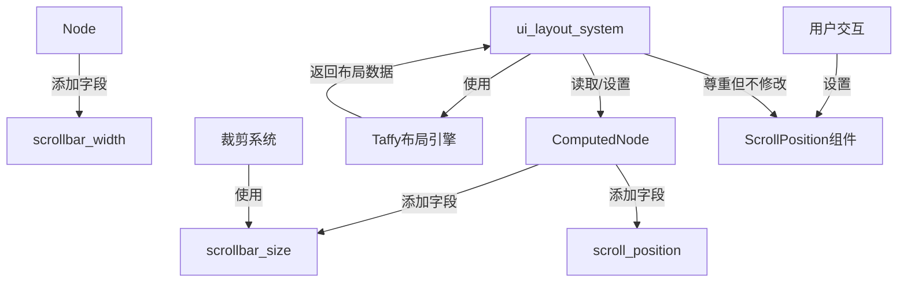

+++
title = "#20093 Improved UI scrolling support and bug fixes"
date = "2025-07-15T00:00:00"
draft = false
template = "pull_request_page.html"
in_search_index = false

[extra]
current_language = "zh-cn"
available_languages = {"en" = { name = "English", url = "/pull_request/bevy/2025-07/pr-20093-en-20250715" }, "zh-cn" = { name = "中文", url = "/pull_request/bevy/2025-07/pr-20093-zh-cn-20250715" }}
+++

# Improved UI scrolling support and bug fixes

## 基本信息
- **标题**: Improved UI scrolling support and bug fixes
- **PR链接**: https://github.com/bevyengine/bevy/pull/20093
- **作者**: ickshonpe
- **状态**: MERGED
- **标签**: C-Bug, C-Feature, A-UI, S-Ready-For-Final-Review, M-Needs-Migration-Guide, M-Needs-Release-Note
- **创建时间**: 2025-07-11T20:47:18Z
- **合并时间**: 2025-07-15T17:53:56Z
- **合并者**: alice-i-cecile

## 描述翻译
### 目标 (Objective)
#### 目标
* 阻止布局更新覆盖 `ScrollPosition`
* 让 `ScrollPosition` 尊重缩放因子 (scale factor)
* 当 `OverflowAxis::Scroll` 被设置时，自动为滚动条在轴向上分配空间

#### 非目标
* 支持 overflow-auto（我原以为Taffy已有此功能，但显然是我记错了）
* 实现任何滚动条小部件 (widget)
* 稳定性（由于不需要支持overflow-auto，暂不需要）
* 未来可能会添加 `ScrollbarWidth` 枚举以更接近CSS API（提供auto/narrow/none选项）。目前 `scrollbar_width` 只是与Taffy API匹配的 `f32`

### 解决方案 (Solution)
* 布局更新不再覆盖 `ScrollPosition` 的值
* 在 `Node` 中添加了字段 `scrollbar_width: f32`。该值被发送给 `Taffy`，后者将根据需要自动在布局中为滚动条分配此宽度的空间
* 在 `ComputedNode` 中添加了字段 `scrollbar_width: f32` 和 `scroll_position: Vec2`。这些在布局期间自动更新
* `ScrollPosition` 现在会考虑缩放因子
* `ui_layout_system` 不再自动为每个UI节点实体添加 `ScrollPosition`。如果每个节点都需要它，应将其设为 `Node` 的必需字段（或直接作为字段）

### 测试 (Testing)
用于测试的示例：
* `scrollbars` 示例，应与之前一样工作
* 新示例 `drag_to_scroll`
* `scroll` 示例，该示例会自动为左侧滚动列表的滚动条分配空间。尚未实现实际滚动条，因此目前只会看到空隙

## 这个PR的故事

### 问题与背景
在Bevy的UI系统中，滚动(scrolling)功能存在三个核心问题。首先，布局更新会覆盖用户设置的 `ScrollPosition` 值，导致滚动位置在布局计算后被意外重置。其次，`ScrollPosition` 没有考虑UI缩放因子，导致在高DPI显示器或缩放UI时滚动位置计算错误。第三，当设置 `OverflowAxis::Scroll` 时，系统没有为滚动条预留空间，导致内容被滚动条遮挡。

这些问题直接影响了需要精确滚动控制的UI场景。例如，在可滚动列表中，用户设置的滚动位置可能在UI更新后丢失；在缩放UI时，滚动位置可能无法正确映射到内容位置；在需要显示滚动条时，内容区域会被意外裁剪。

### 解决方案
开发者采取了系统化的方法解决这些问题：
1. 停止布局系统覆盖 `ScrollPosition`，改将计算后的滚动位置存储在 `ComputedNode` 中
2. 在布局计算中引入缩放因子校正
3. 添加 `scrollbar_width` 属性，让Taffy布局引擎自动为滚动条分配空间
4. 重构滚动位置计算逻辑，使用逻辑像素(logical pixels)而非物理像素(physical pixels)

关键决策包括：
- 选择在 `ComputedNode` 而非 `Node` 中存储运行时计算的滚动位置，因为这是派生数据
- 直接修改Taffy样式而非在Bevy侧处理滚动条空间分配，保持与底层布局引擎一致
- 使用逻辑像素单位统一滚动位置计算，与UI系统的其他尺寸处理保持一致

### 实现细节
核心修改集中在布局系统和节点结构：
1. **`Node` 结构增强**：
   ```rust
   // crates/bevy_ui/src/ui_node.rs
   pub struct Node {
       // ...
       pub scrollbar_width: f32, // 新增字段
   }
   ```
   新字段允许开发者指定滚动条宽度，该值会被传递到Taffy

2. **`ComputedNode` 扩展**：
   ```rust
   pub struct ComputedNode {
       // ...
       pub scrollbar_size: Vec2,    // 新增：滚动条占用空间
       pub scroll_position: Vec2,   // 新增：计算后的滚动位置
   }
   ```
   这些字段由布局系统自动填充，提供运行时计算的滚动信息

3. **布局系统重构**：
   ```rust
   // crates/bevy_ui/src/layout/mod.rs
   fn update_uinode_geometry_recursive(
       // 移除了Commands参数
       // ...
   ) {
       // ...
       // 存储滚动条尺寸
       node.bypass_change_detection().scrollbar_size =
           Vec2::new(layout.scrollbar_size.width, layout.scrollbar_size.height);
       
       // 计算逻辑像素滚动位置（考虑缩放因子）
       let scroll_position: Vec2 = /* 计算逻辑 */;
       
       // 计算最大滚动范围（包含滚动条空间）
       let max_possible_offset = 
           (content_size - layout_size + node.scrollbar_size).max(Vec2::ZERO);
       
       // 存储最终滚动位置到ComputedNode
       node.bypass_change_detection().scroll_position = physical_scroll_position;
   }
   ```
   关键改进：
   - 不再使用ECS命令更新 `ScrollPosition` 组件
   - 滚动位置计算现在考虑缩放因子 (`inverse_target_scale_factor`)
   - 最大滚动范围计算包含滚动条占用的空间

4. **裁剪系统适配**：
   ```rust
   // crates/bevy_ui/src/update.rs
   clip_rect.max.x -= clip_inset.right + computed_node.scrollbar_size.x;
   clip_rect.max.y -= clip_inset.bottom + computed_node.scrollbar_size.y;
   ```
   裁剪区域现在会减去滚动条占用的空间，防止内容被错误裁剪

### 技术洞察
1. **滚动位置存储策略**：  
   将 `scroll_position` 移至 `ComputedNode` 是明智的设计选择。这避免了ECS组件更新的开销，并保持布局数据在单一结构中，提高数据局部性

2. **单位一致性**：  
   统一使用逻辑像素单位处理滚动位置解决了缩放问题。转换公式为：  
   `物理位置 = 逻辑位置 × 缩放因子`  
   这确保了滚动行为在不同DPI和UI缩放设置下保持一致

3. **Taffy集成**：  
   通过直接设置 `scrollbar_width` 的Taffy样式属性（在 `from_node` 函数中），Bevy有效利用了底层布局引擎的能力：
   ```rust
   scrollbar_width: node.scrollbar_width * context.scale_factor
   ```
   这种设计保持了Bevy UI与Taffy的松耦合，同时获得精确的布局控制

4. **变更检测优化**：  
   使用 `bypass_change_detection()` 直接修改 `ComputedNode` 避免了不必要的变更检测触发，这对高频更新的布局系统尤为重要

### 影响
这些修改直接解决了报告的问题：
1. 用户设置的 `ScrollPosition` 不再被布局系统覆盖
2. 滚动位置现在正确处理UI缩放
3. 设置 `OverflowAxis::Scroll` 时会自动预留滚动条空间
4. 新增 `drag_to_scroll` 示例演示了完整的拖动滚动交互

迁移注意事项：
- `ScrollPosition` 现在使用逻辑像素单位
- 开发者需要在需要滚动的节点显式添加 `ScrollPosition` 组件
- 现有项目需更新滚动位置处理逻辑以适应新的单位系统

## 视觉表示



## 关键文件变更

### `crates/bevy_ui/src/ui_node.rs` (+14/-0)
```rust
// 在Node结构体中新增字段
pub struct Node {
    // ...
    pub scrollbar_width: f32,
}

// 在ComputedNode结构体中新增字段
pub struct ComputedNode {
    // ...
    pub scrollbar_size: Vec2,
    pub scroll_position: Vec2,
}
```
**变更原因**：为支持滚动条空间分配和滚动位置存储添加必要字段

### `crates/bevy_ui/src/layout/mod.rs` (+11/-19)
```rust
// 修改前：
fn update_uinode_geometry_recursive(
    commands: &mut Commands, // 需要Commands参数
    // ...
) {
    // ...
    if clamped_scroll_position != scroll_position {
        commands.entity(entity).insert(ScrollPosition(clamped_scroll_position));
    }
}

// 修改后：
fn update_uinode_geometry_recursive(
    // 移除了Commands参数
    // ...
) {
    // ...
    node.bypass_change_detection().scrollbar_size = /* 计算值 */;
    node.bypass_change_detection().scroll_position = /* 计算值 */;
}
```
**变更原因**：重构滚动位置处理逻辑，不再通过ECS命令更新组件，改为直接存储到ComputedNode

### `examples/ui/drag_to_scroll.rs` (+120/-0)
```rust
// 新示例演示拖动滚动功能
commands.spawn((
    Node {
        overflow: Overflow::scroll(),
        ..Default::default()
    },
    ScrollPosition(Vec2::ZERO),
    ScrollableNode,
)).observe(
    // 处理拖动事件更新滚动位置
    |drag: On<Pointer<Drag>>, ui_scale: Res<UiScale>,
     mut scroll_position_query: Query<(&mut ScrollPosition, &ScrollStart)>| {
        // 计算新滚动位置
        scroll_position.0 = (start.0 - drag.distance / ui_scale.0).max(Vec2::ZERO);
    }
)
```
**变更原因**：提供完整的使用示例，演示如何实现拖动滚动功能，同时验证缩放因子处理

### `crates/bevy_ui/src/update.rs` (+4/-4)
```rust
// 修改裁剪计算考虑滚动条空间
// 修改前：
clip_rect.max.x -= clip_inset.right;
clip_rect.max.y -= clip_inset.bottom;

// 修改后：
clip_rect.max.x -= clip_inset.right + computed_node.scrollbar_size.x;
clip_rect.max.y -= clip_inset.bottom + computed_node.scrollbar_size.y;
```
**变更原因**：确保裁剪区域正确计算，避免内容被滚动条遮挡

### `release-content/migration-guides/UI_scroll_position_is_now_logical.md` (+5/-0)
```markdown
---
title: `ScrollPosition` 现在使用逻辑像素单位且布局更新不再覆盖它
pull_requests: [20093]
---
`ScrollPosition` 在布局更新期间不再被覆盖。计算后的滚动位置现在存储于`ComputedNode`的新字段`scroll_position`中
```
**变更原因**：提供迁移指南，帮助用户适应滚动位置处理的变化

## 扩展阅读
1. [Taffy布局引擎文档](https://crates.io/crates/taffy) - 了解Bevy使用的底层布局系统
2. [CSS Overflow属性](https://developer.mozilla.org/en-US/docs/Web/CSS/overflow) - 理解overflow: scroll行为的标准实现
3. [Bevy UI系统架构](https://bevyengine.org/learn/book/features/ui/) - 官方UI系统概览
4. [逻辑像素与物理像素](https://developer.apple.com/design/human-interface-guidelines/ios/visual-design/adaptivity-and-layout/) - 理解不同DPI环境下的尺寸处理