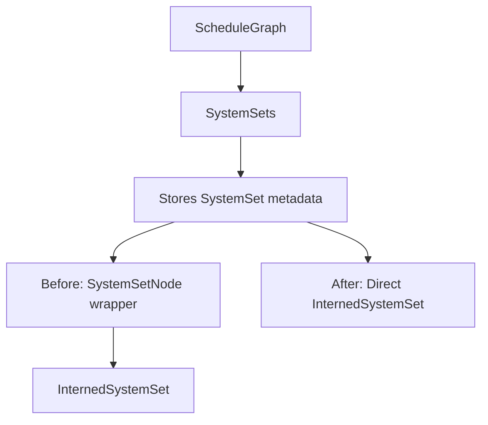

+++
title = "#20100"
date = "2025-07-13T00:00:00"
draft = false
template = "pull_request_page.html"
in_search_index = true

[taxonomies]
list_display = ["show"]

[extra]
current_language = "en"
available_languages = {"en" = { name = "English", url = "/pull_request/bevy/2025-07/pr-20100-en-20250713" }, "zh-cn" = { name = "中文", url = "/pull_request/bevy/2025-07/pr-20100-zh-cn-20250713" }}
+++

## The Story of This Pull Request

This pull request addresses a straightforward but meaningful optimization in Bevy's ECS scheduling implementation. The core issue was that `SystemSetNode` served as a thin wrapper around `InternedSystemSet` but provided minimal additional value. It only offered two helper methods (`name()` and `is_system_type()`) that were essentially passthroughs to the underlying `InternedSystemSet`. Maintaining this abstraction added unnecessary complexity to the scheduler code without significant benefits.

The solution was direct: completely remove `SystemSetNode` and use `InternedSystemSet` throughout the scheduling logic. This required inlining the former helper functions at their call sites. The implementation shows several key changes:

1. **Struct removal**: The entire `SystemSetNode` definition and its implementation were deleted
2. **Storage simplification**: The system sets collection changed from storing `SystemSetNode` to storing `InternedSystemSet` directly
3. **Helper method inlining**: All `is_system_type()` checks were replaced with direct `system_type().is_some()` calls
4. **Formatting adjustment**: The `name()` method was replaced with direct `format!("{set:?}")` calls
5. **Trait object handling**: References to system sets now require double dereferencing (`&**set`) to get the trait object

These changes significantly streamline the scheduler code. The diff shows a net reduction of 24 lines of code, which might seem small but represents meaningful simplification in a core system. The changes are localized to the schedule builder logic and don't affect public APIs, making this a safe internal refactor.

The PR demonstrates good code hygiene by removing unnecessary abstraction layers. The original wrapper didn't encapsulate complex behavior or hide implementation details - it simply forwarded method calls. By working directly with `InternedSystemSet`, the code becomes more transparent and reduces cognitive load for future maintainers.

## Visual Representation



## Key Files Changed

### `crates/bevy_ecs/src/schedule/schedule.rs`
**Changes**: Removed `SystemSetNode` wrapper and updated all references to use `InternedSystemSet` directly

**Key modifications**:
```rust
// Before:
struct SystemSetNode {
    inner: InternedSystemSet,
}

impl SystemSetNode {
    pub fn name(&self) -> String {
        format!("{:?}", &self.inner)
    }
    
    pub fn is_system_type(&self) -> bool {
        self.inner.system_type().is_some()
    }
}

// After: (SystemSetNode completely removed)
```

```rust
// Before:
sets: SlotMap<SystemSetKey, SystemSetNode>

// After:
sets: SlotMap<SystemSetKey, InternedSystemSet>
```

```rust
// Before:
if set.is_system_type() { ... }

// After:
if set.system_type().is_some() { ... }
```

```rust
// Before:
set.name()

// After:
format!("{set:?}")
```

```rust
// Before:
self.system_sets.sets.get(key).map(|set| &*set.inner)

// After:
self.system_sets.sets.get(key).map(|set| &**set)
```

## Further Reading
1. [Bevy ECS Scheduling Documentation](https://bevyengine.org/learn/book/ecs/schedules/)
2. [Rust Deref Trait Documentation](https://doc.rust-lang.org/std/ops/trait.Deref.html)
3. [Interning Pattern Explanation](https://en.wikipedia.org/wiki/String_interning)