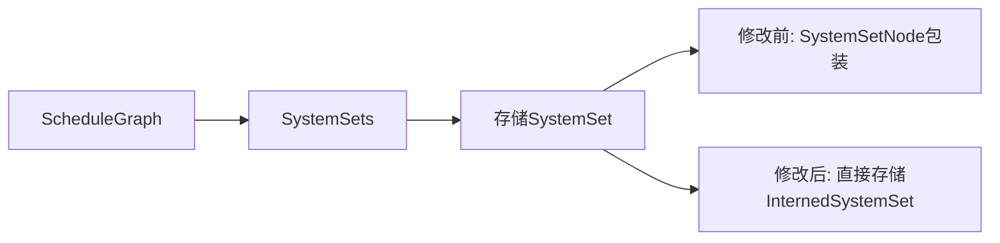

+++
title = "#20100 Remove `SystemSetNode`"
date = "2025-07-13T00:00:00"
draft = false
template = "pull_request_page.html"
in_search_index = false

[extra]
current_language = "zh-cn"
available_languages = {"en" = { name = "English", url = "/pull_request/bevy/2025-07/pr-20100-en-20250713" }, "zh-cn" = { name = "中文", url = "/pull_request/bevy/2025-07/pr-20100-zh-cn-20250713" }}
labels = ["D-Trivial", "A-ECS", "C-Code-Quality", "D-Domain-Agnostic"]
+++

## Title: Remove `SystemSetNode`

## Basic Information
- **Title**: Remove `SystemSetNode`
- **PR Link**: https://github.com/bevyengine/bevy/pull/20100
- **Author**: ItsDoot
- **Status**: MERGED
- **Labels**: D-Trivial, A-ECS, C-Code-Quality, S-Ready-For-Final-Review, D-Domain-Agnostic
- **Created**: 2025-07-12T10:02:03Z
- **Merged**: 2025-07-13T17:45:41Z
- **Merged By**: alice-i-cecile

## Description Translation
### Objective
`SystemSetNode` 除了提供几个辅助函数（用于获取名称字符串和检查是否为 `SystemTypeSet`）外，并没有增加太多价值。我们可以完全移除它，直接使用 `InternedSystemSet`，内联这些辅助函数的使用，同时不会牺牲可读性。

### Solution
移除 `SystemSetNode`，直接使用 `InternedSystemSet`。

### Testing
复用现有测试。

## The Story of This Pull Request

在 Bevy 的 ECS 调度系统中，`SystemSetNode` 作为 `InternedSystemSet` 的包装器存在，主要提供三个辅助方法：`name()` 返回字符串格式的系统集名称，`is_system_type()` 检查是否为 `SystemTypeSet`，以及 `is_anonymous()` 检查是否为匿名集合。随着代码演进，这些辅助方法带来的价值逐渐降低，反而增加了不必要的间接层。

问题在于：
1. `name()` 方法仅执行简单的格式化操作：`format!("{:?}", &self.inner)`
2. `is_system_type()` 只是代理调用 `self.inner.system_type().is_some()`
3. `is_anonymous()` 也是直接代理 `self.inner.is_anonymous()`
4. 整个包装器没有提供额外的状态或逻辑

这种间接层导致：
- 增加代码理解成本（需要在 `SystemSetNode` 和 `InternedSystemSet` 间切换）
- 产生不必要的内存分配（`SystemSetNode` 结构体本身）
- 增加调用开销（通过包装器访问底层数据）

解决方案是直接移除 `SystemSetNode`，在调用点内联其功能。具体修改包括：
1. 删除 `SystemSetNode` 结构体及其实现
2. 将存储类型从 `SystemSetNode` 替换为 `InternedSystemSet`
3. 在调用点直接访问 `InternedSystemSet` 的原生方法
4. 将 `name()` 调用替换为直接的 `format!("{set:?}")`

例如检查系统集类型的逻辑从：
```rust
if set.is_system_type() { ... }
```
改为直接访问：
```rust
if set.system_type().is_some() { ... }
```

这种修改保持了相同的行为但减少了抽象层。在调试场景中，获取名称的操作从：
```rust
set.name()
```
改为：
```rust
format!("{set:?}")
```
这利用了 Rust 的 `Debug` trait 实现，功能相同但更直接。

修改后代码的明显优势：
1. 减少 24 行代码（净变化）
2. 消除不必要的内存分配（`SystemSetNode` 实例）
3. 减少函数调用开销（移除代理方法）
4. 简化类型系统（减少中间类型）
5. 提高代码可读性（直接操作核心类型）

潜在风险较低，因为：
- 所有修改都是语法层面的等义转换
- 功能逻辑没有实质性变化
- 测试套件完全复用现有测试验证

## Visual Representation



## Key Files Changed

### `crates/bevy_ecs/src/schedule/schedule.rs` (+8/-32)

1. **删除 SystemSetNode 结构体**  
   移除了不必要的包装器类型及其实现

```rust
// 删除的代码块:
/// A [`SystemSet`] with metadata, stored in a [`ScheduleGraph`].
struct SystemSetNode {
    inner: InternedSystemSet,
}

impl SystemSetNode {
    pub fn new(set: InternedSystemSet) -> Self {
        Self { inner: set }
    }

    pub fn name(&self) -> String {
        format!("{:?}", &self.inner)
    }

    pub fn is_system_type(&self) -> bool {
        self.inner.system_type().is_some()
    }

    pub fn is_anonymous(&self) -> bool {
        self.inner.is_anonymous()
    }
}
```

2. **修改 SystemSets 结构**  
   将存储类型改为直接使用 `InternedSystemSet`

```diff
 struct SystemSets {
     /// List of system sets in the schedule
-    sets: SlotMap<SystemSetKey, SystemSetNode>,
+    sets: SlotMap<SystemSetKey, InternedSystemSet>,
     /// List of conditions for each system set...
```

3. **简化系统集创建逻辑**  
   直接存储 `InternedSystemSet` 而非包装器

```diff
     fn get_or_add_set(&mut self, set: InternedSystemSet) -> SystemSetKey {
         *self.ids.entry(set).or_insert_with(|| {
-            let key = self.sets.insert(SystemSetNode::new(set));
+            let key = self.sets.insert(set);
             self.conditions.insert(key, Vec::new());
             key
         })
     }
```

4. **内联辅助方法调用**  
   在调用点直接使用 `InternedSystemSet` 的方法

```diff
// 获取名称
-    set.name()
+    format!("{set:?}")

// 检查系统集类型
-    if set.is_system_type() {
+    if set.system_type().is_some() {

// 检查匿名集
     if set.is_anonymous() {
         // 保持不变 (直接代理)
     }
```

## Further Reading
1. [Rust 的 `Debug` Trait 文档](https://doc.rust-lang.org/std/fmt/trait.Debug.html)
2. [Bevy ECS 调度系统概览](https://bevyengine.org/learn/book/getting-started/ecs/)
3. [类型包装与解包装模式讨论](https://rust-lang.github.io/api-guidelines/type-safety.html)
4. [SlotMap 数据结构文档](https://docs.rs/slotmap/latest/slotmap/)